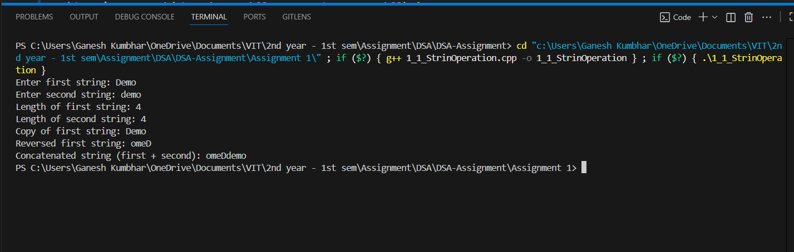

# Basic String Operations without Built-in Functions

## Theory

Strings in C are represented as arrays of characters ending with a null character `'\0'`. Basic string operations such as length calculation, copy, reverse, and concatenation can be implemented manually by iterating over the character array.

- **Length calculation:** Traverse the array until the null character is found, counting the characters.
- **String copy:** Copy each character from the source array to the destination until the null character.
- **String reverse:** Swap characters starting from the ends moving towards the center.
- **String concatenation:** Append characters of the second string to the end of the first before the null terminator.

Implementing these operations without library functions helps in understanding the internal mechanics of string handling and provides flexibility for custom or constrained environments.


## Algorithm

1. Input two strings from the user.  
2. Find the length of both strings manually by traversing until `\0`.  
3. Copy the first string into another array character by character.  
4. Reverse the first string by swapping characters from start and end.  
5. Concatenate the second string to the end of the first string.  
6. Print the results of each operation.  

## Code

```cpp
#include <iostream>
using namespace std;


int stringLength_gsk(const char str_gsk[]) {
    int len_gsk = 0;
    while (str_gsk[len_gsk] != '\0') {
        len_gsk++;
    }
    return len_gsk;
}

void stringCopy_gsk(char dest_gsk[], const char src_gsk[]) {
    int i_gsk = 0;
    while (src_gsk[i_gsk] != '\0') {
        dest_gsk[i_gsk] = src_gsk[i_gsk];
        i_gsk++;
    }
    dest_gsk[i_gsk] = '\0';
}

void stringReverse_gsk(char str_gsk[]) {
    int len_gsk = stringLength_gsk(str_gsk);
    int start_gsk = 0;
    int end_gsk = len_gsk - 1;
    while (start_gsk < end_gsk) {
        char temp_gsk = str_gsk[start_gsk];
        str_gsk[start_gsk] = str_gsk[end_gsk];
        str_gsk[end_gsk] = temp_gsk;
        start_gsk++;
        end_gsk--;
    }
}

void stringConcat_gsk(char dest_gsk[], const char src_gsk[]) {
    int dest_len_gsk = stringLength_gsk(dest_gsk);
    int i_gsk = 0;
    while (src_gsk[i_gsk] != '\0') {
        dest_gsk[dest_len_gsk + i_gsk] = src_gsk[i_gsk];
        i_gsk++;
    }
    dest_gsk[dest_len_gsk + i_gsk] = '\0';
}

int main() {
    char str1_gsk[100], str2_gsk[100], dest_gsk[200];

    cout << "Enter first string: ";
    cin >> str1_gsk;
    cout << "Enter second string: ";
    cin >> str2_gsk;

    // Length
    int len1_gsk = stringLength_gsk(str1_gsk);
    int len2_gsk = stringLength_gsk(str2_gsk);
    cout << "Length of first string: " << len1_gsk << endl;
    cout << "Length of second string: " << len2_gsk << endl;

    // Copy
    stringCopy_gsk(dest_gsk, str1_gsk);
    cout << "Copy of first string: " << dest_gsk << endl;

    // Reverse
    stringReverse_gsk(str1_gsk);
    cout << "Reversed first string: " << str1_gsk << endl;

    // Concatenate
    stringConcat_gsk(str1_gsk, str2_gsk);
    cout << "Concatenated string (first + second): " << str1_gsk << endl;

    return 0;
}

```

## Sample Output

**Input:**  
```
Enter first string: hello
Enter second string: world
```

**Output:**  
```
Length of first string: 5
Length of second string: 5
Copy of first string: hello
Reversed first string: olleh
Concatenated string (first + second): ollehworld
```
