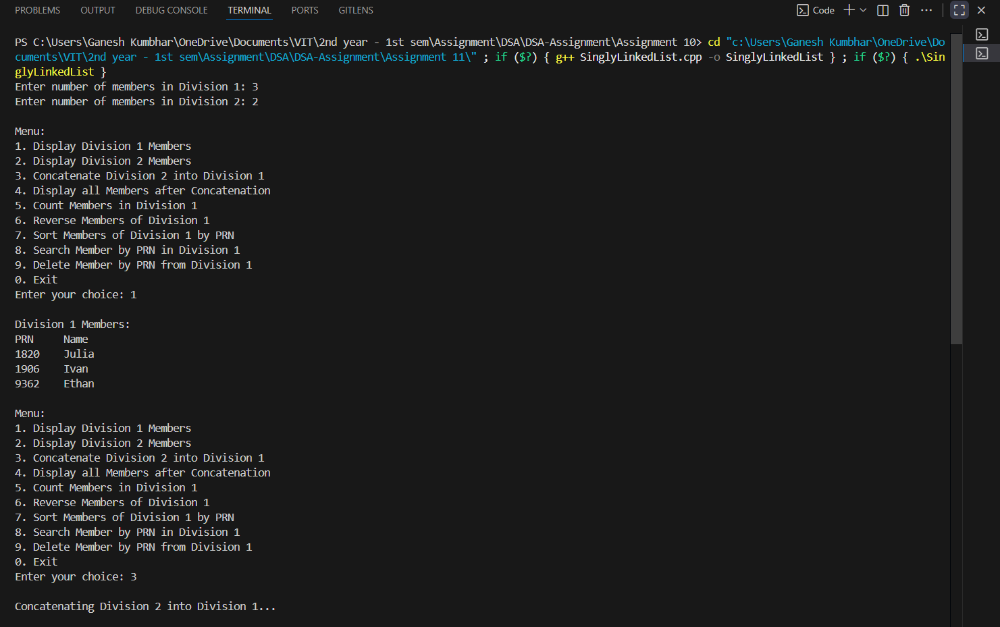
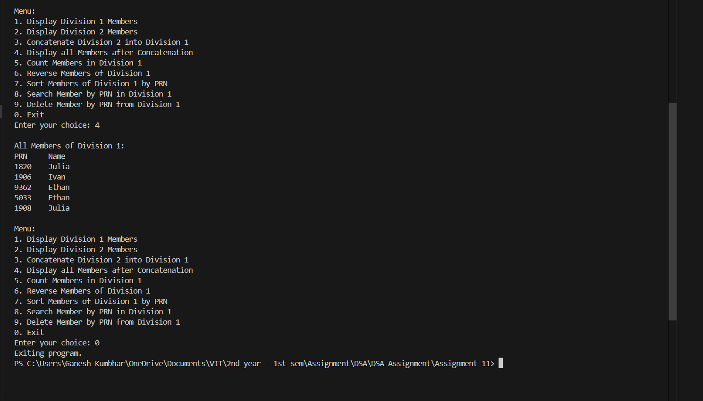

# Vertex Club Management using Singly Linked List

## Theory

A **Singly Linked List (SLL)** is a linear data structure where elements (nodes) are connected sequentially using pointers. Each node contains two parts:
1. **Data** – stores information (e.g., PRN, Name).
2. **Next Pointer** – stores the address of the next node in the sequence.

In this program, the Singly Linked List is used to manage members of a **Vertex Club**, including:
- Adding and deleting members.
- Counting members.
- Reversing and sorting the list.
- Concatenating two lists (Divisions).
- Searching for members by PRN.

---

## Algorithm

### Step 1: Define Structure
Create a structure `Member_gsk` containing PRN, Name, and a pointer to the next node.

### Step 2: Define Class `VertexClub_gsk`
- Initialize `head_gsk` as `nullptr`.
- Implement member functions to:
  - Add President and Members
  - Delete a Member
  - Count Members
  - Display all Members
  - Reverse and Sort the List
  - Concatenate two Divisions
  - Search for a Member by PRN

### Step 3: In `main()`
- Create two divisions (two linked lists).
- Add random members.
- Provide menu options for user interaction to perform operations.

---

## Code Implementation

```cpp
#include <iostream>
#include <string>
#include <cstdlib>
#include <ctime>
using namespace std;

struct Member_gsk {
    int PRN_gsk;
    string name_gsk;
    Member_gsk* next_gsk;
};

class VertexClub_gsk {
    Member_gsk* head_gsk;
public:
    VertexClub_gsk() : head_gsk(nullptr) {}

    void addMember_gsk(int prn_gsk, const string& name_gsk) {
        Member_gsk* newMember_gsk = new Member_gsk{prn_gsk, name_gsk, nullptr};
        if (!head_gsk) {
            head_gsk = newMember_gsk;
            return;
        }
        Member_gsk* temp_gsk = head_gsk;
        while (temp_gsk->next_gsk)
            temp_gsk = temp_gsk->next_gsk;
        temp_gsk->next_gsk = newMember_gsk;
    }

    void addPresident_gsk(int prn_gsk, const string& name_gsk) {
        Member_gsk* newMember_gsk = new Member_gsk{prn_gsk, name_gsk, head_gsk};
        head_gsk = newMember_gsk;
    }

    void deleteMember_gsk(int prn_gsk) {
        if (!head_gsk) return;
        if (head_gsk->PRN_gsk == prn_gsk) {
            Member_gsk* toDelete_gsk = head_gsk;
            head_gsk = head_gsk->next_gsk;
            delete toDelete_gsk;
            return;
        }
        Member_gsk* temp_gsk = head_gsk;
        while (temp_gsk->next_gsk && temp_gsk->next_gsk->PRN_gsk != prn_gsk)
            temp_gsk = temp_gsk->next_gsk;
        if (temp_gsk->next_gsk) {
            Member_gsk* toDelete_gsk = temp_gsk->next_gsk;
            temp_gsk->next_gsk = temp_gsk->next_gsk->next_gsk;
            delete toDelete_gsk;
        }
    }

    int countMembers_gsk() const {
        int count_gsk = 0;
        Member_gsk* temp_gsk = head_gsk;
        while (temp_gsk) {
            count_gsk++;
            temp_gsk = temp_gsk->next_gsk;
        }
        return count_gsk;
    }

    void display_gsk() const {
        if (!head_gsk) {
            cout << "No members in the club.\n";
            return;
        }
        Member_gsk* temp_gsk = head_gsk;
        cout << "PRN\tName\n";
        while (temp_gsk) {
            cout << temp_gsk->PRN_gsk << "\t" << temp_gsk->name_gsk << "\n";
            temp_gsk = temp_gsk->next_gsk;
        }
    }

    Member_gsk* search_gsk(int prn_gsk) const {
        Member_gsk* temp_gsk = head_gsk;
        while (temp_gsk) {
            if (temp_gsk->PRN_gsk == prn_gsk)
                return temp_gsk;
            temp_gsk = temp_gsk->next_gsk;
        }
        return nullptr;
    }

    void reverse_gsk() {
        Member_gsk *prev_gsk = nullptr, *curr_gsk = head_gsk, *next_gsk = nullptr;
        while (curr_gsk) {
            next_gsk = curr_gsk->next_gsk;
            curr_gsk->next_gsk = prev_gsk;
            prev_gsk = curr_gsk;
            curr_gsk = next_gsk;
        }
        head_gsk = prev_gsk;
    }

    void sortList_gsk() {
        if (!head_gsk || !head_gsk->next_gsk) return;
        bool swapped_gsk;
        do {
            swapped_gsk = false;
            Member_gsk* temp_gsk = head_gsk;
            while (temp_gsk->next_gsk) {
                if (temp_gsk->PRN_gsk > temp_gsk->next_gsk->PRN_gsk) {
                    swap(temp_gsk->PRN_gsk, temp_gsk->next_gsk->PRN_gsk);
                    swap(temp_gsk->name_gsk, temp_gsk->next_gsk->name_gsk);
                    swapped_gsk = true;
                }
                temp_gsk = temp_gsk->next_gsk;
            }
        } while (swapped_gsk);
    }

    void concatenate_gsk(VertexClub_gsk& other_gsk) {
        if (!head_gsk) {
            head_gsk = other_gsk.head_gsk;
            other_gsk.head_gsk = nullptr;
            return;
        }
        Member_gsk* temp_gsk = head_gsk;
        while(temp_gsk->next_gsk)
            temp_gsk = temp_gsk->next_gsk;
        temp_gsk->next_gsk = other_gsk.head_gsk;
        other_gsk.head_gsk = nullptr;
    }
};

string generateRandomName_gsk() {
    string names_gsk[] = {
        "Alice", "Bob", "Charlie", "Diana", "Ethan",
        "Fiona", "George", "Hannah", "Ivan", "Julia"
    };
    return names_gsk[rand() % 10];
}

int main() {
    srand((unsigned)time(nullptr));
    VertexClub_gsk club1_gsk, club2_gsk;
    int n1_gsk, n2_gsk;

    cout << "Enter number of members in Division 1: ";
    cin >> n1_gsk;
    for (int i_gsk = 0; i_gsk < n1_gsk; i_gsk++) {
        int prn_gsk = 1000 + rand() % 9000;
        string name_gsk = generateRandomName_gsk();
        if (i_gsk == 0)
            club1_gsk.addPresident_gsk(prn_gsk, name_gsk);
        else
            club1_gsk.addMember_gsk(prn_gsk, name_gsk);
    }

    cout << "Enter number of members in Division 2: ";
    cin >> n2_gsk;
    for (int i_gsk = 0; i_gsk < n2_gsk; i_gsk++) {
        int prn_gsk = 1000 + rand() % 9000;
        string name_gsk = generateRandomName_gsk();
        if (i_gsk == 0)
            club2_gsk.addPresident_gsk(prn_gsk, name_gsk);
        else
            club2_gsk.addMember_gsk(prn_gsk, name_gsk);
    }

    int choice_gsk;
    do {
        cout << "\nMenu:\n";
        cout << "1. Display Division 1 Members\n";
        cout << "2. Display Division 2 Members\n";
        cout << "3. Concatenate Division 2 into Division 1\n";
        cout << "4. Display all Members after Concatenation\n";
        cout << "5. Count Members in Division 1\n";
        cout << "6. Reverse Members of Division 1\n";
        cout << "7. Sort Members of Division 1 by PRN\n";
        cout << "8. Search Member by PRN in Division 1\n";
        cout << "9. Delete Member by PRN from Division 1\n";
        cout << "0. Exit\n";
        cout << "Enter your choice: ";
        cin >> choice_gsk;

        switch(choice_gsk) {
            case 1:
                cout << "\nDivision 1 Members:\n";
                club1_gsk.display_gsk();
                break;
            case 2:
                cout << "\nDivision 2 Members:\n";
                club2_gsk.display_gsk();
                break;
            case 3:
                cout << "\nConcatenating Division 2 into Division 1...\n";
                club1_gsk.concatenate_gsk(club2_gsk);
                break;
            case 4:
                cout << "\nAll Members of Division 1:\n";
                club1_gsk.display_gsk();
                break;
            case 5:
                cout << "Total Members in Division 1: " << club1_gsk.countMembers_gsk() << "\n";
                break;
            case 6:
                cout << "\nReversing Division 1 Members...\n";
                club1_gsk.reverse_gsk();
                break;
            case 7:
                cout << "\nSorting Division 1 Members by PRN...\n";
                club1_gsk.sortList_gsk();
                break;
            case 8: {
                cout << "Enter PRN to search: ";
                int prn_gsk;
                cin >> prn_gsk;
                Member_gsk* member_gsk = club1_gsk.search_gsk(prn_gsk);
                if (member_gsk)
                    cout << "Member Found: " << member_gsk->name_gsk << " with PRN " << member_gsk->PRN_gsk << "\n";
                else
                    cout << "Member not found.\n";
                break;
            }
            case 9: {
                cout << "Enter PRN to delete: ";
                int prn_gsk;
                cin >> prn_gsk;
                club1_gsk.deleteMember_gsk(prn_gsk);
                cout << "If present, member deleted.\n";
                break;
            }
            case 0:
                cout << "Exiting program.\n";
                break;
            default:
                cout << "Invalid choice. Try again.\n";
        }
    } while (choice_gsk != 0);

    return 0;
}
```

---

## Sample Output

```
Enter number of members in Division 1: 3
Enter number of members in Division 2: 2

Menu:
1. Display Division 1 Members
2. Display Division 2 Members
3. Concatenate Division 2 into Division 1
4. Display all Members after Concatenation
5. Count Members in Division 1
6. Reverse Members of Division 1
7. Sort Members of Division 1 by PRN
8. Search Member by PRN in Division 1
9. Delete Member by PRN from Division 1
0. Exit
Enter your choice: 1

Division 1 Members:
PRN     Name
3421    Alice
6823    Bob
9123    Diana

Enter your choice: 3
Concatenating Division 2 into Division 1...

Enter your choice: 4
All Members of Division 1:
PRN     Name
3421    Alice
6823    Bob
9123    Diana
4352    Charlie
7932    Julia

Enter your choice: 7
Sorting Division 1 Members by PRN...

Enter your choice: 4
All Members of Division 1:
PRN     Name
3421    Alice
4352    Charlie
6823    Bob
7932    Julia
9123    Diana

Enter your choice: 0
Exiting program.
```

