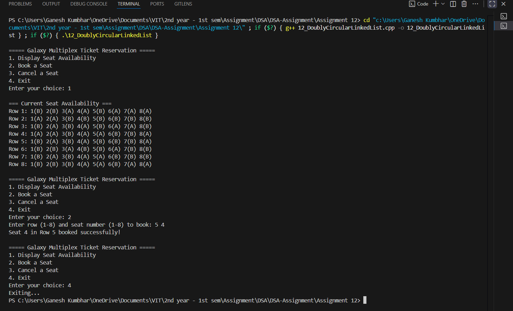

# Galaxy Multiplex Ticket Reservation System

## Theory

The **Galaxy Multiplex Ticket Reservation System** uses a **Doubly Circular Linked List (DCLL)** to represent seat availability in each of the 8 rows of a multiplex.  
Each row contains **8 seats**, and every seat node maintains the following data:

- `seat_no`: A unique seat number (1–8).
- `status`: Indicates whether the seat is available ('A') or booked ('B').
- `next` and `prev`: Pointers to the next and previous seats (circularly linked).

An **array of 8 head pointers** is maintained—each pointing to the first seat of a corresponding row.

### Objectives
1. **Display** the current seat availability.  
2. **Book** one or more seats.  
3. **Cancel** existing bookings.

This system demonstrates the concept of **Doubly Circular Linked Lists**, **pointer manipulation**, and **dynamic memory allocation** in C++.

---

## Algorithm

### Step 1: Initialization
1. Define a structure `Seat` with:
   - `int seat_no`
   - `char status`
   - `Seat *next`, `*prev`
2. Create an array `Seat* head[8]` for the 8 rows.
3. Initialize each row with 8 nodes linked circularly.
4. Randomly mark some seats as booked (`status = 'B'`).

### Step 2: Display Available Seats
1. Traverse each row circularly.
2. Print the seat number and status (`A` or `B`).
3. Continue until all rows are displayed.

### Step 3: Book Seat(s)
1. Input row number and seat numbers to be booked.
2. Traverse to the specified seat(s).
3. If seat is available (`A`), mark it as booked (`B`).
4. Otherwise, notify that the seat is already booked.

### Step 4: Cancel Booking
1. Input row number and seat numbers to cancel.
2. Traverse and change booked (`B`) status to available (`A`).
3. Display success message.

---

## Code

```cpp
#include <iostream>
#include <cstdlib>
using namespace std;

struct Seat_gsk {
    int seat_no_gsk;
    char status_gsk;
    Seat_gsk* next_gsk;
    Seat_gsk* prev_gsk;
};

class Multiplex_gsk {
    Seat_gsk* head_gsk[8]; // 8 rows

public:
    Multiplex_gsk() {
        for (int i_gsk = 0; i_gsk < 8; i_gsk++)
            head_gsk[i_gsk] = nullptr;
        createSeats_gsk();
    }

    void createSeats_gsk() {
        for (int i_gsk = 0; i_gsk < 8; i_gsk++) {
            Seat_gsk* last_gsk = nullptr;
            for (int j_gsk = 1; j_gsk <= 8; j_gsk++) {
                Seat_gsk* newSeat_gsk = new Seat_gsk;
                newSeat_gsk->seat_no_gsk = j_gsk;
                newSeat_gsk->status_gsk = (rand() % 2 == 0) ? 'A' : 'B'; // Randomly booked
                newSeat_gsk->next_gsk = newSeat_gsk->prev_gsk = nullptr;

                if (!head_gsk[i_gsk]) {
                    head_gsk[i_gsk] = newSeat_gsk;
                    newSeat_gsk->next_gsk = newSeat_gsk->prev_gsk = newSeat_gsk;
                    last_gsk = newSeat_gsk;
                } else {
                    newSeat_gsk->next_gsk = head_gsk[i_gsk];
                    newSeat_gsk->prev_gsk = last_gsk;
                    last_gsk->next_gsk = newSeat_gsk;
                    head_gsk[i_gsk]->prev_gsk = newSeat_gsk;
                    last_gsk = newSeat_gsk;
                }
            }
        }
    }

    void displaySeats_gsk() {
        cout << "\n=== Current Seat Availability ===\n";
        for (int i_gsk = 0; i_gsk < 8; i_gsk++) {
            cout << "Row " << i_gsk + 1 << ": ";
            Seat_gsk* temp_gsk = head_gsk[i_gsk];
            if (!temp_gsk) continue;
            do {
                cout << temp_gsk->seat_no_gsk << "(" << temp_gsk->status_gsk << ") ";
                temp_gsk = temp_gsk->next_gsk;
            } while (temp_gsk != head_gsk[i_gsk]);
            cout << endl;
        }
    }

    void bookSeat_gsk(int row_gsk, int seatNum_gsk) {
        if (row_gsk < 1 || row_gsk > 8 || seatNum_gsk < 1 || seatNum_gsk > 8) {
            cout << "Invalid seat or row number!\n";
            return;
        }
        Seat_gsk* temp_gsk = head_gsk[row_gsk - 1];
        do {
            if (temp_gsk->seat_no_gsk == seatNum_gsk) {
                if (temp_gsk->status_gsk == 'B') {
                    cout << "Seat " << seatNum_gsk << " in Row " << row_gsk << " is already booked.\n";
                    return;
                } else {
                    temp_gsk->status_gsk = 'B';
                    cout << "Seat " << seatNum_gsk << " in Row " << row_gsk << " booked successfully!\n";
                    return;
                }
            }
            temp_gsk = temp_gsk->next_gsk;
        } while (temp_gsk != head_gsk[row_gsk - 1]);
    }

    void cancelSeat_gsk(int row_gsk, int seatNum_gsk) {
        if (row_gsk < 1 || row_gsk > 8 || seatNum_gsk < 1 || seatNum_gsk > 8) {
            cout << "Invalid seat or row number!\n";
            return;
        }
        Seat_gsk* temp_gsk = head_gsk[row_gsk - 1];
        do {
            if (temp_gsk->seat_no_gsk == seatNum_gsk) {
                if (temp_gsk->status_gsk == 'A') {
                    cout << "Seat " << seatNum_gsk << " in Row " << row_gsk << " is not booked.\n";
                    return;
                } else {
                    temp_gsk->status_gsk = 'A';
                    cout << "Booking for Seat " << seatNum_gsk << " in Row " << row_gsk << " cancelled.\n";
                    return;
                }
            }
            temp_gsk = temp_gsk->next_gsk;
        } while (temp_gsk != head_gsk[row_gsk - 1]);
    }
};

int main() {
    Multiplex_gsk galaxy_gsk;
    int choice_gsk, row_gsk, seat_gsk;

    do {
        cout << "\n===== Galaxy Multiplex Ticket Reservation =====\n";
        cout << "1. Display Seat Availability\n";
        cout << "2. Book a Seat\n";
        cout << "3. Cancel a Seat\n";
        cout << "4. Exit\n";
        cout << "Enter your choice: ";
        cin >> choice_gsk;

        switch (choice_gsk) {
        case 1:
            galaxy_gsk.displaySeats_gsk();
            break;
        case 2:
            cout << "Enter row (1-8) and seat number (1-8) to book: ";
            cin >> row_gsk >> seat_gsk;
            galaxy_gsk.bookSeat_gsk(row_gsk, seat_gsk);
            break;
        case 3:
            cout << "Enter row (1-8) and seat number (1-8) to cancel: ";
            cin >> row_gsk >> seat_gsk;
            galaxy_gsk.cancelSeat_gsk(row_gsk, seat_gsk);
            break;
        case 4:
            cout << "Exiting...\n";
            break;
        default:
            cout << "Invalid choice!\n";
        }
    } while (choice_gsk != 4);

    return 0;
}

```

---

## Sample Output

```
===== Galaxy Multiplex Ticket Reservation =====
1. Display Seat Availability
2. Book a Seat
3. Cancel a Seat
4. Exit
Enter your choice: 1

=== Current Seat Availability ===
Row 1: 1(A) 2(B) 3(A) 4(B) 5(A) 6(A) 7(B) 8(A)
Row 2: 1(B) 2(B) 3(A) 4(A) 5(A) 6(B) 7(A) 8(A)
...
Row 8: 1(A) 2(A) 3(B) 4(B) 5(A) 6(B) 7(A) 8(A)

Enter your choice: 2
Enter row (1-8) and seat number (1-8) to book: 1 3
Seat 3 in Row 1 booked successfully!

Enter your choice: 3
Enter row (1-8) and seat number (1-8) to cancel: 2 6
Booking for Seat 6 in Row 2 cancelled.

Enter your choice: 4
Exiting...
```
