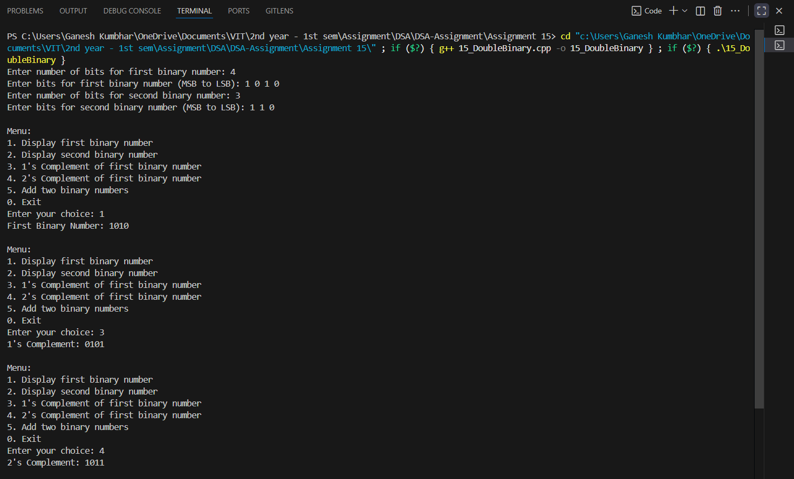
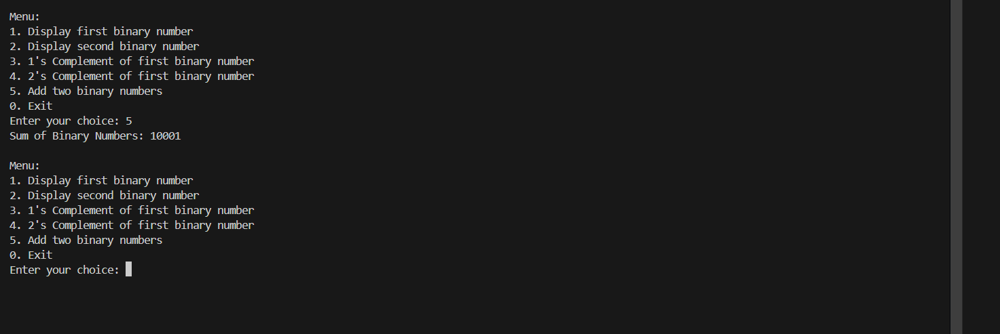

# Binary Number Operations using Doubly Linked List

## Theory
This program represents binary numbers using a doubly linked list and performs operations such as:
1. **1's Complement** - Inverts all bits of the binary number.
2. **2's Complement** - Adds 1 to the 1's complement of the binary number.
3. **Addition of Binary Numbers** - Adds two binary numbers represented as doubly linked lists, handling carry propagation.

---

## Algorithm

### 1's Complement
1. Traverse the list from head to tail.
2. Replace 0 with 1 and 1 with 0.
3. Display the result.

### 2's Complement
1. Start from the least significant bit (tail).
2. Add 1 to the 1's complement.
3. Propagate carry if needed.
4. Display the result.

### Binary Addition
1. Start from the least significant bits of both numbers (tails).
2. Add corresponding bits along with carry.
3. Create a new linked list for the result.
4. Reverse the list to get correct order.
5. Display the sum.

---

## Code

```cpp
#include <iostream>
using namespace std;

struct Node_gsk {
    int bit_gsk;
    Node_gsk* prev_gsk;
    Node_gsk* next_gsk;
};

class BinaryNumber_gsk {
    Node_gsk* head_gsk;
    Node_gsk* tail_gsk;
public:
    BinaryNumber_gsk() : head_gsk(nullptr), tail_gsk(nullptr) {}

    void addBit_gsk(int bit_gsk) {
        Node_gsk* newNode_gsk = new Node_gsk{bit_gsk, tail_gsk, nullptr};
        if (!head_gsk) head_gsk = newNode_gsk;
        if (tail_gsk) tail_gsk->next_gsk = newNode_gsk;
        tail_gsk = newNode_gsk;
    }

    void display_gsk() {
        Node_gsk* temp_gsk = head_gsk;
        while(temp_gsk) {
            cout << temp_gsk->bit_gsk;
            temp_gsk = temp_gsk->next_gsk;
        }
        cout << endl;
    }

    void onesComplement_gsk() {
        Node_gsk* temp_gsk = head_gsk;
        cout << "1's Complement: ";
        while(temp_gsk) {
            cout << (temp_gsk->bit_gsk == 0 ? 1 : 0);
            temp_gsk = temp_gsk->next_gsk;
        }
        cout << endl;
    }

    void twosComplement_gsk() {
        Node_gsk* temp_gsk = tail_gsk;
        bool carry_gsk = true;
        while(temp_gsk) {
            int bit_gsk = temp_gsk->bit_gsk;
            if(carry_gsk) {
                if(bit_gsk == 0) { bit_gsk = 1; carry_gsk = false; }
                else bit_gsk = 0;
            }
            temp_gsk->bit_gsk = bit_gsk;
            temp_gsk = temp_gsk->prev_gsk;
        }
        cout << "2's Complement: ";
        display_gsk();
    }

    static BinaryNumber_gsk addBinary_gsk(BinaryNumber_gsk& a_gsk, BinaryNumber_gsk& b_gsk) {
        BinaryNumber_gsk result_gsk;
        Node_gsk* p1_gsk = a_gsk.tail_gsk;
        Node_gsk* p2_gsk = b_gsk.tail_gsk;
        int carry_gsk = 0;

        while(p1_gsk || p2_gsk || carry_gsk) {
            int sum_gsk = carry_gsk;
            if(p1_gsk) { sum_gsk += p1_gsk->bit_gsk; p1_gsk = p1_gsk->prev_gsk; }
            if(p2_gsk) { sum_gsk += p2_gsk->bit_gsk; p2_gsk = p2_gsk->prev_gsk; }
            result_gsk.addBit_gsk(sum_gsk % 2);
            carry_gsk = sum_gsk / 2;
        }

        Node_gsk* curr_gsk = result_gsk.head_gsk;
        Node_gsk* prev_gsk = nullptr;
        Node_gsk* next_gsk;
        while(curr_gsk) {
            next_gsk = curr_gsk->next_gsk;
            curr_gsk->next_gsk = prev_gsk;
            curr_gsk->prev_gsk = next_gsk;
            prev_gsk = curr_gsk;
            curr_gsk = next_gsk;
        }
        result_gsk.tail_gsk = result_gsk.head_gsk;
        result_gsk.head_gsk = prev_gsk;

        return result_gsk;
    }
};

int main() {
    BinaryNumber_gsk bin1_gsk, bin2_gsk;
    int n1_gsk, n2_gsk, bit_gsk, choice_gsk;

    cout << "Enter number of bits for first binary number: ";
    cin >> n1_gsk;
    cout << "Enter bits for first binary number (MSB to LSB): ";
    for(int i=0;i<n1_gsk;i++) { cin >> bit_gsk; bin1_gsk.addBit_gsk(bit_gsk); }

    cout << "Enter number of bits for second binary number: ";
    cin >> n2_gsk;
    cout << "Enter bits for second binary number (MSB to LSB): ";
    for(int i=0;i<n2_gsk;i++) { cin >> bit_gsk; bin2_gsk.addBit_gsk(bit_gsk); }

    do {
        cout << "\nMenu:\n";
        cout << "1. Display first binary number\n";
        cout << "2. Display second binary number\n";
        cout << "3. 1's Complement of first binary number\n";
        cout << "4. 2's Complement of first binary number\n";
        cout << "5. Add two binary numbers\n";
        cout << "0. Exit\n";
        cout << "Enter your choice: ";
        cin >> choice_gsk;

        switch(choice_gsk) {
            case 1: cout << "First Binary Number: "; bin1_gsk.display_gsk(); break;
            case 2: cout << "Second Binary Number: "; bin2_gsk.display_gsk(); break;
            case 3: bin1_gsk.onesComplement_gsk(); break;
            case 4: bin1_gsk.twosComplement_gsk(); break;
            case 5: {
                BinaryNumber_gsk sum_gsk = BinaryNumber_gsk::addBinary_gsk(bin1_gsk, bin2_gsk);
                cout << "Sum of Binary Numbers: "; sum_gsk.display_gsk(); break;
            }
            case 0: cout << "Exiting program.\n"; break;
            default: cout << "Invalid choice. Try again.\n";
        }
    } while(choice_gsk != 0);

    return 0;
}
```
---

## Sample Output

```
Enter number of bits for first binary number: 4
Enter bits for first binary number (MSB to LSB): 1 0 1 1
Enter number of bits for second binary number: 3
Enter bits for second binary number (MSB to LSB): 1 1 0

Menu:
1. Display first binary number
2. Display second binary number
3. 1's Complement of first binary number
4. 2's Complement of first binary number
5. Add two binary numbers
0. Exit
Enter your choice: 1
First Binary Number: 1011

Enter your choice: 3
1's Complement: 0100

Enter your choice: 4
2's Complement: 0101

Enter your choice: 5
Sum of Binary Numbers: 10001

Enter your choice: 0
Exiting program.

```


