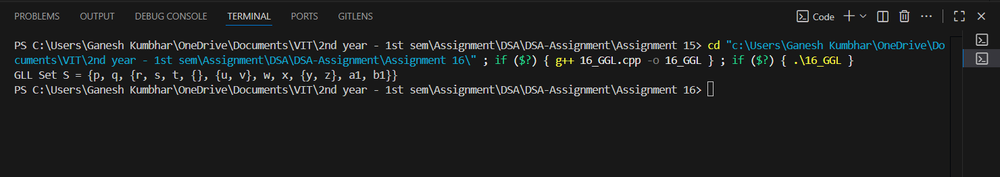

# Set Implementation using Generalized Linked List (GLL)

## Theory
A **Generalized Linked List (GLL)** allows storing both atoms (single elements) and sublists, enabling representation of hierarchical structures.  
In this program, we implement a **Set** using a GLL to handle nested sets and display them in proper set notation.

---

## Algorithm

### Insertion
1. If the element is atomic (single element), create a node with `isAtom = true`.
2. If the element is a sublist, recursively create a GLL for it.
3. Link elements using `next` pointers.

### Display
1. Traverse each node.
2. If the node is atomic, print its value.
3. If the node is a sublist, print `{`, recursively display its elements, then print `}`.
4. Separate elements with commas.

---

## Code

```cpp
#include <iostream>
#include <string>
using namespace std;

struct GLLNode_gsk {
    bool isAtom_gsk;
    string data_gsk;
    GLLNode_gsk* sublist_gsk;
    GLLNode_gsk* next_gsk;
};

GLLNode_gsk* createAtom_gsk(const string& val_gsk) {
    GLLNode_gsk* node_gsk = new GLLNode_gsk;
    node_gsk->isAtom_gsk = true;
    node_gsk->data_gsk = val_gsk;
    node_gsk->sublist_gsk = nullptr;
    node_gsk->next_gsk = nullptr;
    return node_gsk;
}

GLLNode_gsk* createList_gsk(GLLNode_gsk* sublist_gsk) {
    GLLNode_gsk* node_gsk = new GLLNode_gsk;
    node_gsk->isAtom_gsk = false;
    node_gsk->sublist_gsk = sublist_gsk;
    node_gsk->next_gsk = nullptr;
    return node_gsk;
}

void display_gsk(GLLNode_gsk* node_gsk) {
    cout << "{";
    GLLNode_gsk* temp_gsk = node_gsk;
    while(temp_gsk) {
        if(temp_gsk->isAtom_gsk) {
            cout << temp_gsk->data_gsk;
        } else {
            display_gsk(temp_gsk->sublist_gsk);
        }
        if(temp_gsk->next_gsk) cout << ", ";
        temp_gsk = temp_gsk->next_gsk;
    }
    cout << "}";
}

int main() {
    // Construct inner sublists
    GLLNode_gsk* empty_gsk = nullptr;
    GLLNode_gsk* u_gsk = createAtom_gsk("u");
    GLLNode_gsk* v_gsk = createAtom_gsk("v");
    u_gsk->next_gsk = v_gsk;
    GLLNode_gsk* uvList_gsk = createList_gsk(u_gsk);

    GLLNode_gsk* r_gsk = createAtom_gsk("r");
    GLLNode_gsk* s_gsk = createAtom_gsk("s");
    GLLNode_gsk* t_gsk = createAtom_gsk("t");
    GLLNode_gsk* empty2_gsk = createList_gsk(nullptr);
    GLLNode_gsk* w_gsk = createAtom_gsk("w");
    GLLNode_gsk* x_gsk = createAtom_gsk("x");
    GLLNode_gsk* y_gsk = createAtom_gsk("y");
    GLLNode_gsk* z_gsk = createAtom_gsk("z");
    y_gsk->next_gsk = z_gsk;
    GLLNode_gsk* yzList_gsk = createList_gsk(y_gsk);
    GLLNode_gsk* a1_gsk = createAtom_gsk("a1");
    GLLNode_gsk* b1_gsk = createAtom_gsk("b1");

    // Connect inner list elements
    r_gsk->next_gsk = s_gsk;
    s_gsk->next_gsk = t_gsk;
    t_gsk->next_gsk = empty2_gsk;
    empty2_gsk->next_gsk = uvList_gsk;
    uvList_gsk->next_gsk = w_gsk;
    w_gsk->next_gsk = x_gsk;
    x_gsk->next_gsk = yzList_gsk;
    yzList_gsk->next_gsk = a1_gsk;
    a1_gsk->next_gsk = b1_gsk;

    GLLNode_gsk* innerList_gsk = createList_gsk(r_gsk);

    // Top-level list
    GLLNode_gsk* p_gsk = createAtom_gsk("p");
    GLLNode_gsk* q_gsk = createAtom_gsk("q");
    p_gsk->next_gsk = q_gsk;
    q_gsk->next_gsk = innerList_gsk;

    // Display the GLL as set
    cout << "GLL Set S = ";
    display_gsk(p_gsk);
    cout << endl;

    return 0;
}

```
---

## Sample Output

```
The Set in GLL format is:
{p, q, {r, s, t, {}, {u, v}, w, x, {y, z}, a1, b1}}

```
