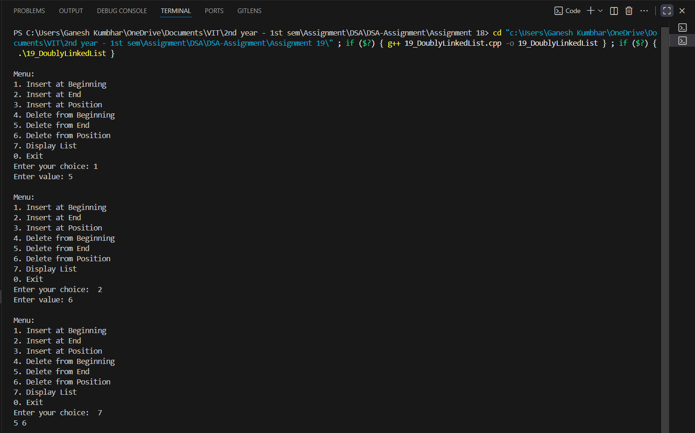

# Doubly Linked List Operations (Insert & Delete)

## Theory
This program demonstrates the implementation of a doubly linked list and provides insertion and deletion operations:
- **Insertion** can be performed at the beginning, at the end, or at a specific position.
- **Deletion** can be performed from the beginning, from the end, or at a specific position.
- A switch-case menu allows the user to choose operations interactively.

---

## Algorithm

### Insert Operation
1. Input the value to insert.
2. Choose the position: beginning, end, or specific position.
3. Adjust `prev` and `next` pointers to insert the new node.
4. Update the head if inserting at the beginning.

### Delete Operation
1. Choose the position: beginning, end, or specific position.
2. Adjust `prev` and `next` pointers to remove the node.
3. Delete the node to free memory.
4. Update the head if deleting the first node.

---

## Code

```cpp
#include <iostream>
using namespace std;

struct Node_gsk {
    int data_gsk;
    Node_gsk* prev_gsk;
    Node_gsk* next_gsk;
};

class DoublyLinkedList_gsk {
    Node_gsk* head_gsk;
public:
    DoublyLinkedList_gsk() : head_gsk(nullptr) {}

    void insertBeginning_gsk(int val_gsk) {
        Node_gsk* newNode_gsk = new Node_gsk{val_gsk, nullptr, head_gsk};
        if (head_gsk) head_gsk->prev_gsk = newNode_gsk;
        head_gsk = newNode_gsk;
    }

    void insertEnd_gsk(int val_gsk) {
        Node_gsk* newNode_gsk = new Node_gsk{val_gsk, nullptr, nullptr};
        if (!head_gsk) {
            head_gsk = newNode_gsk;
            return;
        }
        Node_gsk* temp_gsk = head_gsk;
        while (temp_gsk->next_gsk) temp_gsk = temp_gsk->next_gsk;
        temp_gsk->next_gsk = newNode_gsk;
        newNode_gsk->prev_gsk = temp_gsk;
    }

    void insertPosition_gsk(int val_gsk, int pos_gsk) {
        if (pos_gsk == 1) {
            insertBeginning_gsk(val_gsk);
            return;
        }
        Node_gsk* temp_gsk = head_gsk;
        for (int i = 1; i < pos_gsk - 1 && temp_gsk; i++) temp_gsk = temp_gsk->next_gsk;
        if (!temp_gsk) {
            cout << "Position out of range\n";
            return;
        }
        Node_gsk* newNode_gsk = new Node_gsk{val_gsk, temp_gsk, temp_gsk->next_gsk};
        if (temp_gsk->next_gsk) temp_gsk->next_gsk->prev_gsk = newNode_gsk;
        temp_gsk->next_gsk = newNode_gsk;
    }

    void deleteBeginning_gsk() {
        if (!head_gsk) return;
        Node_gsk* temp_gsk = head_gsk;
        head_gsk = head_gsk->next_gsk;
        if (head_gsk) head_gsk->prev_gsk = nullptr;
        delete temp_gsk;
    }

    void deleteEnd_gsk() {
        if (!head_gsk) return;
        Node_gsk* temp_gsk = head_gsk;
        while (temp_gsk->next_gsk) temp_gsk = temp_gsk->next_gsk;
        if (temp_gsk->prev_gsk) temp_gsk->prev_gsk->next_gsk = nullptr;
        else head_gsk = nullptr;
        delete temp_gsk;
    }

    void deletePosition_gsk(int pos_gsk) {
        if (!head_gsk) return;
        if (pos_gsk == 1) {
            deleteBeginning_gsk();
            return;
        }
        Node_gsk* temp_gsk = head_gsk;
        for (int i = 1; i < pos_gsk && temp_gsk; i++) temp_gsk = temp_gsk->next_gsk;
        if (!temp_gsk) {
            cout << "Position out of range\n";
            return;
        }
        if (temp_gsk->prev_gsk) temp_gsk->prev_gsk->next_gsk = temp_gsk->next_gsk;
        if (temp_gsk->next_gsk) temp_gsk->next_gsk->prev_gsk = temp_gsk->prev_gsk;
        delete temp_gsk;
    }

    void display_gsk() const {
        Node_gsk* temp_gsk = head_gsk;
        if (!temp_gsk) {
            cout << "List is empty\n";
            return;
        }
        while (temp_gsk) {
            cout << temp_gsk->data_gsk << " ";
            temp_gsk = temp_gsk->next_gsk;
        }
        cout << endl;
    }
};

int main() {
    DoublyLinkedList_gsk dll_gsk;
    int choice_gsk, val_gsk, pos_gsk;

    do {
        cout << "\nMenu:\n";
        cout << "1. Insert at Beginning\n";
        cout << "2. Insert at End\n";
        cout << "3. Insert at Position\n";
        cout << "4. Delete from Beginning\n";
        cout << "5. Delete from End\n";
        cout << "6. Delete from Position\n";
        cout << "7. Display List\n";
        cout << "0. Exit\n";
        cout << "Enter your choice: ";
        cin >> choice_gsk;

        switch(choice_gsk) {
            case 1:
                cout << "Enter value: ";
                cin >> val_gsk;
                dll_gsk.insertBeginning_gsk(val_gsk);
                break;
            case 2:
                cout << "Enter value: ";
                cin >> val_gsk;
                dll_gsk.insertEnd_gsk(val_gsk);
                break;
            case 3:
                cout << "Enter value and position: ";
                cin >> val_gsk >> pos_gsk;
                dll_gsk.insertPosition_gsk(val_gsk, pos_gsk);
                break;
            case 4:
                dll_gsk.deleteBeginning_gsk();
                break;
            case 5:
                dll_gsk.deleteEnd_gsk();
                break;
            case 6:
                cout << "Enter position to delete: ";
                cin >> pos_gsk;
                dll_gsk.deletePosition_gsk(pos_gsk);
                break;
            case 7:
                dll_gsk.display_gsk();
                break;
            case 0:
                cout << "Exiting program.\n";
                break;
            default:
                cout << "Invalid choice. Try again.\n";
        }
    } while (choice_gsk != 0);

    return 0;
}
```
---
## Sample Output
```
Menu:
1. Insert at Beginning
2. Insert at End
3. Insert at Position
4. Delete from Beginning
5. Delete from End
6. Delete from Position
7. Display List
0. Exit
Enter your choice: 1
Enter value: 10

Enter your choice: 2
Enter value: 20

Enter your choice: 3
Enter value and position: 15 2

Enter your choice: 7
10 15 20

Enter your choice: 4

Enter your choice: 7
15 20

Enter your choice: 0
Exiting program.

```
