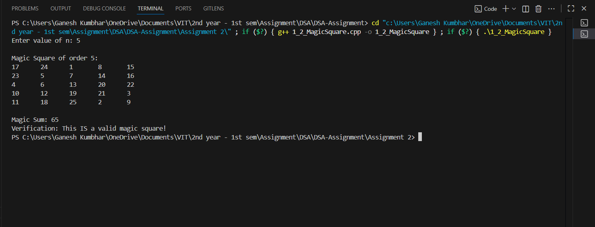

# Magic Square Construction and Verification

## Theory

A **magic square** is a square array of numbers where the sums of the numbers in each row, each column, and both main diagonals are equal. This constant sum is known as the **magic constant** and is given by:

\[
\text{Magic Constant} = \frac{n \times (n^2 + 1)}{2}
\]

Magic squares are classified by their order \(n\):

- **Odd order** (\(n\) odd): Constructed using the Siamese method, which uses a specific wrapping pattern to place numbers.
- **Doubly-even order** (\(n\) divisible by 4): Constructed through complementing technique on particular cells.
- **Singly-even order** (\(n\) even but not divisible by 4): Usually requires more advanced algorithms.

The program builds the magic square according to these rules and verifies correctness by checking that all rows, columns, and diagonals sum to the magic constant.


## Algorithm

1. Input the value of `n`.  
2. If `n < 3`, display an error.  
3. If `n` is odd:  
   - Use the Siamese method: start at the middle of the first row, place numbers sequentially, moving up and right, wrapping around, and adjusting if the cell is already filled.  
4. If `n` is doubly even (`n % 4 == 0`):  
   - Use a pattern method where certain positions are filled with decreasing values while others are filled normally.  
5. Print the magic square.  
6. Calculate the magic sum.  
7. Verify whether the generated square is valid.  

## Code

```cpp
#include <iostream>
#include <vector>
using namespace std;

// Odd-order (Siamese method)
void generateOddMagicSquare_gsk(int n_gsk, vector<vector<int>>& square_gsk) {
    int num_gsk, row_gsk = 0, col_gsk = n_gsk / 2, next_row_gsk, next_col_gsk;
    for (num_gsk = 1; num_gsk <= n_gsk * n_gsk; num_gsk++) {
        square_gsk[row_gsk][col_gsk] = num_gsk;
        next_row_gsk = row_gsk - 1;
        next_col_gsk = col_gsk + 1;

        if (next_row_gsk < 0) next_row_gsk = n_gsk - 1;
        if (next_col_gsk == n_gsk) next_col_gsk = 0;

        if (square_gsk[next_row_gsk][next_col_gsk] != 0) {
            next_row_gsk = (row_gsk + 1) % n_gsk;
            next_col_gsk = col_gsk;
        }
        row_gsk = next_row_gsk;
        col_gsk = next_col_gsk;
    }
}

// Doubly-even order (n % 4 == 0)
void generateDoublyEvenMagicSquare_gsk(int n_gsk, vector<vector<int>>& square_gsk) {
    int num_gsk = 1;
    int total_gsk = n_gsk * n_gsk;

    for (int i_gsk = 0; i_gsk < n_gsk; i_gsk++) {
        for (int j_gsk = 0; j_gsk < n_gsk; j_gsk++) {
            if ((i_gsk % 4 == j_gsk % 4) || ((i_gsk % 4 + j_gsk % 4) == 3))
                square_gsk[i_gsk][j_gsk] = total_gsk - num_gsk + 1;
            else
                square_gsk[i_gsk][j_gsk] = num_gsk;
            num_gsk++;
        }
    }
}

// Verifies all rows, columns, and diagonals
bool verifyMagicSquare_gsk(int n_gsk, vector<vector<int>>& square_gsk, int magicSum_gsk) {
    int sum_gsk;

    // Check rows
    for (int i_gsk = 0; i_gsk < n_gsk; i_gsk++) {
        sum_gsk = 0;
        for (int j_gsk = 0; j_gsk < n_gsk; j_gsk++) sum_gsk += square_gsk[i_gsk][j_gsk];
        if (sum_gsk != magicSum_gsk) return false;
    }
    // Check columns
    for (int j_gsk = 0; j_gsk < n_gsk; j_gsk++) {
        sum_gsk = 0;
        for (int i_gsk = 0; i_gsk < n_gsk; i_gsk++) sum_gsk += square_gsk[i_gsk][j_gsk];
        if (sum_gsk != magicSum_gsk) return false;
    }
    // Main diagonal
    sum_gsk = 0;
    for (int i_gsk = 0; i_gsk < n_gsk; i_gsk++) sum_gsk += square_gsk[i_gsk][i_gsk];
    if (sum_gsk != magicSum_gsk) return false;

    // Secondary diagonal
    sum_gsk = 0;
    for (int i_gsk = 0; i_gsk < n_gsk; i_gsk++) sum_gsk += square_gsk[i_gsk][n_gsk - i_gsk - 1];
    if (sum_gsk != magicSum_gsk) return false;

    return true;
}

int main() {
    int n_gsk;
    cout << "Enter value of n: ";
    cin >> n_gsk;

    if (n_gsk < 3) {
        cout << "Error: n must be >= 3." << endl;
        return 1;
    }

    // Create n x n vector initialized with 0
    vector<vector<int>> square_gsk(n_gsk, vector<int>(n_gsk, 0));

    // Construct magic square
    if (n_gsk % 2 == 1)
        generateOddMagicSquare_gsk(n_gsk, square_gsk);
    else if (n_gsk % 4 == 0)
        generateDoublyEvenMagicSquare_gsk(n_gsk, square_gsk);
    else {
        cout << "Singly even (n % 4 == 2) magic square not implemented in this simple version." << endl;
        return 1;
    }

    // Print magic square
    cout << "\nMagic Square of order " << n_gsk << ":\n";
    for (int i_gsk = 0; i_gsk < n_gsk; i_gsk++) {
        for (int j_gsk = 0; j_gsk < n_gsk; j_gsk++)
            cout << square_gsk[i_gsk][j_gsk] << "\t";
        cout << endl;
    }

    int magicSum_gsk = n_gsk * (n_gsk * n_gsk + 1) / 2;
    cout << "\nMagic Sum: " << magicSum_gsk << endl;

    // Verify
    if (verifyMagicSquare_gsk(n_gsk, square_gsk, magicSum_gsk))
        cout << "Verification: This IS a valid magic square!" << endl;
    else
        cout << "Verification: This is NOT a valid magic square." << endl;

    return 0;
}


```

## Sample Output

**Input:**  
```
Enter value of n: 3
```

**Output:**  
```
Magic Square of order 3:
 8  1  6
 3  5  7
 4  9  2

Magic Sum: 15
Verification: This IS a valid magic square!
```

---

**Input:**  
```
Enter value of n: 4
```

**Output:**  
```
Magic Square of order 4:
16  2  3 13
 5 11 10  8
 9  7  6 12
 4 14 15  1

Magic Sum: 34
Verification: This IS a valid magic square!
```
