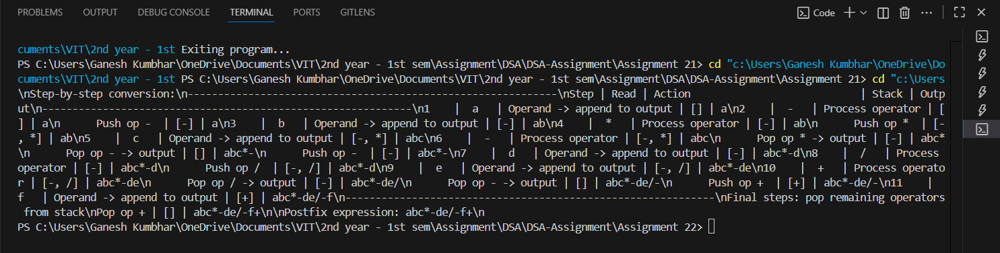

# Infix → Postfix Conversion using Stack (step-by-step)

## Theory
Converting an infix expression (e.g. `a-b*c-d/e+f`) to postfix (Reverse Polish Notation) requires handling operator precedence and parentheses.  
A stack is used to temporarily hold operators; operands are appended directly to the output. When an operator with lower or equal precedence is encountered, operators are popped from the stack to the output.

This program:
1. Reads an infix expression from the user.
2. Converts it to postfix while printing **step-by-step** actions (what was read, what was pushed/popped, current stack and current postfix).
3. Handles `+ - * / ^` and parentheses `(` `)`. `^` is treated as right-associative.

---

## Algorithm
1. Initialize an empty stack and empty output string.
2. Scan the infix expression left to right.
   - If token is an operand (alphanumeric), append to output.
   - If token is `'('`, push it onto the stack.
   - If token is `')'`, pop operators from stack to output until `'('` is encountered (pop the `'('` too).
   - If token is an operator `op`:
     - While there is an operator at the top of the stack with greater precedence, or equal precedence and `op` is left-associative, pop it to the output.
     - Push `op` onto the stack.
3. After scanning, pop any remaining operators from the stack to the output.
4. The output string is the postfix expression.

---

## Code

```cpp
#include <iostream>
#include <string>
#include <vector>
#include <cctype>
using namespace std;

int precedence_gsk(char op_gsk) {
    if (op_gsk == '+' || op_gsk == '-') return 1;
    if (op_gsk == '*' || op_gsk == '/') return 2;
    if (op_gsk == '^') return 3;
    return 0;
}

bool isOperator_gsk(char ch_gsk) {
    return ch_gsk == '+' || ch_gsk == '-' || ch_gsk == '*' || ch_gsk == '/' || ch_gsk == '^';
}

string showStack_gsk(const vector<char>& stk_gsk) {
    if (stk_gsk.empty()) return "[]";
    string s_gsk = "[";
    for (size_t i = 0; i < stk_gsk.size(); ++i) {
        s_gsk += stk_gsk[i];
        if (i + 1 < stk_gsk.size()) s_gsk += ", ";
    }
    s_gsk += "]";
    return s_gsk;
}

int main() {
    string expr_gsk;
    cout << "Enter infix expression (e.g. a-b*c-d/e+f): ";
    getline(cin, expr_gsk);

    string input_gsk;
    for (char c : expr_gsk) if (c != ' ') input_gsk.push_back(c);

    vector<char> stack_gsk;
    string output_gsk;
    int step_gsk = 1;

    cout << "\\nStep-by-step conversion:\\n";
    cout << "-------------------------------------------------------------\\n";
    cout << "Step | Read | Action                            | Stack | Output\\n";
    cout << "-------------------------------------------------------------\\n";

    for (size_t i = 0; i < input_gsk.size(); ++i) {
        char ch_gsk = input_gsk[i];
        string action_gsk;

        if (isalnum((unsigned char)ch_gsk)) {
            output_gsk.push_back(ch_gsk);
            action_gsk = "Operand -> append to output";
            cout << step_gsk++ << "    |  " << ch_gsk << "   | " << action_gsk;
            cout << " | " << showStack_gsk(stack_gsk) << " | " << output_gsk << "\\n";
        } else if (ch_gsk == '(') {
            stack_gsk.push_back(ch_gsk);
            action_gsk = "Push '('";
            cout << step_gsk++ << "    |  " << ch_gsk << "   | " << action_gsk;
            cout << " | " << showStack_gsk(stack_gsk) << " | " << output_gsk << "\\n";
        } else if (ch_gsk == ')') {
            action_gsk = "Pop until '(' -> ";
            cout << step_gsk++ << "    |  " << ch_gsk << "   | ";
            while (!stack_gsk.empty() && stack_gsk.back() != '(') {
                output_gsk.push_back(stack_gsk.back());
                action_gsk += string(1, stack_gsk.back()) + " ";
                stack_gsk.pop_back();
            }
            if (!stack_gsk.empty() && stack_gsk.back() == '(') stack_gsk.pop_back();
            cout << action_gsk;
            cout << " | " << showStack_gsk(stack_gsk) << " | " << output_gsk << "\\n";
        } else if (isOperator_gsk(ch_gsk)) {
            action_gsk = "Process operator";
            cout << step_gsk++ << "    |  " << ch_gsk << "   | " << action_gsk;
            cout << " | " << showStack_gsk(stack_gsk) << " | " << output_gsk << "\\n";

            while (!stack_gsk.empty() && stack_gsk.back() != '(') {
                char top_gsk = stack_gsk.back();
                int precTop_gsk = precedence_gsk(top_gsk);
                int precCh_gsk = precedence_gsk(ch_gsk);

                if (precTop_gsk > precCh_gsk || (precTop_gsk == precCh_gsk && ch_gsk != '^')) {
                    stack_gsk.pop_back();
                    output_gsk.push_back(top_gsk);
                    cout << "      Pop op " << top_gsk << " -> output";
                    cout << " | " << showStack_gsk(stack_gsk) << " | " << output_gsk << "\\n";
                } else {
                    break;
                }
            }
            stack_gsk.push_back(ch_gsk);
            cout << "      Push op " << ch_gsk << " ";
            cout << " | " << showStack_gsk(stack_gsk) << " | " << output_gsk << "\\n";
        } else {
            cout << step_gsk++ << "    |  " << ch_gsk << "   | ignored (unknown char)";
            cout << " | " << showStack_gsk(stack_gsk) << " | " << output_gsk << "\\n";
        }
    }

    cout << "-------------------------------------------------------------\\n";
    cout << "Final steps: pop remaining operators from stack\\n";
    while (!stack_gsk.empty()) {
        if (stack_gsk.back() == '(' || stack_gsk.back() == ')') {
            stack_gsk.pop_back();
        } else {
            char op_gsk = stack_gsk.back();
            stack_gsk.pop_back();
            output_gsk.push_back(op_gsk);
            cout << "Pop op " << op_gsk << " | " << showStack_gsk(stack_gsk) << " | " << output_gsk << "\\n";
        }
    }

    cout << "\\nPostfix expression: " << output_gsk << "\\n";
    return 0;
}
```
---

## Sample Output

```
Enter infix expression (e.g. a-b*c-d/e+f): a-b*c-d/e+f

Step-by-step conversion:
-------------------------------------------------------------
Step | Read | Action                            | Stack | Output
-------------------------------------------------------------
1    |  a   | Operand -> append to output       | [] | a
2    |  -   | Process operator                  | [] | a
      Push op -  | [-] | a
3    |  b   | Operand -> append to output       | [-] | ab
4    |  *   | Process operator                  | [-] | ab
      Push op *  | [-, *] | ab
5    |  c   | Operand -> append to output       | [-, *] | abc
6    |  -   | Process operator                  | [-, *] | abc
      Pop op * -> output               | [-] | abc*
      Pop op - -> output               | [] | abc*-
      Push op -                        | [-] | abc*-
7    |  d   | Operand -> append to output       | [-] | abc*-d
8    |  /   | Process operator                  | [-] | abc*-d
      Push op /                         | [-, /] | abc*-d
9    |  e   | Operand -> append to output       | [-, /] | abc*-de
10   |  +   | Process operator                  | [-, /] | abc*-de
      Pop op / -> output               | [-] | abc*-de/
      Pop op - -> output               | [] | abc*-de/-
      Push op +                        | [+] | abc*-de/-
11   |  f   | Operand -> append to output       | [+] | abc*-de/-f
-------------------------------------------------------------
Final steps: pop remaining operators from stack
Pop op + | [] | abc*-de/-f+

Postfix expression: abc*-de/-f+

```
