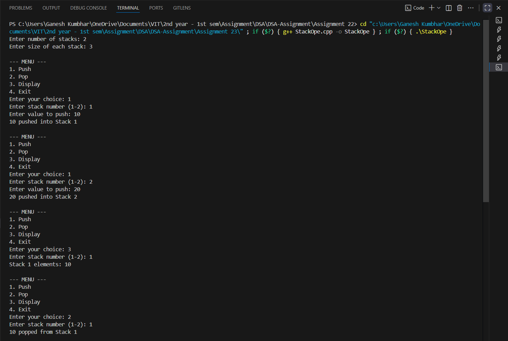
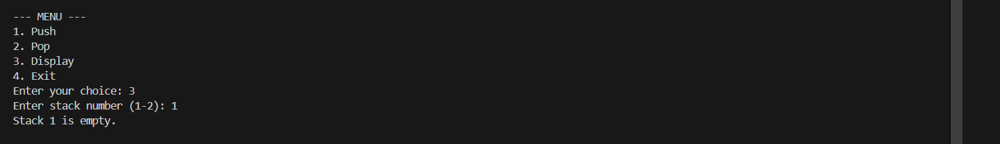

# Multiple Stack Implementation using Array (C++)

## Theory
A **multiple stack** implementation allows two or more stacks to share the same array.  
The idea is to divide a single array logically into multiple sections, each representing a separate stack.  
Each stack has its own top pointer and operates independently with push and pop operations.

This approach is memory-efficient because multiple stacks share a common array, reducing unused memory.

---

## Algorithm
1. Initialize `n` stacks using an array and maintain an array of top indices for each stack.
2. For **Push**:
   - Check for **overflow** (stack is full).
   - Insert the element at the current top + 1 position.
3. For **Pop**:
   - Check for **underflow** (stack is empty).
   - Remove the element from the current top position.
4. For **Display**:
   - Print all elements of a specific stack.
5. Use a **switch case menu** to perform the above operations.

---

## Code

```cpp
#include <iostream>
using namespace std;

#define MAX 100

class MultiStack_gsk {
    int arr_gsk[MAX];
    int top_gsk[10];
    int base_gsk[10];
    int stackCount_gsk;
    int size_gsk;

public:
    MultiStack_gsk(int n_gsk, int sizeEach_gsk) {
        stackCount_gsk = n_gsk;
        size_gsk = sizeEach_gsk;
        for (int i = 0; i < stackCount_gsk; i++) {
            base_gsk[i] = i * size_gsk;
            top_gsk[i] = base_gsk[i] - 1;
        }
    }

    void push_gsk(int stackNum_gsk, int val_gsk) {
        if (stackNum_gsk >= stackCount_gsk || stackNum_gsk < 0) {
            cout << "Invalid stack number!" << endl;
            return;
        }
        if (top_gsk[stackNum_gsk] == base_gsk[stackNum_gsk] + size_gsk - 1) {
            cout << "Stack Overflow in Stack " << stackNum_gsk + 1 << endl;
            return;
        }
        arr_gsk[++top_gsk[stackNum_gsk]] = val_gsk;
        cout << val_gsk << " pushed into Stack " << stackNum_gsk + 1 << endl;
    }

    void pop_gsk(int stackNum_gsk) {
        if (stackNum_gsk >= stackCount_gsk || stackNum_gsk < 0) {
            cout << "Invalid stack number!" << endl;
            return;
        }
        if (top_gsk[stackNum_gsk] < base_gsk[stackNum_gsk]) {
            cout << "Stack Underflow in Stack " << stackNum_gsk + 1 << endl;
            return;
        }
        cout << arr_gsk[top_gsk[stackNum_gsk]--] << " popped from Stack " << stackNum_gsk + 1 << endl;
    }

    void display_gsk(int stackNum_gsk) {
        if (stackNum_gsk >= stackCount_gsk || stackNum_gsk < 0) {
            cout << "Invalid stack number!" << endl;
            return;
        }
        if (top_gsk[stackNum_gsk] < base_gsk[stackNum_gsk]) {
            cout << "Stack " << stackNum_gsk + 1 << " is empty." << endl;
            return;
        }
        cout << "Stack " << stackNum_gsk + 1 << " elements: ";
        for (int i = base_gsk[stackNum_gsk]; i <= top_gsk[stackNum_gsk]; i++)
            cout << arr_gsk[i] << " ";
        cout << endl;
    }
};

int main() {
    int n_gsk, sizeEach_gsk;
    cout << "Enter number of stacks: ";
    cin >> n_gsk;
    cout << "Enter size of each stack: ";
    cin >> sizeEach_gsk;

    MultiStack_gsk ms_gsk(n_gsk, sizeEach_gsk);

    int choice_gsk, stackNum_gsk, val_gsk;
    do {
        cout << "\n--- MENU ---\n";
        cout << "1. Push\n2. Pop\n3. Display\n4. Exit\n";
        cout << "Enter your choice: ";
        cin >> choice_gsk;

        switch (choice_gsk) {
            case 1:
                cout << "Enter stack number (1-" << n_gsk << "): ";
                cin >> stackNum_gsk;
                cout << "Enter value to push: ";
                cin >> val_gsk;
                ms_gsk.push_gsk(stackNum_gsk - 1, val_gsk);
                break;
            case 2:
                cout << "Enter stack number (1-" << n_gsk << "): ";
                cin >> stackNum_gsk;
                ms_gsk.pop_gsk(stackNum_gsk - 1);
                break;
            case 3:
                cout << "Enter stack number (1-" << n_gsk << "): ";
                cin >> stackNum_gsk;
                ms_gsk.display_gsk(stackNum_gsk - 1);
                break;
            case 4:
                cout << "Exiting..." << endl;
                break;
            default:
                cout << "Invalid choice!" << endl;
        }
    } while (choice_gsk != 4);

    return 0;
}
```
---

## Sample Output

```
Enter number of stacks: 2
Enter size of each stack: 3

--- MENU ---
1. Push
2. Pop
3. Display
4. Exit
Enter your choice: 1
Enter stack number (1-2): 1
Enter value to push: 10
10 pushed into Stack 1

Enter your choice: 1
Enter stack number (1-2): 2
Enter value to push: 20
20 pushed into Stack 2

Enter your choice: 3
Enter stack number (1-2): 1
Stack 1 elements: 10

Enter your choice: 2
Enter stack number (1-2): 1
10 popped from Stack 1

Enter your choice: 3
Enter stack number (1-2): 1
Stack 1 is empty.

Enter your choice: 4
Exiting...
```



