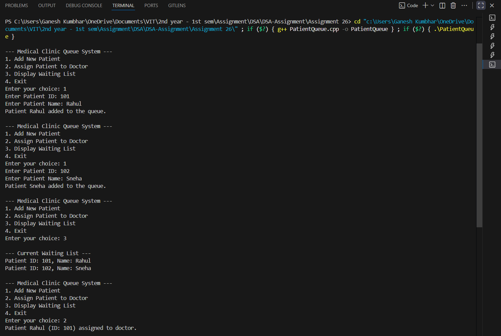
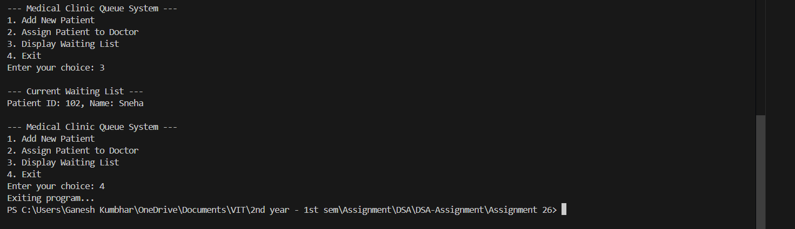

# Patient Queue Management System using Linked List

## Theory
In a **medical clinic**, patients arrive randomly and are assigned to doctors in a **first-come, first-served (FCFS)** manner.  
To manage this efficiently, a **queue data structure** can be used — where patients are added (enqueued) at the rear and removed (dequeued) from the front.

A **linked list implementation** of a queue dynamically allocates memory for each patient node, making it flexible for varying patient counts.

---

## Algorithm

1. **Start**
2. Initialize `front` and `rear` pointers as `NULL`.
3. Display menu:
   - 1. Add (enqueue) new patient  
   - 2. Assign (dequeue) patient to doctor  
   - 3. Display waiting list  
   - 4. Exit
4. **For Add operation:**
   - Create a new node with patient details.
   - If queue empty, set both `front` and `rear` to new node.
   - Else, link it at the end and update `rear`.
5. **For Assign operation:**
   - Remove the node at `front` and assign the patient to the doctor.
   - Update `front` to the next node.
6. **For Display operation:**
   - Traverse from `front` to `rear` and print all patients.
7. Repeat until user chooses Exit.
8. **End**

---

## Program Code

```cpp
#include <iostream>
#include <string>
using namespace std;

struct Patient_gsk {
    int id_gsk;
    string name_gsk;
    Patient_gsk* next_gsk;
};

class ClinicQueue_gsk {
    Patient_gsk* front_gsk;
    Patient_gsk* rear_gsk;
public:
    ClinicQueue_gsk() {
        front_gsk = rear_gsk = nullptr;
    }

    void addPatient_gsk(int id_gsk, string name_gsk) {
        Patient_gsk* newPatient_gsk = new Patient_gsk();
        newPatient_gsk->id_gsk = id_gsk;
        newPatient_gsk->name_gsk = name_gsk;
        newPatient_gsk->next_gsk = nullptr;

        if (rear_gsk == nullptr) {
            front_gsk = rear_gsk = newPatient_gsk;
            cout << "Patient " << name_gsk << " added to the queue.\n";
            return;
        }

        rear_gsk->next_gsk = newPatient_gsk;
        rear_gsk = newPatient_gsk;
        cout << "Patient " << name_gsk << " added to the queue.\n";
    }

    void assignDoctor_gsk() {
        if (front_gsk == nullptr) {
            cout << "No patients waiting.\n";
            return;
        }

        Patient_gsk* temp_gsk = front_gsk;
        cout << "Patient " << temp_gsk->name_gsk << " (ID: " << temp_gsk->id_gsk << ") assigned to doctor.\n";
        front_gsk = front_gsk->next_gsk;

        if (front_gsk == nullptr) rear_gsk = nullptr;
        delete temp_gsk;
    }

    void displayQueue_gsk() {
        if (front_gsk == nullptr) {
            cout << "No patients currently waiting.\n";
            return;
        }

        Patient_gsk* temp_gsk = front_gsk;
        cout << "\n--- Current Waiting List ---\n";
        while (temp_gsk != nullptr) {
            cout << "Patient ID: " << temp_gsk->id_gsk << ", Name: " << temp_gsk->name_gsk << endl;
            temp_gsk = temp_gsk->next_gsk;
        }
    }
};

int main() {
    ClinicQueue_gsk clinic_gsk;
    int choice_gsk, id_gsk;
    string name_gsk;

    do {
        cout << "\n--- Medical Clinic Queue System ---\n";
        cout << "1. Add New Patient\n2. Assign Patient to Doctor\n3. Display Waiting List\n4. Exit\n";
        cout << "Enter your choice: ";
        cin >> choice_gsk;

        switch (choice_gsk) {
            case 1:
                cout << "Enter Patient ID: ";
                cin >> id_gsk;
                cout << "Enter Patient Name: ";
                cin >> name_gsk;
                clinic_gsk.addPatient_gsk(id_gsk, name_gsk);
                break;
            case 2:
                clinic_gsk.assignDoctor_gsk();
                break;
            case 3:
                clinic_gsk.displayQueue_gsk();
                break;
            case 4:
                cout << "Exiting program...\n";
                break;
            default:
                cout << "Invalid choice! Try again.\n";
        }
    } while (choice_gsk != 4);

    return 0;
}
```
---

## Sample Output

```
--- Medical Clinic Queue System ---
1. Add New Patient
2. Assign Patient to Doctor
3. Display Waiting List
4. Exit
Enter your choice: 1
Enter Patient ID: 101
Enter Patient Name: Rahul
Patient Rahul added to the queue.

Enter your choice: 1
Enter Patient ID: 102
Enter Patient Name: Sneha
Patient Sneha added to the queue.

Enter your choice: 3

--- Current Waiting List ---
Patient ID: 101, Name: Rahul
Patient ID: 102, Name: Sneha

Enter your choice: 2
Patient Rahul (ID: 101) assigned to doctor.

Enter your choice: 3
--- Current Waiting List ---
Patient ID: 102, Name: Sneha

Enter your choice: 4
Exiting program...
```

