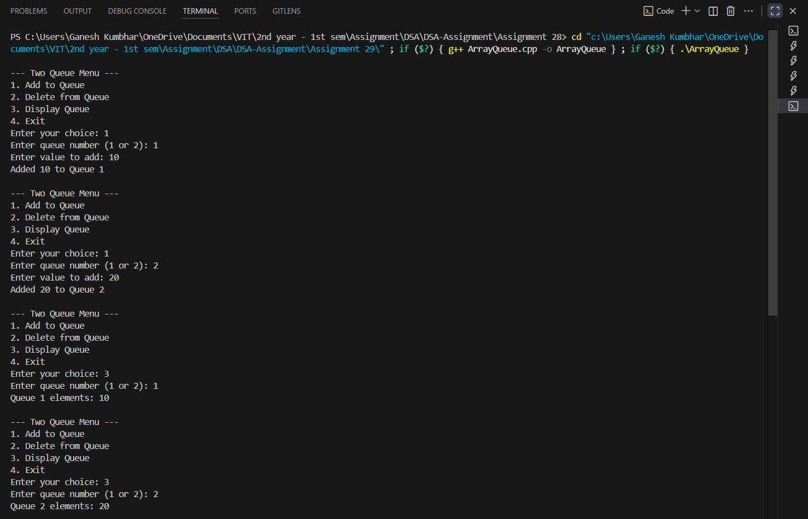
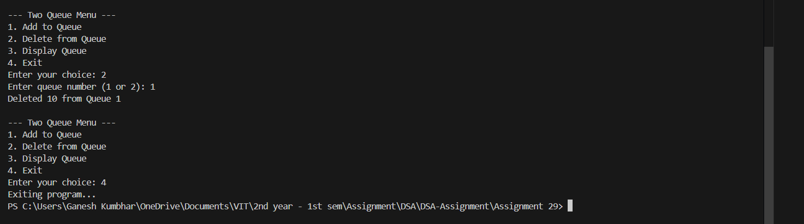

# Two Queues using Array

## Theory
A **queue** is a linear data structure that follows the **First-In-First-Out (FIFO)** principle.  
Here, we implement **two queues** using arrays and allow the user to:
- Add elements to either queue.
- Delete elements from either queue.
- Display the elements of either queue.

---

## Algorithm

1. **Start**
2. Initialize two arrays to represent Queue1 and Queue2 along with front and rear pointers.
3. Display menu:
   - 1. Add to Queue
   - 2. Delete from Queue
   - 3. Display Queue
   - 4. Exit
4. **Add to Queue:**
   - Ask which queue (1 or 2).
   - Insert element at the rear if space is available.
5. **Delete from Queue:**
   - Ask which queue (1 or 2).
   - Remove element from the front if the queue is not empty.
6. **Display Queue:**
   - Ask which queue (1 or 2).
   - Print elements from front to rear.
7. Repeat until user chooses Exit.
8. **End**

---

## Program Code

```cpp
#include <iostream>
using namespace std;

#define MAX 50

class TwoQueue_gsk {
    int queue1_gsk[MAX], queue2_gsk[MAX];
    int front1_gsk, rear1_gsk, front2_gsk, rear2_gsk;
public:
    TwoQueue_gsk() {
        front1_gsk = rear1_gsk = -1;
        front2_gsk = rear2_gsk = -1;
    }

    void addQueue_gsk(int qNum_gsk, int value_gsk) {
        if (qNum_gsk == 1) {
            if (rear1_gsk == MAX - 1) {
                cout << "Queue 1 Overflow\n";
                return;
            }
            if (front1_gsk == -1) front1_gsk = 0;
            queue1_gsk[++rear1_gsk] = value_gsk;
            cout << "Added " << value_gsk << " to Queue 1\n";
        } else {
            if (rear2_gsk == MAX - 1) {
                cout << "Queue 2 Overflow\n";
                return;
            }
            if (front2_gsk == -1) front2_gsk = 0;
            queue2_gsk[++rear2_gsk] = value_gsk;
            cout << "Added " << value_gsk << " to Queue 2\n";
        }
    }

    void deleteQueue_gsk(int qNum_gsk) {
        if (qNum_gsk == 1) {
            if (front1_gsk == -1 || front1_gsk > rear1_gsk) {
                cout << "Queue 1 Underflow\n";
                return;
            }
            cout << "Deleted " << queue1_gsk[front1_gsk++] << " from Queue 1\n";
            if (front1_gsk > rear1_gsk) front1_gsk = rear1_gsk = -1;
        } else {
            if (front2_gsk == -1 || front2_gsk > rear2_gsk) {
                cout << "Queue 2 Underflow\n";
                return;
            }
            cout << "Deleted " << queue2_gsk[front2_gsk++] << " from Queue 2\n";
            if (front2_gsk > rear2_gsk) front2_gsk = rear2_gsk = -1;
        }
    }

    void displayQueue_gsk(int qNum_gsk) {
        if (qNum_gsk == 1) {
            if (front1_gsk == -1) {
                cout << "Queue 1 is empty\n";
                return;
            }
            cout << "Queue 1 elements: ";
            for (int i = front1_gsk; i <= rear1_gsk; i++) cout << queue1_gsk[i] << " ";
            cout << "\n";
        } else {
            if (front2_gsk == -1) {
                cout << "Queue 2 is empty\n";
                return;
            }
            cout << "Queue 2 elements: ";
            for (int i = front2_gsk; i <= rear2_gsk; i++) cout << queue2_gsk[i] << " ";
            cout << "\n";
        }
    }
};

int main() {
    TwoQueue_gsk tq_gsk;
    int choice_gsk, qNum_gsk, value_gsk;

    do {
        cout << "\n--- Two Queue Menu ---\n";
        cout << "1. Add to Queue\n";
        cout << "2. Delete from Queue\n";
        cout << "3. Display Queue\n";
        cout << "4. Exit\n";
        cout << "Enter your choice: ";
        cin >> choice_gsk;

        switch(choice_gsk) {
            case 1:
                cout << "Enter queue number (1 or 2): ";
                cin >> qNum_gsk;
                cout << "Enter value to add: ";
                cin >> value_gsk;
                tq_gsk.addQueue_gsk(qNum_gsk, value_gsk);
                break;
            case 2:
                cout << "Enter queue number (1 or 2): ";
                cin >> qNum_gsk;
                tq_gsk.deleteQueue_gsk(qNum_gsk);
                break;
            case 3:
                cout << "Enter queue number (1 or 2): ";
                cin >> qNum_gsk;
                tq_gsk.displayQueue_gsk(qNum_gsk);
                break;
            case 4:
                cout << "Exiting program...\n";
                break;
            default:
                cout << "Invalid choice. Try again.\n";
        }
    } while(choice_gsk != 4);

    return 0;
}
```
---

## Sample Output

```

--- Two Queue Menu ---
1. Add to Queue
2. Delete from Queue
3. Display Queue
4. Exit
Enter your choice: 1
Enter queue number (1 or 2): 1
Enter value to add: 10
Added 10 to Queue 1

Enter your choice: 1
Enter queue number (1 or 2): 2
Enter value to add: 20
Added 20 to Queue 2

Enter your choice: 3
Enter queue number (1 or 2): 1
Queue 1 elements: 10

Enter your choice: 3
Enter queue number (1 or 2): 2
Queue 2 elements: 20

Enter your choice: 2
Enter queue number (1 or 2): 1
Deleted 10 from Queue 1

Enter your choice: 4
Exiting program...
```


