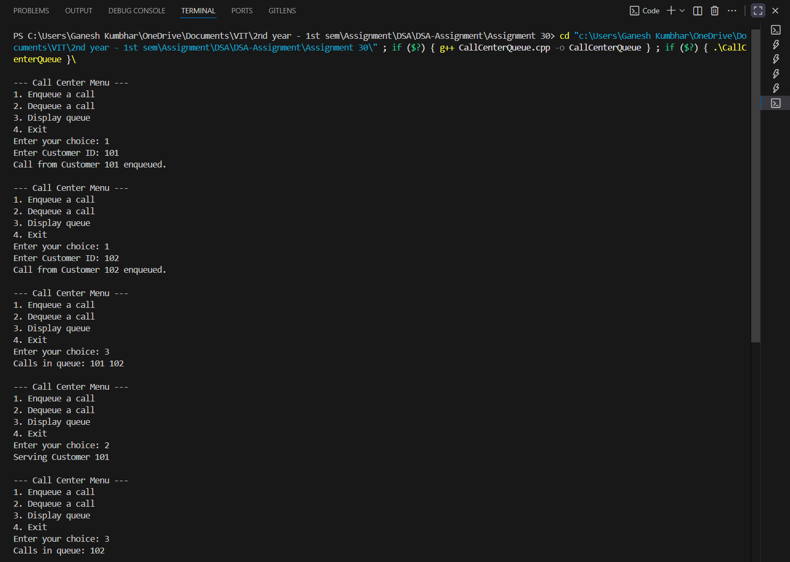

# Call Center Queue using Linked List

## Theory
A **queue** is a linear data structure that follows **First-In-First-Out (FIFO)**.  
In a **call center**, calls are handled in the order they arrive.  
We implement this using a **linked list** where:
- **Enqueue** adds a new call to the rear.
- **Dequeue** removes the call from the front for service.

---

## Algorithm

1. **Start**
2. Initialize the linked list for queue.
3. Display menu:
   - 1. Enqueue a call
   - 2. Dequeue a call
   - 3. Display queue
   - 4. Exit
4. **Enqueue**:
   - Insert new call (customer number) at the rear.
5. **Dequeue**:
   - Remove the call at the front if queue is not empty.
6. **Display**:
   - Print all calls from front to rear.
7. Repeat until the user chooses Exit.
8. **End**

---

## Program Code

```cpp
#include <iostream>
using namespace std;

struct Call_gsk {
    int customerID_gsk;
    Call_gsk* next_gsk;
};

class CallQueue_gsk {
    Call_gsk* front_gsk;
    Call_gsk* rear_gsk;
public:
    CallQueue_gsk() {
        front_gsk = rear_gsk = nullptr;
    }

    void enqueue_gsk(int id_gsk) {
        Call_gsk* newCall_gsk = new Call_gsk{ id_gsk, nullptr };
        if (!rear_gsk) {
            front_gsk = rear_gsk = newCall_gsk;
        } else {
            rear_gsk->next_gsk = newCall_gsk;
            rear_gsk = newCall_gsk;
        }
        cout << "Call from Customer " << id_gsk << " enqueued.\n";
    }

    void dequeue_gsk() {
        if (!front_gsk) {
            cout << "No calls in queue.\n";
            return;
        }
        Call_gsk* temp_gsk = front_gsk;
        cout << "Serving Customer " << front_gsk->customerID_gsk << "\n";
        front_gsk = front_gsk->next_gsk;
        if (!front_gsk) rear_gsk = nullptr;
        delete temp_gsk;
    }

    void display_gsk() {
        if (!front_gsk) {
            cout << "Queue is empty.\n";
            return;
        }
        Call_gsk* temp_gsk = front_gsk;
        cout << "Calls in queue: ";
        while (temp_gsk) {
            cout << temp_gsk->customerID_gsk << " ";
            temp_gsk = temp_gsk->next_gsk;
        }
        cout << "\n";
    }
};

int main() {
    CallQueue_gsk cq_gsk;
    int choice_gsk, id_gsk;

    do {
        cout << "\n--- Call Center Menu ---\n";
        cout << "1. Enqueue a call\n";
        cout << "2. Dequeue a call\n";
        cout << "3. Display queue\n";
        cout << "4. Exit\n";
        cout << "Enter your choice: ";
        cin >> choice_gsk;

        switch(choice_gsk) {
            case 1:
                cout << "Enter Customer ID: ";
                cin >> id_gsk;
                cq_gsk.enqueue_gsk(id_gsk);
                break;
            case 2:
                cq_gsk.dequeue_gsk();
                break;
            case 3:
                cq_gsk.display_gsk();
                break;
            case 4:
                cout << "Exiting program...\n";
                break;
            default:
                cout << "Invalid choice. Try again.\n";
        }
    } while(choice_gsk != 4);

    return 0;
}
```
---

## Sample Output

```
--- Call Center Menu ---
1. Enqueue a call
2. Dequeue a call
3. Display queue
4. Exit
Enter your choice: 1
Enter Customer ID: 101
Call from Customer 101 enqueued.

Enter your choice: 1
Enter Customer ID: 102
Call from Customer 102 enqueued.

Enter your choice: 3
Calls in queue: 101 102

Enter your choice: 2
Serving Customer 101

Enter your choice: 3
Calls in queue: 102

Enter your choice: 4
Exiting program...
```
