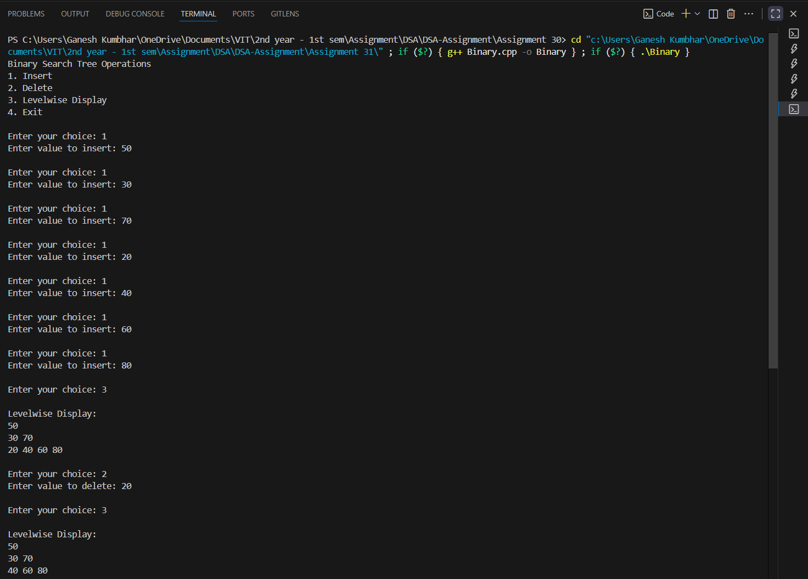

# Binary Search Tree (BST) Operations

## Theory

A **Binary Search Tree (BST)** is a data structure in which each node has at most two children — **left** and **right** — and the following properties hold:

1. The **left child** of a node contains a value **less than** the node’s value.  
2. The **right child** of a node contains a value **greater than** the node’s value.  
3. Both left and right subtrees are also binary search trees.

BSTs are widely used for efficient searching, insertion, and deletion of data. The **time complexity** for these operations is on average **O(log n)** but can degrade to **O(n)** for unbalanced trees.

### Common BST Operations:
- **Create** – Initialize an empty tree.
- **Insert** – Add a node to the correct position in the BST.
- **Delete** – Remove a node and restructure the tree while maintaining BST properties.
- **Level-wise Display (Level Order Traversal)** – Print the nodes level by level using a queue.

---

## Algorithm

1. **Start**
2. Create a structure `Node` with data, left, and right pointers.
3. Implement functions:
   - `insertNode()` — to insert a new value maintaining BST rules.
   - `deleteNode()` — to delete a node with given value.
   - `minValueNode()` — to find the smallest node in a subtree (used during deletion).
   - `levelOrder()` — to display the tree level by level using a queue.
4. In `main()`:
   - Create an empty BST.
   - Insert sample elements.
   - Display the BST using level order.
   - Perform deletion of a few nodes.
   - Display the updated BST.
5. **End**

---

## Code

```cpp

#include <iostream>
#include <queue>
using namespace std;

struct Node_gsk {
    int data_gsk;
    Node_gsk* left_gsk;
    Node_gsk* right_gsk;
    Node_gsk(int val_gsk) {
        data_gsk = val_gsk;
        left_gsk = right_gsk = nullptr;
    }
};

// Insert a node
Node_gsk* insertNode_gsk(Node_gsk* root_gsk, int val_gsk) {
    if (root_gsk == nullptr)
        return new Node_gsk(val_gsk);

    if (val_gsk < root_gsk->data_gsk)
        root_gsk->left_gsk = insertNode_gsk(root_gsk->left_gsk, val_gsk);
    else if (val_gsk > root_gsk->data_gsk)
        root_gsk->right_gsk = insertNode_gsk(root_gsk->right_gsk, val_gsk);

    return root_gsk;
}

// Find node with minimum value (used in delete)
Node_gsk* minValueNode_gsk(Node_gsk* node_gsk) {
    Node_gsk* current_gsk = node_gsk;
    while (current_gsk && current_gsk->left_gsk != nullptr)
        current_gsk = current_gsk->left_gsk;
    return current_gsk;
}

// Delete a node
Node_gsk* deleteNode_gsk(Node_gsk* root_gsk, int val_gsk) {
    if (root_gsk == nullptr)
        return root_gsk;

    if (val_gsk < root_gsk->data_gsk)
        root_gsk->left_gsk = deleteNode_gsk(root_gsk->left_gsk, val_gsk);
    else if (val_gsk > root_gsk->data_gsk)
        root_gsk->right_gsk = deleteNode_gsk(root_gsk->right_gsk, val_gsk);
    else {
        // Node with one or no child
        if (root_gsk->left_gsk == nullptr) {
            Node_gsk* temp_gsk = root_gsk->right_gsk;
            delete root_gsk;
            return temp_gsk;
        }
        else if (root_gsk->right_gsk == nullptr) {
            Node_gsk* temp_gsk = root_gsk->left_gsk;
            delete root_gsk;
            return temp_gsk;
        }
        // Node with two children
        Node_gsk* temp_gsk = minValueNode_gsk(root_gsk->right_gsk);
        root_gsk->data_gsk = temp_gsk->data_gsk;
        root_gsk->right_gsk = deleteNode_gsk(root_gsk->right_gsk, temp_gsk->data_gsk);
    }
    return root_gsk;
}

// Level-order display
void levelOrder_gsk(Node_gsk* root_gsk) {
    if (root_gsk == nullptr) return;
    queue<Node_gsk*> q_gsk;
    q_gsk.push(root_gsk);
    while (!q_gsk.empty()) {
        int size_gsk = q_gsk.size();
        while (size_gsk--) {
            Node_gsk* current_gsk = q_gsk.front();
            q_gsk.pop();
            cout << current_gsk->data_gsk << " ";
            if (current_gsk->left_gsk) q_gsk.push(current_gsk->left_gsk);
            if (current_gsk->right_gsk) q_gsk.push(current_gsk->right_gsk);
        }
        cout << endl;
    }
}

int main() {
    Node_gsk* root_gsk = nullptr;
    int choice_gsk, val_gsk;

    cout << "Binary Search Tree Operations\n";
    cout << "1. Insert\n2. Delete\n3. Levelwise Display\n4. Exit\n";

    while (true) {
        cout << "\nEnter your choice: ";
        cin >> choice_gsk;

        switch (choice_gsk) {
            case 1:
                cout << "Enter value to insert: ";
                cin >> val_gsk;
                root_gsk = insertNode_gsk(root_gsk, val_gsk);
                break;

            case 2:
                cout << "Enter value to delete: ";
                cin >> val_gsk;
                root_gsk = deleteNode_gsk(root_gsk, val_gsk);
                break;

            case 3:
                cout << "\nLevelwise Display:\n";
                levelOrder_gsk(root_gsk);
                break;

            case 4:
                cout << "Exiting..." << endl;
                return 0;

            default:
                cout << "Invalid choice! Try again.\n";
        }
    }
}
```
---

## Sample Output


```
Binary Search Tree Operations
1. Insert
2. Delete
3. Levelwise Display
4. Exit

Enter your choice: 1
Enter value to insert: 50
Enter your choice: 1
Enter value to insert: 30
Enter your choice: 1
Enter value to insert: 70
Enter your choice: 1
Enter value to insert: 20
Enter your choice: 1
Enter value to insert: 40
Enter your choice: 1
Enter value to insert: 60
Enter your choice: 1
Enter value to insert: 80
Enter your choice: 3

Levelwise Display:
50
30 70
20 40 60 80

Enter your choice: 2
Enter value to delete: 20
Enter your choice: 3

Levelwise Display:
50
30 70
40 60 80

Enter your choice: 4
Exiting...
```
