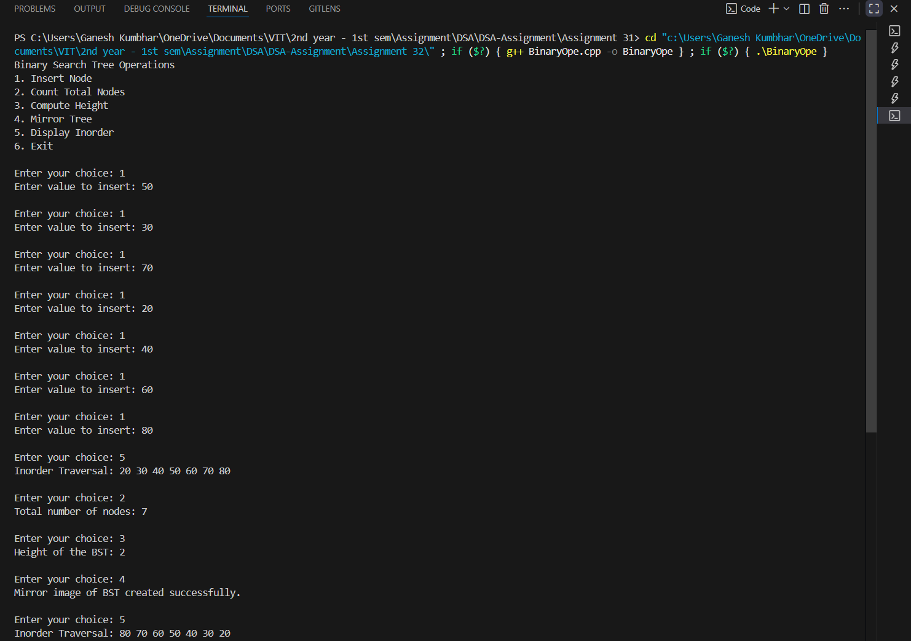

# Binary Search Tree (BST) Operations  
*(Count Total Nodes, Compute Height, and Mirror Image)*

## Theory

A **Binary Search Tree (BST)** is a data structure in which each node has at most two children — **left** and **right** — and satisfies these properties:

1. The **left child** of a node contains a key **less than** the node’s key.  
2. The **right child** of a node contains a key **greater than** the node’s key.  
3. Both left and right subtrees are also BSTs.

### Additional Operations:
- **Count Nodes:**  
  Counts the total number of nodes in the BST using recursive traversal.
  
- **Compute Height:**  
  The height of a BST is the number of edges on the longest path from the root to a leaf node.  
  For an empty tree, the height is defined as `-1` or `0` (depending on convention).

- **Mirror Image:**  
  The mirror image of a BST is obtained by swapping the left and right child of every node recursively.

---

## Algorithm

1. **Start**
2. Create a structure `Node` with data, left, and right pointers.  
3. Implement functions:
   - `insertNode()` → to insert nodes following BST rules.
   - `countNodes()` → recursively counts all nodes.
   - `heightBST()` → recursively calculates the height.
   - `mirrorTree()` → recursively swaps left and right subtrees.
   - `inorderTraversal()` → to display the tree in sorted order.
4. In `main()`:  
   - Create an empty BST.  
   - Insert elements.  
   - Provide a menu for operations:  
     - Count Nodes  
     - Compute Height  
     - Mirror Image  
     - Inorder Display  
     - Exit  
5. **End**

---

## Code

```cpp

#include <iostream>
#include <algorithm>
using namespace std;

struct Node_gsk {
    int data_gsk;
    Node_gsk* left_gsk;
    Node_gsk* right_gsk;
    Node_gsk(int val_gsk) {
        data_gsk = val_gsk;
        left_gsk = right_gsk = nullptr;
    }
};

// Insert a new node into the BST
Node_gsk* insertNode_gsk(Node_gsk* root_gsk, int val_gsk) {
    if (root_gsk == nullptr)
        return new Node_gsk(val_gsk);
    if (val_gsk < root_gsk->data_gsk)
        root_gsk->left_gsk = insertNode_gsk(root_gsk->left_gsk, val_gsk);
    else if (val_gsk > root_gsk->data_gsk)
        root_gsk->right_gsk = insertNode_gsk(root_gsk->right_gsk, val_gsk);
    return root_gsk;
}

// Count total number of nodes
int countNodes_gsk(Node_gsk* root_gsk) {
    if (root_gsk == nullptr)
        return 0;
    return 1 + countNodes_gsk(root_gsk->left_gsk) + countNodes_gsk(root_gsk->right_gsk);
}

// Compute height of BST
int heightBST_gsk(Node_gsk* root_gsk) {
    if (root_gsk == nullptr)
        return -1;  // or return 0 if you prefer counting nodes instead of edges
    return 1 + max(heightBST_gsk(root_gsk->left_gsk), heightBST_gsk(root_gsk->right_gsk));
}

// Mirror the BST
void mirrorTree_gsk(Node_gsk* root_gsk) {
    if (root_gsk == nullptr)
        return;
    swap(root_gsk->left_gsk, root_gsk->right_gsk);
    mirrorTree_gsk(root_gsk->left_gsk);
    mirrorTree_gsk(root_gsk->right_gsk);
}

// Inorder traversal (Left → Root → Right)
void inorderTraversal_gsk(Node_gsk* root_gsk) {
    if (root_gsk == nullptr)
        return;
    inorderTraversal_gsk(root_gsk->left_gsk);
    cout << root_gsk->data_gsk << " ";
    inorderTraversal_gsk(root_gsk->right_gsk);
}

int main() {
    Node_gsk* root_gsk = nullptr;
    int choice_gsk, val_gsk;

    cout << "Binary Search Tree Operations\n";
    cout << "1. Insert Node\n2. Count Total Nodes\n3. Compute Height\n4. Mirror Tree\n5. Display Inorder\n6. Exit\n";

    while (true) {
        cout << "\nEnter your choice: ";
        cin >> choice_gsk;

        switch (choice_gsk) {
            case 1:
                cout << "Enter value to insert: ";
                cin >> val_gsk;
                root_gsk = insertNode_gsk(root_gsk, val_gsk);
                break;

            case 2:
                cout << "Total number of nodes: " << countNodes_gsk(root_gsk) << endl;
                break;

            case 3:
                cout << "Height of the BST: " << heightBST_gsk(root_gsk) << endl;
                break;

            case 4:
                mirrorTree_gsk(root_gsk);
                cout << "Mirror image of BST created successfully.\n";
                break;

            case 5:
                cout << "Inorder Traversal: ";
                inorderTraversal_gsk(root_gsk);
                cout << endl;
                break;

            case 6:
                cout << "Exiting..." << endl;
                return 0;

            default:
                cout << "Invalid choice! Try again.\n";
        }
    }
}
```
---

## Sample Output

```
Binary Search Tree Operations
1. Insert Node
2. Count Total Nodes
3. Compute Height
4. Mirror Tree
5. Display Inorder
6. Exit

Enter your choice: 1
Enter value to insert: 50
Enter your choice: 1
Enter value to insert: 30
Enter your choice: 1
Enter value to insert: 70
Enter your choice: 1
Enter value to insert: 20
Enter your choice: 1
Enter value to insert: 40
Enter your choice: 1
Enter value to insert: 60
Enter your choice: 1
Enter value to insert: 80

Enter your choice: 5
Inorder Traversal: 20 30 40 50 60 70 80 

Enter your choice: 2
Total number of nodes: 7

Enter your choice: 3
Height of the BST: 2

Enter your choice: 4
Mirror image of BST created successfully.

Enter your choice: 5
Inorder Traversal: 80 70 60 50 40 30 20 

Enter your choice: 6
Exiting...
```
