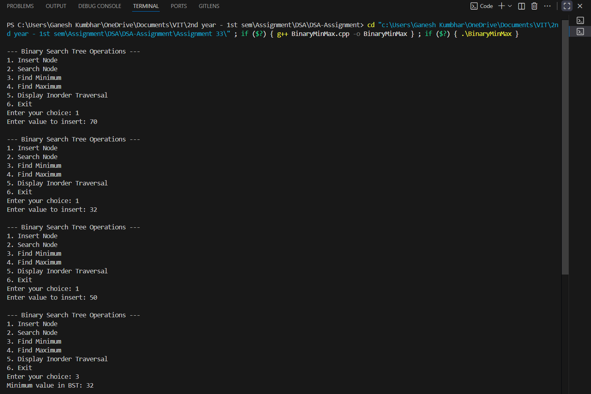
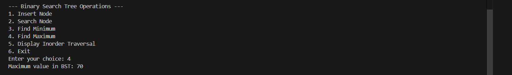

# Binary Search Tree (BST) Operations  
*(Create, Search, Find Minimum and Maximum)*

---

## Theory

A **Binary Search Tree (BST)** is a special type of **binary tree** where each node follows the **BST property**:

1. The value of each node in the **left subtree** is **less than** the value of the root node.  
2. The value of each node in the **right subtree** is **greater than** the value of the root node.  
3. Both left and right subtrees are also **Binary Search Trees**.

BSTs provide efficient operations for:
- **Insertion**
- **Searching**
- **Finding Minimum and Maximum values**

Average time complexity for these operations is **O(log n)** for a balanced BST.

---

## Operations Performed

- **Create BST:** Insert nodes following the BST property.  
- **Search Node:** Locate a specific element.  
- **Find Minimum:** Return the smallest value in the BST.  
- **Find Maximum:** Return the largest value in the BST.  
- **Display Inorder Traversal:** Display nodes in sorted order.

---

## Algorithm

1. **Start**  
2. Create a structure `Node` with `data`, `left`, and `right` pointers.  
3. Implement the following functions:  
   - `insertNode()` → Inserts an element while maintaining the BST property.  
   - `searchNode()` → Searches for a given element recursively.  
   - `findMin()` → Finds the smallest node by traversing left.  
   - `findMax()` → Finds the largest node by traversing right.  
   - `inorderTraversal()` → Displays all nodes in sorted (ascending) order.  
4. In `main()` function:  
   - Create an empty BST.  
   - Insert user-defined values.  
   - Allow menu-driven operations.  
5. **End**

---

## Code

```cpp
#include <iostream>
using namespace std;

struct Node_gsk {
    int data_gsk;
    Node_gsk* left_gsk;
    Node_gsk* right_gsk;
};

// Create a new node
Node_gsk* createNode_gsk(int value_gsk) {
    Node_gsk* newNode_gsk = new Node_gsk;
    newNode_gsk->data_gsk = value_gsk;
    newNode_gsk->left_gsk = newNode_gsk->right_gsk = nullptr;
    return newNode_gsk;
}

// Insert node into BST
Node_gsk* insertNode_gsk(Node_gsk* root_gsk, int value_gsk) {
    if (root_gsk == nullptr)
        return createNode_gsk(value_gsk);
    if (value_gsk < root_gsk->data_gsk)
        root_gsk->left_gsk = insertNode_gsk(root_gsk->left_gsk, value_gsk);
    else if (value_gsk > root_gsk->data_gsk)
        root_gsk->right_gsk = insertNode_gsk(root_gsk->right_gsk, value_gsk);
    return root_gsk;
}

// Search for a value in BST
bool searchNode_gsk(Node_gsk* root_gsk, int key_gsk) {
    if (root_gsk == nullptr)
        return false;
    if (root_gsk->data_gsk == key_gsk)
        return true;
    else if (key_gsk < root_gsk->data_gsk)
        return searchNode_gsk(root_gsk->left_gsk, key_gsk);
    else
        return searchNode_gsk(root_gsk->right_gsk, key_gsk);
}

// Find minimum value node
Node_gsk* findMin_gsk(Node_gsk* root_gsk) {
    while (root_gsk && root_gsk->left_gsk != nullptr)
        root_gsk = root_gsk->left_gsk;
    return root_gsk;
}

// Find maximum value node
Node_gsk* findMax_gsk(Node_gsk* root_gsk) {
    while (root_gsk && root_gsk->right_gsk != nullptr)
        root_gsk = root_gsk->right_gsk;
    return root_gsk;
}

// Display BST using Inorder Traversal
void inorderTraversal_gsk(Node_gsk* root_gsk) {
    if (root_gsk != nullptr) {
        inorderTraversal_gsk(root_gsk->left_gsk);
        cout << root_gsk->data_gsk << " ";
        inorderTraversal_gsk(root_gsk->right_gsk);
    }
}

// Main Function
int main() {
    Node_gsk* root_gsk = nullptr;
    int choice_gsk, value_gsk;

    while (true) {
        cout << "\n--- Binary Search Tree Operations ---\n";
        cout << "1. Insert Node\n";
        cout << "2. Search Node\n";
        cout << "3. Find Minimum\n";
        cout << "4. Find Maximum\n";
        cout << "5. Display Inorder Traversal\n";
        cout << "6. Exit\n";
        cout << "Enter your choice: ";
        cin >> choice_gsk;

        switch (choice_gsk) {
            case 1:
                cout << "Enter value to insert: ";
                cin >> value_gsk;
                root_gsk = insertNode_gsk(root_gsk, value_gsk);
                break;

            case 2:
                cout << "Enter value to search: ";
                cin >> value_gsk;
                if (searchNode_gsk(root_gsk, value_gsk))
                    cout << value_gsk << " found in the BST.\n";
                else
                    cout << value_gsk << " not found in the BST.\n";
                break;

            case 3:
                if (root_gsk)
                    cout << "Minimum value in BST: " << findMin_gsk(root_gsk)->data_gsk << endl;
                else
                    cout << "BST is empty.\n";
                break;

            case 4:
                if (root_gsk)
                    cout << "Maximum value in BST: " << findMax_gsk(root_gsk)->data_gsk << endl;
                else
                    cout << "BST is empty.\n";
                break;

            case 5:
                cout << "Inorder Traversal (sorted order): ";
                inorderTraversal_gsk(root_gsk);
                cout << endl;
                break;

            case 6:
                cout << "Exiting...\n";
                return 0;

            default:
                cout << "Invalid choice. Try again.\n";
        }
    }
}
```
---

## Sample Output

```
--- Binary Search Tree Operations ---
1. Insert Node
2. Search Node
3. Find Minimum
4. Find Maximum
5. Display Inorder Traversal
6. Exit
Enter your choice: 1
Enter value to insert: 50
Enter your choice: 1
Enter value to insert: 30
Enter your choice: 1
Enter value to insert: 70
Enter your choice: 1
Enter value to insert: 20
Enter your choice: 1
Enter value to insert: 40
Enter your choice: 1
Enter value to insert: 60
Enter your choice: 1
Enter value to insert: 80

Enter your choice: 5
Inorder Traversal (sorted order): 20 30 40 50 60 70 80 

Enter your choice: 2
Enter value to search: 60
60 found in the BST.

Enter your choice: 3
Minimum value in BST: 20

Enter your choice: 4
Maximum value in BST: 80

Enter your choice: 6
Exiting...
```




