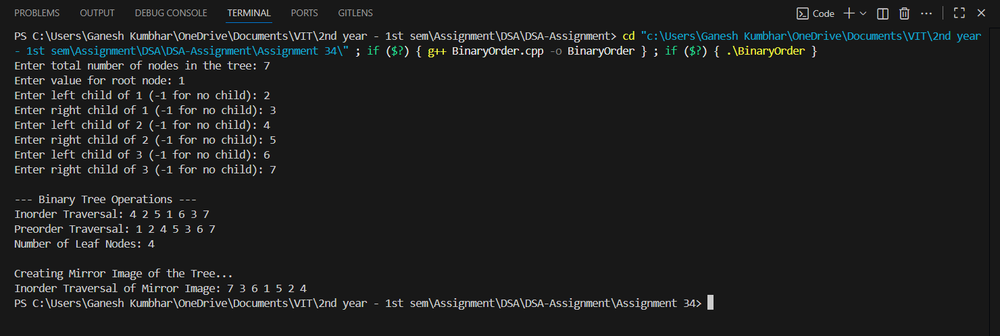

# Binary Tree – Nonrecursive Operations  
*(Inorder, Preorder, Leaf Count, Mirror Image – with user input)*

## Theory

A **Binary Tree** is a hierarchical structure in which each node has at most **two children** — referred to as the **left** and **right** child.  
Binary Trees are used in many applications like expression parsing, searching, and hierarchical data representation.

In this program, we:
- Create a Binary Tree by user input (node values entered manually).
- Perform **Nonrecursive Traversals** using **stack**.
- Display the **number of leaf nodes**.
- Generate and display the **mirror image** of the tree.

### Operations Performed
- **Inorder Traversal (Nonrecursive)** – Left → Root → Right  
- **Preorder Traversal (Nonrecursive)** – Root → Left → Right  
- **Leaf Node Count** – Nodes with no children.  
- **Mirror Image** – Swap left and right children recursively.

---

## Algorithm

1. Start  
2. Define a structure `Node` with `data`, `left`, and `right`.  
3. Input number of nodes `n`.  
4. Create a binary tree by inserting nodes in **level order** using a queue.  
5. Perform:  
   - Nonrecursive **Inorder** traversal.  
   - Nonrecursive **Preorder** traversal.  
   - Count **Leaf Nodes**.  
   - Generate and display **Mirror Image**.  
6. End  

---

## Code

```cpp
#include <iostream>
#include <queue>
#include <stack>
using namespace std;

struct Node_gsk {
    int data_gsk;
    Node_gsk *left_gsk, *right_gsk;
    Node_gsk(int val_gsk) {
        data_gsk = val_gsk;
        left_gsk = right_gsk = nullptr;
    }
};

// Create Binary Tree in Level Order using user input
Node_gsk* createTree_gsk(int n_gsk) {
    if (n_gsk <= 0) return nullptr;

    int val_gsk;
    cout << "Enter value for root node: ";
    cin >> val_gsk;
    Node_gsk* root_gsk = new Node_gsk(val_gsk);

    queue<Node_gsk*> q_gsk;
    q_gsk.push(root_gsk);

    int count_gsk = 1;
    while (count_gsk < n_gsk) {
        Node_gsk* curr_gsk = q_gsk.front();
        q_gsk.pop();

        int leftVal_gsk, rightVal_gsk;

        cout << "Enter left child of " << curr_gsk->data_gsk << " (-1 for no child): ";
        cin >> leftVal_gsk;
        if (leftVal_gsk != -1) {
            curr_gsk->left_gsk = new Node_gsk(leftVal_gsk);
            q_gsk.push(curr_gsk->left_gsk);
            count_gsk++;
            if (count_gsk == n_gsk) break;
        }

        cout << "Enter right child of " << curr_gsk->data_gsk << " (-1 for no child): ";
        cin >> rightVal_gsk;
        if (rightVal_gsk != -1) {
            curr_gsk->right_gsk = new Node_gsk(rightVal_gsk);
            q_gsk.push(curr_gsk->right_gsk);
            count_gsk++;
        }
    }

    return root_gsk;
}

// Nonrecursive Inorder Traversal
void inorderTraversal_gsk(Node_gsk* root_gsk) {
    stack<Node_gsk*> s_gsk;
    Node_gsk* curr_gsk = root_gsk;

    cout << "Inorder Traversal: ";
    while (curr_gsk != nullptr || !s_gsk.empty()) {
        while (curr_gsk != nullptr) {
            s_gsk.push(curr_gsk);
            curr_gsk = curr_gsk->left_gsk;
        }
        curr_gsk = s_gsk.top();
        s_gsk.pop();
        cout << curr_gsk->data_gsk << " ";
        curr_gsk = curr_gsk->right_gsk;
    }
    cout << endl;
}

// Nonrecursive Preorder Traversal
void preorderTraversal_gsk(Node_gsk* root_gsk) {
    if (root_gsk == nullptr)
        return;

    stack<Node_gsk*> s_gsk;
    s_gsk.push(root_gsk);

    cout << "Preorder Traversal: ";
    while (!s_gsk.empty()) {
        Node_gsk* curr_gsk = s_gsk.top();
        s_gsk.pop();
        cout << curr_gsk->data_gsk << " ";

        if (curr_gsk->right_gsk)
            s_gsk.push(curr_gsk->right_gsk);
        if (curr_gsk->left_gsk)
            s_gsk.push(curr_gsk->left_gsk);
    }
    cout << endl;
}

// Count Leaf Nodes
int countLeafNodes_gsk(Node_gsk* root_gsk) {
    if (root_gsk == nullptr)
        return 0;

    stack<Node_gsk*> s_gsk;
    s_gsk.push(root_gsk);
    int count_gsk = 0;

    while (!s_gsk.empty()) {
        Node_gsk* curr_gsk = s_gsk.top();
        s_gsk.pop();

        if (curr_gsk->left_gsk == nullptr && curr_gsk->right_gsk == nullptr)
            count_gsk++;

        if (curr_gsk->right_gsk)
            s_gsk.push(curr_gsk->right_gsk);
        if (curr_gsk->left_gsk)
            s_gsk.push(curr_gsk->left_gsk);
    }
    return count_gsk;
}

// Mirror Image of Tree
void mirrorImage_gsk(Node_gsk* root_gsk) {
    if (root_gsk == nullptr)
        return;

    swap(root_gsk->left_gsk, root_gsk->right_gsk);
    mirrorImage_gsk(root_gsk->left_gsk);
    mirrorImage_gsk(root_gsk->right_gsk);
}

// Display Inorder Traversal (for mirror verification)
void displayInorder_gsk(Node_gsk* root_gsk) {
    if (root_gsk == nullptr)
        return;
    displayInorder_gsk(root_gsk->left_gsk);
    cout << root_gsk->data_gsk << " ";
    displayInorder_gsk(root_gsk->right_gsk);
}

int main() {
    int n_gsk;
    cout << "Enter total number of nodes in the tree: ";
    cin >> n_gsk;

    Node_gsk* root_gsk = createTree_gsk(n_gsk);

    cout << "\n--- Binary Tree Operations ---\n";
    inorderTraversal_gsk(root_gsk);
    preorderTraversal_gsk(root_gsk);

    cout << "Number of Leaf Nodes: " << countLeafNodes_gsk(root_gsk) << endl;

    cout << "\nCreating Mirror Image of the Tree...\n";
    mirrorImage_gsk(root_gsk);

    cout << "Inorder Traversal of Mirror Image: ";
    displayInorder_gsk(root_gsk);
    cout << endl;

    return 0;
}
```
---

## Sample Output

```
Enter total number of nodes in the tree: 7
Enter value for root node: 1
Enter left child of 1 (-1 for no child): 2
Enter right child of 1 (-1 for no child): 3
Enter left child of 2 (-1 for no child): 4
Enter right child of 2 (-1 for no child): 5
Enter left child of 3 (-1 for no child): 6
Enter right child of 3 (-1 for no child): 7

--- Binary Tree Operations ---
Inorder Traversal: 4 2 5 1 6 3 7 
Preorder Traversal: 1 2 4 5 3 6 7 
Number of Leaf Nodes: 4

Creating Mirror Image of the Tree...
Inorder Traversal of Mirror Image: 7 3 6 1 5 2 4
```
