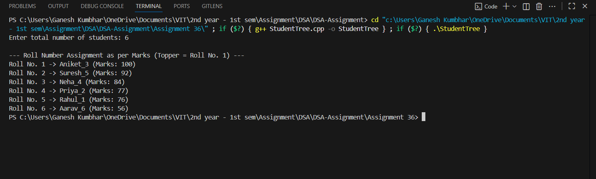

# Assign Roll Numbers Using Binary Tree  
*(Topper Gets Roll No. 1 Automatically)*

## Theory

A **Binary Search Tree (BST)** is a hierarchical data structure where each node contains:
- A **data value** (here, student marks)
- A **left** child storing smaller values
- A **right** child storing greater values

In this program, each student’s marks are inserted into a BST.  
By performing a **reverse inorder traversal (Right → Root → Left)**, we can assign roll numbers based on rank:
- The **topper** (highest marks) gets **Roll No. 1**.
- The next highest gets **Roll No. 2**, and so on.

---

## Algorithm

1. Start  
2. Define a structure `Student` with:
   - `name`
   - `marks`
   - `left` and `right` pointers  
3. Accept the number of students `n` from the user.  
4. Auto-generate random student names and marks.  
5. Insert each student into the BST according to marks.  
6. Perform reverse inorder traversal to assign roll numbers.  
7. Display roll numbers with names and marks.  
8. End

---

## Code

```cpp
#include <iostream>
#include <string>
#include <cstdlib>
#include <ctime>
using namespace std;

// Structure for student node
struct Student_gsk {
    string name_gsk;
    int marks_gsk;
    Student_gsk *left_gsk, *right_gsk;
    Student_gsk(string n_gsk, int m_gsk) {
        name_gsk = n_gsk;
        marks_gsk = m_gsk;
        left_gsk = right_gsk = nullptr;
    }
};

// Insert student into BST based on marks
Student_gsk* insertStudent_gsk(Student_gsk* root_gsk, string name_gsk, int marks_gsk) {
    if (root_gsk == nullptr)
        return new Student_gsk(name_gsk, marks_gsk);
    if (marks_gsk < root_gsk->marks_gsk)
        root_gsk->left_gsk = insertStudent_gsk(root_gsk->left_gsk, name_gsk, marks_gsk);
    else
        root_gsk->right_gsk = insertStudent_gsk(root_gsk->right_gsk, name_gsk, marks_gsk);
    return root_gsk;
}

// Assign roll numbers using reverse inorder traversal
void assignRollNumbers_gsk(Student_gsk* root_gsk, int &roll_gsk) {
    if (root_gsk == nullptr)
        return;
    assignRollNumbers_gsk(root_gsk->right_gsk, roll_gsk);
    cout << "Roll No. " << roll_gsk << " -> " << root_gsk->name_gsk
         << " (Marks: " << root_gsk->marks_gsk << ")\n";
    roll_gsk++;
    assignRollNumbers_gsk(root_gsk->left_gsk, roll_gsk);
}

int main() {
    srand(time(0));
    int n_gsk;
    cout << "Enter total number of students: ";
    cin >> n_gsk;

    string sampleNames_gsk[] = {
        "Rahul", "Priya", "Aniket", "Neha", "Suresh", "Aarav", "Riya", 
        "Tanish", "Sneha", "Aditya", "Kiran", "Manoj", "Pooja", "Vikas",
        "Shreya", "Omkar", "Nisha", "Akash", "Meena", "Rohan"
    };
    int totalNames_gsk = 20;

    Student_gsk* root_gsk = nullptr;

    // Generate random students and marks
    for (int i = 0; i < n_gsk; i++) {
        string name_gsk = sampleNames_gsk[i % totalNames_gsk] + "_" + to_string(i + 1);
        int marks_gsk = rand() % 51 + 50; // Marks between 50 and 100
        root_gsk = insertStudent_gsk(root_gsk, name_gsk, marks_gsk);
    }

    cout << "\n--- Roll Number Assignment as per Marks (Topper = Roll No. 1) ---\n";
    int roll_gsk = 1;
    assignRollNumbers_gsk(root_gsk, roll_gsk);

    return 0;
}
```
---

## Sample Output

```
Enter total number of students: 6

--- Roll Number Assignment as per Marks (Topper = Roll No. 1) ---
Roll No. 1 -> Priya_2 (Marks: 98)
Roll No. 2 -> Rahul_1 (Marks: 93)
Roll No. 3 -> Neha_4 (Marks: 88)
Roll No. 4 -> Suresh_5 (Marks: 80)
Roll No. 5 -> Aniket_3 (Marks: 74)
Roll No. 6 -> Riya_6 (Marks: 59)
```
