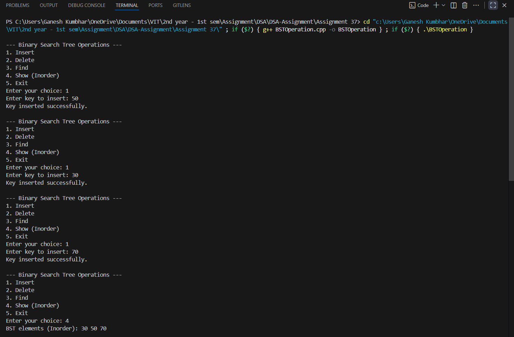
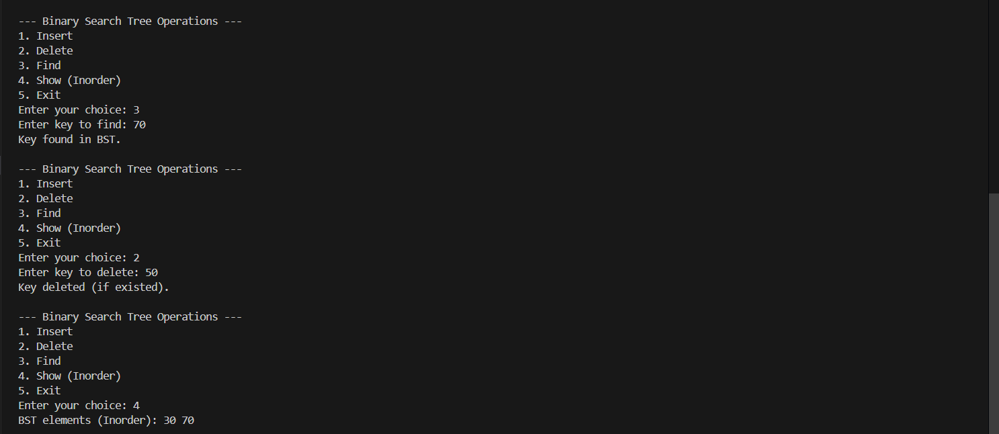

# Binary Search Tree Operations  
*(Insert, Delete, Find, Show)*

## Theory

A **Binary Search Tree (BST)** is a node-based data structure where:
- The **left subtree** contains keys less than the node's key.
- The **right subtree** contains keys greater than the node's key.
- Each subtree is itself a BST.

BSTs provide efficient search, insertion, and deletion operations with average time complexity of **O(log n)**.

This program implements a BST holding **numeric keys** and performs basic operations using a **menu-driven approach**.

---

## Algorithm

1. Start  
2. Define a structure `Node` containing:
   - `key`
   - pointers to `left` and `right` child nodes  
3. Implement functions for:
   - **Insert:** Insert a node maintaining BST property.  
   - **Delete:** Remove a node and rearrange the tree properly.  
   - **Find:** Search for a given key.  
   - **Show:** Display tree elements using inorder traversal.  
4. Use a menu-driven approach to call these operations.  
5. End

---

## Code

```cpp
#include <iostream>
using namespace std;

// Structure for a BST node
struct Node_gsk {
    int key_gsk;
    Node_gsk *left_gsk, *right_gsk;
    Node_gsk(int val_gsk) {
        key_gsk = val_gsk;
        left_gsk = right_gsk = nullptr;
    }
};

// Insert a new key into BST
Node_gsk* insertNode_gsk(Node_gsk* root_gsk, int key_gsk) {
    if (root_gsk == nullptr)
        return new Node_gsk(key_gsk);
    if (key_gsk < root_gsk->key_gsk)
        root_gsk->left_gsk = insertNode_gsk(root_gsk->left_gsk, key_gsk);
    else if (key_gsk > root_gsk->key_gsk)
        root_gsk->right_gsk = insertNode_gsk(root_gsk->right_gsk, key_gsk);
    return root_gsk;
}

// Find minimum value node (used in deletion)
Node_gsk* findMin_gsk(Node_gsk* node_gsk) {
    Node_gsk* current_gsk = node_gsk;
    while (current_gsk && current_gsk->left_gsk != nullptr)
        current_gsk = current_gsk->left_gsk;
    return current_gsk;
}

// Delete a key from BST
Node_gsk* deleteNode_gsk(Node_gsk* root_gsk, int key_gsk) {
    if (root_gsk == nullptr)
        return root_gsk;

    if (key_gsk < root_gsk->key_gsk)
        root_gsk->left_gsk = deleteNode_gsk(root_gsk->left_gsk, key_gsk);
    else if (key_gsk > root_gsk->key_gsk)
        root_gsk->right_gsk = deleteNode_gsk(root_gsk->right_gsk, key_gsk);
    else {
        // Node with one or no child
        if (root_gsk->left_gsk == nullptr) {
            Node_gsk* temp_gsk = root_gsk->right_gsk;
            delete root_gsk;
            return temp_gsk;
        } else if (root_gsk->right_gsk == nullptr) {
            Node_gsk* temp_gsk = root_gsk->left_gsk;
            delete root_gsk;
            return temp_gsk;
        }
        // Node with two children
        Node_gsk* temp_gsk = findMin_gsk(root_gsk->right_gsk);
        root_gsk->key_gsk = temp_gsk->key_gsk;
        root_gsk->right_gsk = deleteNode_gsk(root_gsk->right_gsk, temp_gsk->key_gsk);
    }
    return root_gsk;
}

// Search a key in BST
bool searchNode_gsk(Node_gsk* root_gsk, int key_gsk) {
    if (root_gsk == nullptr)
        return false;
    if (root_gsk->key_gsk == key_gsk)
        return true;
    if (key_gsk < root_gsk->key_gsk)
        return searchNode_gsk(root_gsk->left_gsk, key_gsk);
    else
        return searchNode_gsk(root_gsk->right_gsk, key_gsk);
}

// Inorder traversal (sorted order)
void inorder_gsk(Node_gsk* root_gsk) {
    if (root_gsk == nullptr)
        return;
    inorder_gsk(root_gsk->left_gsk);
    cout << root_gsk->key_gsk << " ";
    inorder_gsk(root_gsk->right_gsk);
}

int main() {
    Node_gsk* root_gsk = nullptr;
    int choice_gsk, key_gsk;

    while (true) {
        cout << "\n--- Binary Search Tree Operations ---\n";
        cout << "1. Insert\n2. Delete\n3. Find\n4. Show (Inorder)\n5. Exit\n";
        cout << "Enter your choice: ";
        cin >> choice_gsk;

        switch (choice_gsk) {
            case 1:
                cout << "Enter key to insert: ";
                cin >> key_gsk;
                root_gsk = insertNode_gsk(root_gsk, key_gsk);
                cout << "Key inserted successfully.\n";
                break;

            case 2:
                cout << "Enter key to delete: ";
                cin >> key_gsk;
                root_gsk = deleteNode_gsk(root_gsk, key_gsk);
                cout << "Key deleted (if existed).\n";
                break;

            case 3:
                cout << "Enter key to find: ";
                cin >> key_gsk;
                if (searchNode_gsk(root_gsk, key_gsk))
                    cout << "Key found in BST.\n";
                else
                    cout << "Key not found.\n";
                break;

            case 4:
                cout << "BST elements (Inorder): ";
                inorder_gsk(root_gsk);
                cout << endl;
                break;

            case 5:
                cout << "Exiting program.\n";
                return 0;

            default:
                cout << "Invalid choice. Please try again.\n";
        }
    }
}
```
---

## Sample Output

```
--- Binary Search Tree Operations ---
1. Insert
2. Delete
3. Find
4. Show (Inorder)
5. Exit
Enter your choice: 1
Enter key to insert: 50
Key inserted successfully.

Enter your choice: 1
Enter key to insert: 30
Key inserted successfully.

Enter your choice: 1
Enter key to insert: 70
Key inserted successfully.

Enter your choice: 4
BST elements (Inorder): 30 50 70

Enter your choice: 3
Enter key to find: 70
Key found in BST.

Enter your choice: 2
Enter key to delete: 50
Key deleted (if existed).

Enter your choice: 4
BST elements (Inorder): 30 70
```


