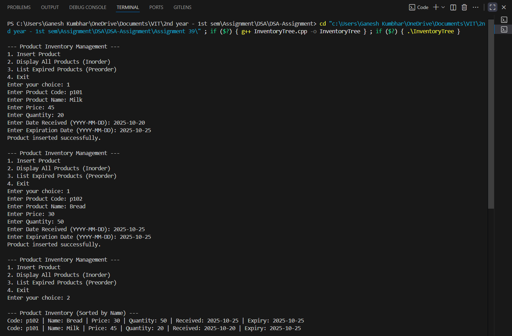
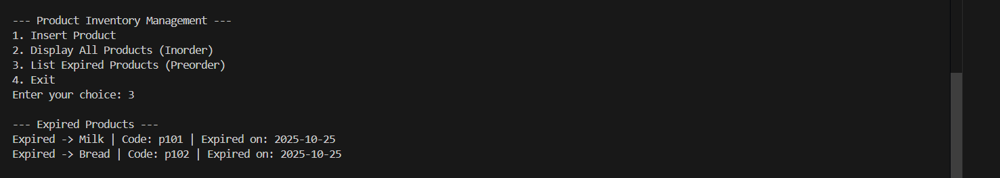

# Product Inventory Management System using Search Tree Data Structure
*(Organized by Product Name)*

## Theory

A **Search Tree** (specifically, a **Binary Search Tree**) is a hierarchical data structure that allows efficient data organization and retrieval.  
Each node contains a key that determines its position in the tree.  
In this program, the **Product Name** acts as the key for insertion and sorting.

Each product node stores:
- **Product Code** (unique identifier)  
- **Product Name**  
- **Price**  
- **Quantity in Stock**  
- **Date Received**  
- **Expiration Date**

The program enables insertion, display, and tracking of expired items efficiently using recursive traversal techniques.

---

## Objectives

1. To implement a **Product Inventory System** using a **Binary Search Tree**.  
2. To organize products based on their **Product Name**.  
3. To efficiently **display all products** (sorted by name) using **inorder traversal**.  
4. To **list expired products** using **preorder traversal**.  

---

## Algorithm

1. **Start**  
2. Define a structure `Product` containing:
   - Product details (Code, Name, Price, Quantity, Dates)
   - Left and right pointers for BST links  
3. Insert new products into the BST according to **Product Name**.  
4. Use **Inorder Traversal** to display all products in alphabetical order.  
5. Use **Preorder Traversal** to list expired products.  
6. **End**

---

## Source Code

```cpp
#include <iostream>
#include <string>
#include <ctime>
using namespace std;

// Structure for Product node
struct Product_gsk {
    string code_gsk, name_gsk, date_received_gsk, expiry_date_gsk;
    float price_gsk;
    int quantity_gsk;
    Product_gsk *left_gsk, *right_gsk;

    Product_gsk(string c_gsk, string n_gsk, float p_gsk, int q_gsk, string dr_gsk, string ed_gsk) {
        code_gsk = c_gsk;
        name_gsk = n_gsk;
        price_gsk = p_gsk;
        quantity_gsk = q_gsk;
        date_received_gsk = dr_gsk;
        expiry_date_gsk = ed_gsk;
        left_gsk = right_gsk = nullptr;
    }
};

// Convert "YYYY-MM-DD" to time_t for date comparison
time_t convertToTime(string date_gsk) {
    tm t = {};
    sscanf(date_gsk.c_str(), "%d-%d-%d", &t.tm_year, &t.tm_mon, &t.tm_mday);
    t.tm_year -= 1900;
    t.tm_mon -= 1;
    return mktime(&t);
}

// Insert product based on product name
Product_gsk* insertProduct_gsk(Product_gsk* root_gsk, string code_gsk, string name_gsk, float price_gsk, int qty_gsk, string dr_gsk, string ed_gsk) {
    if (root_gsk == nullptr)
        return new Product_gsk(code_gsk, name_gsk, price_gsk, qty_gsk, dr_gsk, ed_gsk);

    if (name_gsk < root_gsk->name_gsk)
        root_gsk->left_gsk = insertProduct_gsk(root_gsk->left_gsk, code_gsk, name_gsk, price_gsk, qty_gsk, dr_gsk, ed_gsk);
    else if (name_gsk > root_gsk->name_gsk)
        root_gsk->right_gsk = insertProduct_gsk(root_gsk->right_gsk, code_gsk, name_gsk, price_gsk, qty_gsk, dr_gsk, ed_gsk);

    return root_gsk;
}

// Display all products in sorted order (Inorder)
void inorderDisplay_gsk(Product_gsk* root_gsk) {
    if (root_gsk == nullptr)
        return;

    inorderDisplay_gsk(root_gsk->left_gsk);
    cout << "Code: " << root_gsk->code_gsk
         << " | Name: " << root_gsk->name_gsk
         << " | Price: " << root_gsk->price_gsk
         << " | Quantity: " << root_gsk->quantity_gsk
         << " | Received: " << root_gsk->date_received_gsk
         << " | Expiry: " << root_gsk->expiry_date_gsk << endl;
    inorderDisplay_gsk(root_gsk->right_gsk);
}

// List expired products in Preorder
void listExpiredItems_gsk(Product_gsk* root_gsk) {
    if (root_gsk == nullptr)
        return;

    time_t now = time(0);
    time_t expDate = convertToTime(root_gsk->expiry_date_gsk);

    if (difftime(expDate, now) < 0) {
        cout << "Expired -> " << root_gsk->name_gsk
             << " | Code: " << root_gsk->code_gsk
             << " | Expired on: " << root_gsk->expiry_date_gsk << endl;
    }

    listExpiredItems_gsk(root_gsk->left_gsk);
    listExpiredItems_gsk(root_gsk->right_gsk);
}

int main() {
    Product_gsk* root_gsk = nullptr;
    int choice_gsk;
    string code_gsk, name_gsk, dr_gsk, ed_gsk;
    float price_gsk;
    int qty_gsk;

    while (true) {
        cout << "\n--- Product Inventory Management ---\n";
        cout << "1. Insert Product\n2. Display All Products (Inorder)\n3. List Expired Products (Preorder)\n4. Exit\n";
        cout << "Enter your choice: ";
        cin >> choice_gsk;

        switch (choice_gsk) {
            case 1:
                cout << "Enter Product Code: ";
                cin >> code_gsk;
                cout << "Enter Product Name: ";
                cin.ignore();
                getline(cin, name_gsk);
                cout << "Enter Price: ";
                cin >> price_gsk;
                cout << "Enter Quantity: ";
                cin >> qty_gsk;
                cout << "Enter Date Received (YYYY-MM-DD): ";
                cin >> dr_gsk;
                cout << "Enter Expiration Date (YYYY-MM-DD): ";
                cin >> ed_gsk;
                root_gsk = insertProduct_gsk(root_gsk, code_gsk, name_gsk, price_gsk, qty_gsk, dr_gsk, ed_gsk);
                cout << "Product inserted successfully.\n";
                break;

            case 2:
                cout << "\n--- Product Inventory (Sorted by Name) ---\n";
                inorderDisplay_gsk(root_gsk);
                break;

            case 3:
                cout << "\n--- Expired Products ---\n";
                listExpiredItems_gsk(root_gsk);
                break;

            case 4:
                cout << "Exiting program.\n";
                return 0;

            default:
                cout << "Invalid choice. Try again.\n";
        }
    }
}
```
---

## Sample Output

```
--- Product Inventory Management ---
1. Insert Product
2. Display All Products (Inorder)
3. List Expired Products (Preorder)
4. Exit
Enter your choice: 1
Enter Product Code: P101
Enter Product Name: Milk
Enter Price: 45
Enter Quantity: 20
Enter Date Received (YYYY-MM-DD): 2025-10-20
Enter Expiration Date (YYYY-MM-DD): 2025-10-25
Product inserted successfully.

Enter your choice: 1
Enter Product Code: P102
Enter Product Name: Bread
Enter Price: 30
Enter Quantity: 50
Enter Date Received (YYYY-MM-DD): 2025-10-25
Enter Expiration Date (YYYY-MM-DD):2025-10-25
Product inserted successfully.

Enter your choice: 2

--- Product Inventory (Sorted by Name) ---
Code: P102 | Name: Bread | Price: 30 | Quantity: 50 | Received: 2025-10-25 | Expiry: 2025-11-01
Code: P101 | Name: Milk  | Price: 45 | Quantity: 20 | Received: 2025-10-20 | Expiry: 2025-10-25

Enter your choice: 3

--- Expired Products ---
Expired -> Milk | Code: P101 | Expired on: 2025-10-25
```


