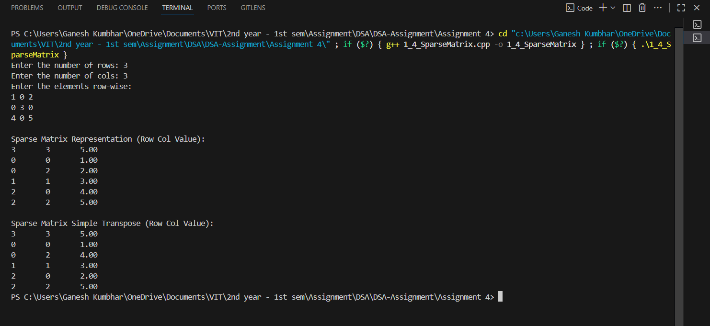

# Sparse Matrix - Compact Representation and Simple Transpose  

## Theory
A **sparse matrix** is a matrix where most of the elements are zero.  
To efficiently store such matrices, we use the **triplet representation** format, where each non-zero element is stored as `(row, column, value)`.  

- The first element (header) stores the total number of rows, columns, and non-zero values.  
- The rest of the array stores the non-zero entries.  
- The transpose of a sparse matrix is achieved by **swapping rows and columns** in each triplet.  

## Algorithm

1. Input the number of rows and columns of the matrix.  
2. Dynamically allocate the matrix and read its elements.  
3. Count the number of non-zero elements.  
4. Allocate an array of `Sparse` structures to store triplets.  
   - The first element stores `(rows, cols, count)`.  
   - The rest store the `(row, col, value)` of each non-zero element.  
5. Display the sparse representation.  
6. Create the **transpose** by swapping row and column values of each triplet.  
   - Process columns in order for stable ordering.  
7. Display the transpose sparse representation.  
8. Free all dynamically allocated memory.  

## Code

```cpp
#include <iostream>
#include <iomanip>
using namespace std;

// Triplet structure for sparse matrix
struct Sparse_gsk {
    int row_gsk, col_gsk;
    float val_gsk;
};

int main() {
    int m_gsk, n_gsk;
    float** matrix_gsk = nullptr;
    Sparse_gsk* sparse_gsk = nullptr;
    Sparse_gsk* transpose_gsk = nullptr;
    int i_gsk, j_gsk;

    // 1. Input rows and columns
    cout << "Enter the number of rows: ";
    cin >> m_gsk;
    cout << "Enter the number of cols: ";
    cin >> n_gsk;

    // 2. Allocate 2D matrix
    matrix_gsk = new float*[m_gsk];
    for (i_gsk = 0; i_gsk < m_gsk; i_gsk++)
        matrix_gsk[i_gsk] = new float[n_gsk];

    // 3. Read matrix and count non-zeros
    int count_gsk = 0;
    cout << "Enter the elements row-wise:\n";
    for (i_gsk = 0; i_gsk < m_gsk; i_gsk++)
        for (j_gsk = 0; j_gsk < n_gsk; j_gsk++) {
            cin >> matrix_gsk[i_gsk][j_gsk];
            if (matrix_gsk[i_gsk][j_gsk] != 0.0f)
                count_gsk++;
        }

    // 4. Allocate sparse[0..count] and store header
    sparse_gsk = new Sparse_gsk[count_gsk + 1];
    sparse_gsk[0].row_gsk = m_gsk;
    sparse_gsk[0].col_gsk = n_gsk;
    sparse_gsk[0].val_gsk = count_gsk;

    // 5. Fill sparse triplets
    int k_gsk = 1;
    for (i_gsk = 0; i_gsk < m_gsk; i_gsk++)
        for (j_gsk = 0; j_gsk < n_gsk; j_gsk++)
            if (matrix_gsk[i_gsk][j_gsk] != 0.0f) {
                sparse_gsk[k_gsk].row_gsk = i_gsk;
                sparse_gsk[k_gsk].col_gsk = j_gsk;
                sparse_gsk[k_gsk].val_gsk = matrix_gsk[i_gsk][j_gsk];
                k_gsk++;
            }

    // 6. Display sparse
    cout << "\nSparse Matrix Representation (Row Col Value):\n";
    for (i_gsk = 0; i_gsk <= count_gsk; i_gsk++)
        cout << sparse_gsk[i_gsk].row_gsk << "\t" << sparse_gsk[i_gsk].col_gsk << "\t" << fixed << setprecision(2) << sparse_gsk[i_gsk].val_gsk << endl;

    // 7. Simple Transpose (swap row/col in triplets, row and col in header)
    transpose_gsk = new Sparse_gsk[count_gsk + 1];
    transpose_gsk[0].row_gsk = sparse_gsk[0].col_gsk;
    transpose_gsk[0].col_gsk = sparse_gsk[0].row_gsk;
    transpose_gsk[0].val_gsk = sparse_gsk[0].val_gsk;

    k_gsk = 1;
    // Process columns in order for stable transpose
    for (j_gsk = 0; j_gsk < n_gsk; j_gsk++)
        for (i_gsk = 1; i_gsk <= count_gsk; i_gsk++)
            if (sparse_gsk[i_gsk].col_gsk == j_gsk) {
                transpose_gsk[k_gsk].row_gsk = sparse_gsk[i_gsk].col_gsk;
                transpose_gsk[k_gsk].col_gsk = sparse_gsk[i_gsk].row_gsk;
                transpose_gsk[k_gsk].val_gsk = sparse_gsk[i_gsk].val_gsk;
                k_gsk++;
            }

    // 8. Display transpose
    cout << "\nSparse Matrix Simple Transpose (Row Col Value):\n";
    for (i_gsk = 0; i_gsk <= count_gsk; i_gsk++)
        cout << transpose_gsk[i_gsk].row_gsk << "\t" << transpose_gsk[i_gsk].col_gsk << "\t" << fixed << setprecision(2) << transpose_gsk[i_gsk].val_gsk << endl;

    // 9. Free all memory
    for (i_gsk = 0; i_gsk < m_gsk; i_gsk++)
        delete[] matrix_gsk[i_gsk];
    delete[] matrix_gsk;
    delete[] sparse_gsk;
    delete[] transpose_gsk;

    return 0;
}
```

## Sample Output

**Input:**  
```
Enter the number of rows: 3
Enter the number of cols: 3
Enter the elements row-wise:
1 0 2
0 3 0
4 0 5
```

**Output:**  
```
Sparse Matrix Representation (Row Col Value):
3   3   5.00
0   0   1.00
0   2   2.00
1   1   3.00
2   0   4.00
2   2   5.00

Sparse Matrix Simple Transpose (Row Col Value):
3   3   5.00
0   0   1.00
2   0   2.00
1   1   3.00
0   2   4.00
2   2   5.00
```
