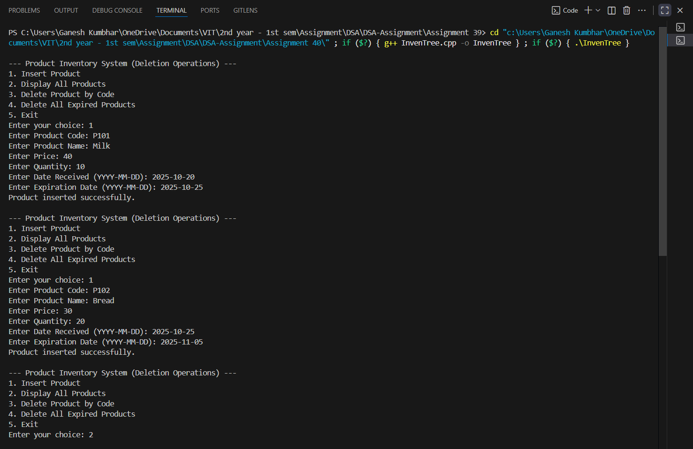
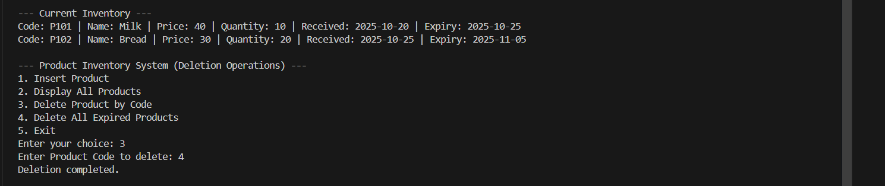

# Deletion Operations in Product Inventory System using Search Tree

## Theory

A **Binary Search Tree (BST)** is a non-linear data structure where each node contains:
- A key (used for ordering)
- Pointers to the left and right child nodes  

In a BST:
- The left child contains keys smaller than the parent.
- The right child contains keys larger than the parent.

In this program, we implement a **Product Inventory System** organized by **Unique Product Code** as the key.  
The system supports **deletion operations** such as:
1. Deleting a specific product by its code.
2. Deleting all expired products automatically by checking current date.

---

## Objectives

1. To implement deletion operations in a **Product Inventory System** using a **Binary Search Tree**.  
2. To allow deletion of:
   - A product by **Product Code**.
   - **All expired products** based on current date comparison.  
3. To display the updated inventory after each operation.

---

## Algorithm

### 1. Delete Product by Code
1. Start at the root.
2. If the given code is smaller, go to the left subtree.
3. If the code is greater, go to the right subtree.
4. If found:
   - **Case 1:** Node has no child → delete directly.
   - **Case 2:** Node has one child → replace node with its child.
   - **Case 3:** Node has two children → replace with inorder successor.
5. Return updated root.

### 2. Delete All Expired Products
1. Traverse the tree recursively.
2. For each node, compare **expiration date** with the current date.
3. If expired, delete the node.
4. Continue traversal for remaining nodes.

---

## Source Code

```cpp
#include <iostream>
#include <string>
#include <ctime>
using namespace std;

// Structure for Product node
struct Product_gsk {
    string code_gsk, name_gsk, date_received_gsk, expiry_date_gsk;
    float price_gsk;
    int quantity_gsk;
    Product_gsk *left_gsk, *right_gsk;

    Product_gsk(string c_gsk, string n_gsk, float p_gsk, int q_gsk, string dr_gsk, string ed_gsk) {
        code_gsk = c_gsk;
        name_gsk = n_gsk;
        price_gsk = p_gsk;
        quantity_gsk = q_gsk;
        date_received_gsk = dr_gsk;
        expiry_date_gsk = ed_gsk;
        left_gsk = right_gsk = nullptr;
    }
};

// Convert "YYYY-MM-DD" to time_t
time_t convertToTime_gsk(string date_gsk) {
    tm t = {};
    sscanf(date_gsk.c_str(), "%d-%d-%d", &t.tm_year, &t.tm_mon, &t.tm_mday);
    t.tm_year -= 1900;
    t.tm_mon -= 1;
    return mktime(&t);
}

// Insert product based on Product Code
Product_gsk* insertProduct_gsk(Product_gsk* root_gsk, string code_gsk, string name_gsk, float price_gsk, int qty_gsk, string dr_gsk, string ed_gsk) {
    if (root_gsk == nullptr)
        return new Product_gsk(code_gsk, name_gsk, price_gsk, qty_gsk, dr_gsk, ed_gsk);

    if (code_gsk < root_gsk->code_gsk)
        root_gsk->left_gsk = insertProduct_gsk(root_gsk->left_gsk, code_gsk, name_gsk, price_gsk, qty_gsk, dr_gsk, ed_gsk);
    else if (code_gsk > root_gsk->code_gsk)
        root_gsk->right_gsk = insertProduct_gsk(root_gsk->right_gsk, code_gsk, name_gsk, price_gsk, qty_gsk, dr_gsk, ed_gsk);

    return root_gsk;
}

// Find minimum node in subtree
Product_gsk* findMin_gsk(Product_gsk* root_gsk) {
    while (root_gsk && root_gsk->left_gsk != nullptr)
        root_gsk = root_gsk->left_gsk;
    return root_gsk;
}

// Delete a product by code
Product_gsk* deleteByCode_gsk(Product_gsk* root_gsk, string code_gsk) {
    if (root_gsk == nullptr)
        return root_gsk;

    if (code_gsk < root_gsk->code_gsk)
        root_gsk->left_gsk = deleteByCode_gsk(root_gsk->left_gsk, code_gsk);
    else if (code_gsk > root_gsk->code_gsk)
        root_gsk->right_gsk = deleteByCode_gsk(root_gsk->right_gsk, code_gsk);
    else {
        if (root_gsk->left_gsk == nullptr) {
            Product_gsk* temp = root_gsk->right_gsk;
            delete root_gsk;
            return temp;
        }
        else if (root_gsk->right_gsk == nullptr) {
            Product_gsk* temp = root_gsk->left_gsk;
            delete root_gsk;
            return temp;
        }

        Product_gsk* temp = findMin_gsk(root_gsk->right_gsk);
        root_gsk->code_gsk = temp->code_gsk;
        root_gsk->name_gsk = temp->name_gsk;
        root_gsk->price_gsk = temp->price_gsk;
        root_gsk->quantity_gsk = temp->quantity_gsk;
        root_gsk->date_received_gsk = temp->date_received_gsk;
        root_gsk->expiry_date_gsk = temp->expiry_date_gsk;
        root_gsk->right_gsk = deleteByCode_gsk(root_gsk->right_gsk, temp->code_gsk);
    }
    return root_gsk;
}

// Delete all expired products
Product_gsk* deleteExpired_gsk(Product_gsk* root_gsk) {
    if (root_gsk == nullptr)
        return nullptr;

    root_gsk->left_gsk = deleteExpired_gsk(root_gsk->left_gsk);
    root_gsk->right_gsk = deleteExpired_gsk(root_gsk->right_gsk);

    time_t now = time(0);
    time_t expDate = convertToTime_gsk(root_gsk->expiry_date_gsk);
    if (difftime(expDate, now) < 0) {
        cout << "Deleting expired product: " << root_gsk->name_gsk << " (" << root_gsk->code_gsk << ")\n";
        root_gsk = deleteByCode_gsk(root_gsk, root_gsk->code_gsk);
    }
    return root_gsk;
}

// Display all products (Inorder)
void inorderDisplay_gsk(Product_gsk* root_gsk) {
    if (root_gsk == nullptr)
        return;
    inorderDisplay_gsk(root_gsk->left_gsk);
    cout << "Code: " << root_gsk->code_gsk
         << " | Name: " << root_gsk->name_gsk
         << " | Price: " << root_gsk->price_gsk
         << " | Quantity: " << root_gsk->quantity_gsk
         << " | Received: " << root_gsk->date_received_gsk
         << " | Expiry: " << root_gsk->expiry_date_gsk << endl;
    inorderDisplay_gsk(root_gsk->right_gsk);
}

int main() {
    Product_gsk* root_gsk = nullptr;
    int choice_gsk;
    string code_gsk, name_gsk, dr_gsk, ed_gsk;
    float price_gsk;
    int qty_gsk;

    while (true) {
        cout << "\n--- Product Inventory System (Deletion Operations) ---\n";
        cout << "1. Insert Product\n2. Display All Products\n3. Delete Product by Code\n4. Delete All Expired Products\n5. Exit\n";
        cout << "Enter your choice: ";
        cin >> choice_gsk;

        switch (choice_gsk) {
            case 1:
                cout << "Enter Product Code: ";
                cin >> code_gsk;
                cout << "Enter Product Name: ";
                cin.ignore();
                getline(cin, name_gsk);
                cout << "Enter Price: ";
                cin >> price_gsk;
                cout << "Enter Quantity: ";
                cin >> qty_gsk;
                cout << "Enter Date Received (YYYY-MM-DD): ";
                cin >> dr_gsk;
                cout << "Enter Expiration Date (YYYY-MM-DD): ";
                cin >> ed_gsk;
                root_gsk = insertProduct_gsk(root_gsk, code_gsk, name_gsk, price_gsk, qty_gsk, dr_gsk, ed_gsk);
                cout << "Product inserted successfully.\n";
                break;

            case 2:
                cout << "\n--- Current Inventory ---\n";
                inorderDisplay_gsk(root_gsk);
                break;

            case 3:
                cout << "Enter Product Code to delete: ";
                cin >> code_gsk;
                root_gsk = deleteByCode_gsk(root_gsk, code_gsk);
                cout << "Deletion completed.\n";
                break;

            case 4:
                root_gsk = deleteExpired_gsk(root_gsk);
                cout << "Expired products deleted successfully.\n";
                break;

            case 5:
                cout << "Exiting program.\n";
                return 0;

            default:
                cout << "Invalid choice. Try again.\n";
        }
    }
}
```
---

## Sample Output

```
--- Product Inventory System (Deletion Operations) ---
1. Insert Product
2. Display All Products
3. Delete Product by Code
4. Delete All Expired Products
5. Exit
Enter your choice: 1
Enter Product Code: P101
Enter Product Name: Milk
Enter Price: 40
Enter Quantity: 10
Enter Date Received (YYYY-MM-DD): 2025-10-20
Enter Expiration Date (YYYY-MM-DD): 2025-10-25
Product inserted successfully.

Enter your choice: 1
Enter Product Code: P102
Enter Product Name: Bread
Enter Price: 30
Enter Quantity: 20
Enter Date Received (YYYY-MM-DD): 2025-10-25
Enter Expiration Date (YYYY-MM-DD): 2025-11-05
Product inserted successfully.

Enter your choice: 2
--- Current Inventory ---
Code: P101 | Name: Milk | Price: 40 | Quantity: 10 | Received: 2025-10-20 | Expiry: 2025-10-25
Code: P102 | Name: Bread | Price: 30 | Quantity: 20 | Received: 2025-10-25 | Expiry: 2025-11-05

Enter your choice: 3
Enter Product Code to delete: P102
Deletion completed.

Enter your choice: 4
Deleting expired product: Milk (P101)
Expired products deleted successfully.
```



