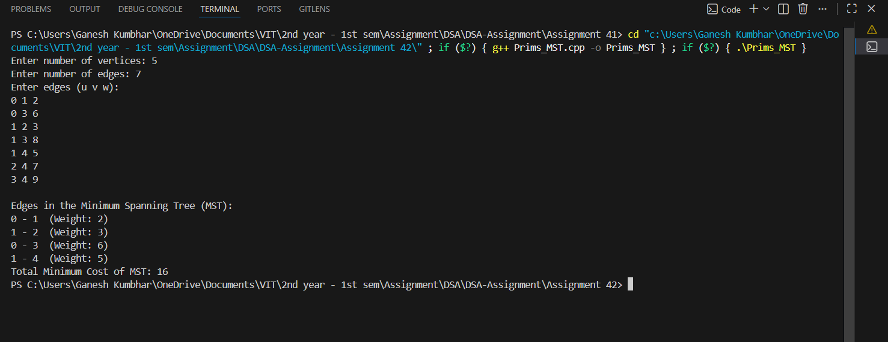

# Prim’s Algorithm for Minimum Spanning Tree (MST)

## Theory

A **Minimum Spanning Tree (MST)** of a connected, undirected, weighted graph is a subset of edges that connects all vertices together, without any cycles, and with the **minimum possible total edge weight**.

### **Prim’s Algorithm**
Prim’s Algorithm is a **greedy algorithm** used to find the MST.  
It starts with a single vertex and keeps adding the smallest edge that connects a vertex in the MST to a vertex outside it, until all vertices are included.

### **Adjacency List Representation**
An **Adjacency List** represents a graph as an array (or vector) of lists:
- Each vertex has a list of all adjacent vertices.
- Each entry in the list stores the **connected vertex** and the **edge weight**.
---

## Algorithm

### **Steps of Prim’s Algorithm**
1. Start with any vertex (say `0`).
2. Maintain three arrays:
   - `key[]`: Minimum weight edge to connect a vertex.
   - `parent[]`: Stores parent vertex of each vertex in MST.
   - `mstSet[]`: Tracks vertices included in MST.
3. Initialize all `key[]` as infinity, and `mstSet[]` as false.
4. Set `key[0] = 0` (starting vertex) and `parent[0] = -1`.
5. Repeat `(V - 1)` times:
   - Pick vertex `u` with the smallest `key[]` not in MST.
   - Include `u` in MST (`mstSet[u] = true`).
   - For every adjacent vertex `v` of `u`, update `key[v]` if:
     - There’s an edge `(u, v)` and  
     - `key[v] > weight(u, v)` and  
     - `v` is not in MST.
6. Print all edges `(parent[v], v)` in MST and calculate total cost.

---

## Source Code

```cpp
#include <iostream>
#include <vector>
#include <queue>
#include <climits>
using namespace std;

typedef pair<int, int> Pair_gsk; // (weight, vertex)

class Graph_gsk {
    int V_gsk;
    vector<vector<Pair_gsk>> adj_gsk; // Adjacency list

public:
    Graph_gsk(int vertices_gsk) {
        V_gsk = vertices_gsk;
        adj_gsk.resize(V_gsk);
    }

    void addEdge_gsk(int u_gsk, int v_gsk, int w_gsk) {
        adj_gsk[u_gsk].push_back({w_gsk, v_gsk});
        adj_gsk[v_gsk].push_back({w_gsk, u_gsk}); // Undirected graph
    }

    void primMST_gsk() {
        vector<int> key_gsk(V_gsk, INT_MAX);
        vector<int> parent_gsk(V_gsk, -1);
        vector<bool> inMST_gsk(V_gsk, false);

        priority_queue<Pair_gsk, vector<Pair_gsk>, greater<Pair_gsk>> pq_gsk;

        int start_gsk = 0;
        key_gsk[start_gsk] = 0;
        pq_gsk.push({0, start_gsk});

        while (!pq_gsk.empty()) {
            int u_gsk = pq_gsk.top().second;
            pq_gsk.pop();
            inMST_gsk[u_gsk] = true;

            for (auto [weight_gsk, v_gsk] : adj_gsk[u_gsk]) {
                if (!inMST_gsk[v_gsk] && weight_gsk < key_gsk[v_gsk]) {
                    key_gsk[v_gsk] = weight_gsk;
                    pq_gsk.push({key_gsk[v_gsk], v_gsk});
                    parent_gsk[v_gsk] = u_gsk;
                }
            }
        }

        cout << "\nEdges in the Minimum Spanning Tree (MST):\n";
        int totalWeight_gsk = 0;
        for (int i = 1; i < V_gsk; i++) {
            cout << parent_gsk[i] << " - " << i << "  (Weight: " << key_gsk[i] << ")\n";
            totalWeight_gsk += key_gsk[i];
        }
        cout << "Total Minimum Cost of MST: " << totalWeight_gsk << endl;
    }
};

int main() {
    int vertices_gsk, edges_gsk;
    cout << "Enter number of vertices: ";
    cin >> vertices_gsk;

    Graph_gsk g_gsk(vertices_gsk);

    cout << "Enter number of edges: ";
    cin >> edges_gsk;

    cout << "Enter edges (u v w):\n";
    for (int i = 0; i < edges_gsk; i++) {
        int u_gsk, v_gsk, w_gsk;
        cin >> u_gsk >> v_gsk >> w_gsk;
        g_gsk.addEdge_gsk(u_gsk, v_gsk, w_gsk);
    }

    g_gsk.primMST_gsk();
    return 0;
}
```

---

## Sample Output

```
Enter number of vertices: 5
Enter number of edges: 7
Enter edges (u v w):
0 1 2
0 3 6
1 2 3
1 3 8
1 4 5
2 4 7
3 4 9

Edges in the Minimum Spanning Tree (MST):
0 - 1  (Weight: 2)
1 - 2  (Weight: 3)
1 - 4  (Weight: 5)
0 - 3  (Weight: 6)
Total Minimum Cost of MST: 16
```
