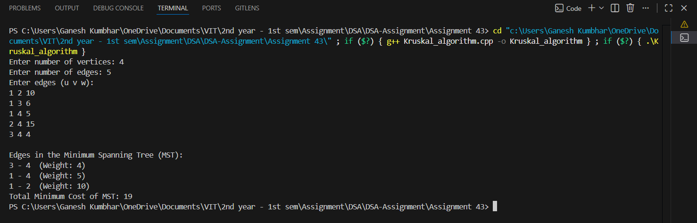

# Kruskal’s Algorithm for Minimum Spanning Tree (MST)

## Theory

**Kruskal’s Algorithm** is a **greedy algorithm** used to find the **Minimum Spanning Tree (MST)** of a connected, undirected, and weighted graph.

It works by:
1. Sorting all edges in non-decreasing order of their weight.
2. Picking the smallest edge that does not form a cycle with the MST constructed so far.
3. Repeating until there are `(V - 1)` edges in the MST.

To detect cycles efficiently, **Disjoint Set Union (DSU)** or **Union-Find** data structure is used.

In this program, the graph is represented using an **Adjacency List**, and all edges are stored in a vector for sorting.

---

## Objectives

1. To implement **Kruskal’s algorithm** for finding the **Minimum Spanning Tree (MST)**.
2. To use **Adjacency List** for representing the graph.
3. To calculate and display the total **Minimum Cost** of the MST.

---

## Algorithm

### Steps:
1. **Input** the number of vertices and edges.
2. **Store edges** in a list along with their weights.
3. **Sort** the edges based on weight.
4. **Initialize** a Disjoint Set (Union-Find) for each vertex.
5. **Iterate** through edges:
   - If the edge connects two different sets, include it in the MST.
   - Perform **union** of those sets.
6. **Display** the edges included in the MST and the total minimum cost.

---

## Source Code

```cpp
#include <iostream>
#include <vector>
#include <algorithm>
using namespace std;

struct Edge_gsk {
    int src_gsk, dest_gsk, weight_gsk;
};

class Graph_gsk {
    int V_gsk;
    vector<Edge_gsk> edges_gsk;

public:
    Graph_gsk(int vertices_gsk) {
        V_gsk = vertices_gsk;
    }

    void addEdge_gsk(int u_gsk, int v_gsk, int w_gsk) {
        edges_gsk.push_back({u_gsk, v_gsk, w_gsk});
    }

    int findParent_gsk(int vertex_gsk, vector<int>& parent_gsk) {
        if (parent_gsk[vertex_gsk] == vertex_gsk)
            return vertex_gsk;
        return parent_gsk[vertex_gsk] = findParent_gsk(parent_gsk[vertex_gsk], parent_gsk);
    }

    void unionSets_gsk(int u_gsk, int v_gsk, vector<int>& parent_gsk, vector<int>& rank_gsk) {
        int rootU_gsk = findParent_gsk(u_gsk, parent_gsk);
        int rootV_gsk = findParent_gsk(v_gsk, parent_gsk);

        if (rootU_gsk != rootV_gsk) {
            if (rank_gsk[rootU_gsk] < rank_gsk[rootV_gsk])
                parent_gsk[rootU_gsk] = rootV_gsk;
            else if (rank_gsk[rootU_gsk] > rank_gsk[rootV_gsk])
                parent_gsk[rootV_gsk] = rootU_gsk;
            else {
                parent_gsk[rootV_gsk] = rootU_gsk;
                rank_gsk[rootU_gsk]++;
            }
        }
    }

    void kruskalMST_gsk() {
        sort(edges_gsk.begin(), edges_gsk.end(), [](Edge_gsk a, Edge_gsk b) {
            return a.weight_gsk < b.weight_gsk;
        });

        vector<int> parent_gsk(V_gsk);
        vector<int> rank_gsk(V_gsk, 0);
        for (int i = 0; i < V_gsk; i++)
            parent_gsk[i] = i;

        vector<Edge_gsk> result_gsk;
        int totalWeight_gsk = 0;

        for (auto edge_gsk : edges_gsk) {
            int rootU_gsk = findParent_gsk(edge_gsk.src_gsk, parent_gsk);
            int rootV_gsk = findParent_gsk(edge_gsk.dest_gsk, parent_gsk);

            if (rootU_gsk != rootV_gsk) {
                result_gsk.push_back(edge_gsk);
                totalWeight_gsk += edge_gsk.weight_gsk;
                unionSets_gsk(rootU_gsk, rootV_gsk, parent_gsk, rank_gsk);
            }
        }

        cout << "\nEdges in the Minimum Spanning Tree (MST):\n";
        for (auto edge_gsk : result_gsk)
            cout << edge_gsk.src_gsk << " - " << edge_gsk.dest_gsk << "  (Weight: " << edge_gsk.weight_gsk << ")\n";

        cout << "Total Minimum Cost of MST: " << totalWeight_gsk << endl;
    }
};

int main() {
    int vertices_gsk, edges_gsk;
    cout << "Enter number of vertices: ";
    cin >> vertices_gsk;

    Graph_gsk g_gsk(vertices_gsk);

    cout << "Enter number of edges: ";
    cin >> edges_gsk;

    cout << "Enter edges (u v w):\n";
    for (int i = 0; i < edges_gsk; i++) {
        int u_gsk, v_gsk, w_gsk;
        cin >> u_gsk >> v_gsk >> w_gsk;
        g_gsk.addEdge_gsk(u_gsk, v_gsk, w_gsk);
    }

    g_gsk.kruskalMST_gsk();
    return 0;
}
```
---

## Sample Output

```
Enter number of vertices: 4
Enter number of edges: 5
Enter edges (u v w):
0 1 10
0 2 6
0 3 5
1 3 15
2 3 4

Edges in the Minimum Spanning Tree (MST):
2 - 3  (Weight: 4)
0 - 3  (Weight: 5)
0 - 1  (Weight: 10)
Total Minimum Cost of MST: 19
```

