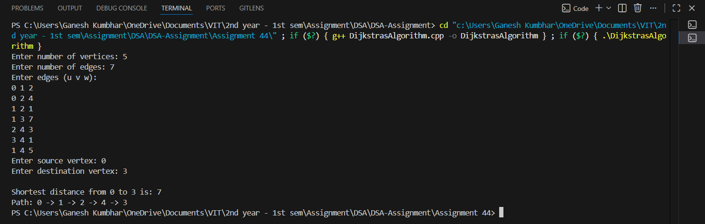

# Dijkstra’s Algorithm for Shortest Path

## Theory

**Dijkstra’s Algorithm** is a **greedy algorithm** used to find the **shortest path** from a given **source vertex** to all other vertices in a **weighted graph** (with non-negative edge weights).  

It uses a **priority queue (min-heap)** to always pick the vertex with the minimum distance that has not yet been processed.

In this program, the graph is represented using an **Adjacency List**, where each vertex stores its connected vertices and corresponding edge weights.

---

## Objectives

1. To implement **Dijkstra’s Algorithm** for finding the shortest distance between two nodes.  
2. To represent the graph using an **Adjacency List**.  
3. To display the shortest distance and the path between the specified source and destination nodes.

---

## Algorithm

### Steps:
1. **Input** the number of vertices and edges.  
2. **Store** all edges and weights in an adjacency list.  
3. Initialize all distances as **infinity** except the **source vertex** (distance = 0).  
4. Use a **priority queue** to pick the vertex with the minimum distance.  
5. Update distances of its adjacent vertices if a **shorter path** is found.  
6. Repeat until all vertices are processed.  
7. Display the **shortest distance** and the **path** from source to destination.

---

## Source Code

```cpp
#include <iostream>
#include <vector>
#include <queue>
#include <climits>
using namespace std;

typedef pair<int, int> Pair_gsk; // (distance, vertex)

class Graph_gsk {
    int V_gsk;
    vector<vector<Pair_gsk>> adj_gsk; // Adjacency list

public:
    Graph_gsk(int vertices_gsk) {
        V_gsk = vertices_gsk;
        adj_gsk.resize(V_gsk);
    }

    void addEdge_gsk(int u_gsk, int v_gsk, int w_gsk) {
        adj_gsk[u_gsk].push_back({w_gsk, v_gsk});
        adj_gsk[v_gsk].push_back({w_gsk, u_gsk}); // Undirected graph
    }

    void dijkstra_gsk(int src_gsk, int dest_gsk) {
        vector<int> dist_gsk(V_gsk, INT_MAX);
        vector<int> parent_gsk(V_gsk, -1);
        priority_queue<Pair_gsk, vector<Pair_gsk>, greater<Pair_gsk>> pq_gsk;

        dist_gsk[src_gsk] = 0;
        pq_gsk.push({0, src_gsk});

        while (!pq_gsk.empty()) {
            int u_gsk = pq_gsk.top().second;
            int d_gsk = pq_gsk.top().first;
            pq_gsk.pop();

            if (d_gsk > dist_gsk[u_gsk])
                continue;

            for (auto edge_gsk : adj_gsk[u_gsk]) {
                int weight_gsk = edge_gsk.first;
                int v_gsk = edge_gsk.second;

                if (dist_gsk[u_gsk] + weight_gsk < dist_gsk[v_gsk]) {
                    dist_gsk[v_gsk] = dist_gsk[u_gsk] + weight_gsk;
                    parent_gsk[v_gsk] = u_gsk;
                    pq_gsk.push({dist_gsk[v_gsk], v_gsk});
                }
            }
        }

        cout << "\nShortest distance from " << src_gsk << " to " << dest_gsk << " is: " << dist_gsk[dest_gsk] << endl;

        cout << "Path: ";
        vector<int> path_gsk;
        for (int v = dest_gsk; v != -1; v = parent_gsk[v])
            path_gsk.push_back(v);

        for (int i = path_gsk.size() - 1; i >= 0; i--) {
            cout << path_gsk[i];
            if (i != 0) cout << " -> ";
        }
        cout << endl;
    }
};

int main() {
    int vertices_gsk, edges_gsk;
    cout << "Enter number of vertices: ";
    cin >> vertices_gsk;

    Graph_gsk g_gsk(vertices_gsk);

    cout << "Enter number of edges: ";
    cin >> edges_gsk;

    cout << "Enter edges (u v w):\n";
    for (int i = 0; i < edges_gsk; i++) {
        int u_gsk, v_gsk, w_gsk;
        cin >> u_gsk >> v_gsk >> w_gsk;
        g_gsk.addEdge_gsk(u_gsk, v_gsk, w_gsk);
    }

    int src_gsk, dest_gsk;
    cout << "Enter source vertex: ";
    cin >> src_gsk;
    cout << "Enter destination vertex: ";
    cin >> dest_gsk;

    g_gsk.dijkstra_gsk(src_gsk, dest_gsk);
    return 0;
}
```
---

## Sample Output

```
Enter number of vertices: 5
Enter number of edges: 7
Enter edges (u v w):
0 1 2
0 2 4
1 2 1
1 3 7
2 4 3
3 4 1
1 4 5
Enter source vertex: 0
Enter destination vertex: 3

Shortest distance from 0 to 3 is: 7
Path: 0 -> 1 -> 2 -> 4 -> 3
```


