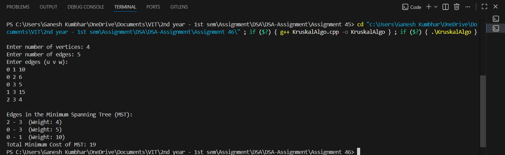

# Kruskal’s Algorithm to Find Minimum Spanning Tree (MST)

## Aim

Write a Program to implement **Kruskal’s algorithm** to find the **Minimum Spanning Tree (MST)** of a user-defined graph.  
Use **Adjacency Matrix** to represent a graph.

---

## Theory

**Kruskal’s Algorithm** is a **greedy algorithm** that finds a **Minimum Spanning Tree (MST)** for a connected, undirected, and weighted graph.  
The MST connects all vertices with the **minimum total edge weight** and **no cycles**.

### Key Concepts:
- The algorithm sorts all edges in **non-decreasing order of their weights**.
- It then picks the smallest edge and adds it to the MST if it **doesn’t form a cycle**.
- The process continues until the MST contains **(V - 1)** edges.

### Terminology:
- **MST (Minimum Spanning Tree)**: A subset of edges that connects all vertices with minimum cost and no cycles.
- **Disjoint Set (Union-Find)**: A data structure used to check whether including an edge will form a cycle.

---

## Algorithm

1. Start.  
2. Input the number of vertices and edges.  
3. Represent the graph using an **Adjacency Matrix**.  
4. Extract all edges and sort them by weight (ascending order).  
5. Use **Union-Find** to detect cycles.  
6. Add edges to the MST one by one until `(V - 1)` edges are added.  
7. Display the edges included in the MST and its total cost.  
8. Stop.

---

## Program

```cpp
#include <iostream>
#include <vector>
#include <algorithm>
using namespace std;

class Graph_gsk {
    int V_gsk;
    vector<vector<int>> adj_gsk;

    int findParent_gsk(int vertex_gsk, vector<int>& parent_gsk) {
        if (parent_gsk[vertex_gsk] != vertex_gsk)
            parent_gsk[vertex_gsk] = findParent_gsk(parent_gsk[vertex_gsk], parent_gsk);
        return parent_gsk[vertex_gsk];
    }

    void unionSets_gsk(int u_gsk, int v_gsk, vector<int>& parent_gsk, vector<int>& rank_gsk) {
        int rootU_gsk = findParent_gsk(u_gsk, parent_gsk);
        int rootV_gsk = findParent_gsk(v_gsk, parent_gsk);

        if (rootU_gsk != rootV_gsk) {
            if (rank_gsk[rootU_gsk] < rank_gsk[rootV_gsk])
                parent_gsk[rootU_gsk] = rootV_gsk;
            else if (rank_gsk[rootU_gsk] > rank_gsk[rootV_gsk])
                parent_gsk[rootV_gsk] = rootU_gsk;
            else {
                parent_gsk[rootV_gsk] = rootU_gsk;
                rank_gsk[rootU_gsk]++;
            }
        }
    }

public:
    Graph_gsk(int vertices_gsk) {
        V_gsk = vertices_gsk;
        adj_gsk.resize(V_gsk, vector<int>(V_gsk, 0));
    }

    void addEdge_gsk(int u_gsk, int v_gsk, int w_gsk) {
        adj_gsk[u_gsk][v_gsk] = w_gsk;
        adj_gsk[v_gsk][u_gsk] = w_gsk; // Undirected graph
    }

    void kruskalMST_gsk() {
        vector<pair<int, pair<int, int>>> edges_gsk;

        // Convert adjacency matrix to edge list
        for (int i = 0; i < V_gsk; i++) {
            for (int j = i + 1; j < V_gsk; j++) {
                if (adj_gsk[i][j] != 0)
                    edges_gsk.push_back({adj_gsk[i][j], {i, j}});
            }
        }

        sort(edges_gsk.begin(), edges_gsk.end());

        vector<int> parent_gsk(V_gsk), rank_gsk(V_gsk, 0);
        for (int i = 0; i < V_gsk; i++)
            parent_gsk[i] = i;

        cout << "\nEdges in the Minimum Spanning Tree (MST):\n";
        int totalWeight_gsk = 0;

        for (auto edge_gsk : edges_gsk) {
            int weight_gsk = edge_gsk.first;
            int u_gsk = edge_gsk.second.first;
            int v_gsk = edge_gsk.second.second;

            int rootU_gsk = findParent_gsk(u_gsk, parent_gsk);
            int rootV_gsk = findParent_gsk(v_gsk, parent_gsk);

            if (rootU_gsk != rootV_gsk) {
                cout << u_gsk << " - " << v_gsk << "  (Weight: " << weight_gsk << ")\n";
                totalWeight_gsk += weight_gsk;
                unionSets_gsk(rootU_gsk, rootV_gsk, parent_gsk, rank_gsk);
            }
        }

        cout << "Total Minimum Cost of MST: " << totalWeight_gsk << endl;
    }
};

int main() {
    int vertices_gsk, edges_gsk;
    cout << "Enter number of vertices: ";
    cin >> vertices_gsk;

    Graph_gsk g_gsk(vertices_gsk);

    cout << "Enter number of edges: ";
    cin >> edges_gsk;

    cout << "Enter edges (u v w):\n";
    for (int i = 0; i < edges_gsk; i++) {
        int u_gsk, v_gsk, w_gsk;
        cin >> u_gsk >> v_gsk >> w_gsk;
        g_gsk.addEdge_gsk(u_gsk, v_gsk, w_gsk);
    }

    g_gsk.kruskalMST_gsk();
    return 0;
}
```
---

## Sample Output

```
Enter number of vertices: 4
Enter number of edges: 5
Enter edges (u v w):
0 1 10
0 2 6
0 3 5
1 3 15
2 3 4

Edges in the Minimum Spanning Tree (MST):
2 - 3  (Weight: 4)
0 - 3  (Weight: 5)
0 - 1  (Weight: 10)
Total Minimum Cost of MST: 19
```
