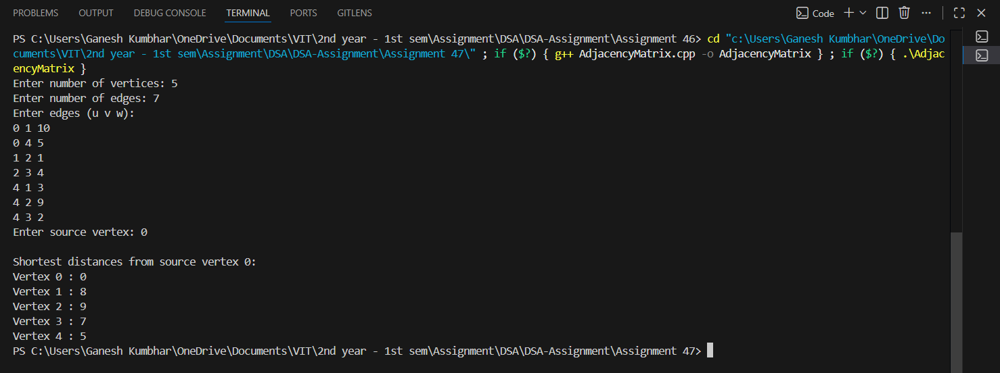

# Dijkstra’s Algorithm using Adjacency Matrix

## Theory

A **graph** is a data structure consisting of vertices (nodes) and edges connecting them.  
In a **weighted graph**, each edge has an associated cost (or weight).  

The **Dijkstra’s Algorithm** is a **greedy algorithm** used to find the **shortest path** from a source vertex to all other vertices in a weighted graph (non-negative weights).  

It works by repeatedly selecting the vertex with the **minimum distance** that has not yet been visited, and updating the distances to its adjacent vertices.

---

## Objectives

1. To accept a user-defined graph using an **Adjacency Matrix** representation.  
2. To implement **Dijkstra’s Algorithm** to find the shortest path from a given source node to all other nodes.  
3. To display the **shortest distances** from the source to each vertex.

---

## Algorithm

### Dijkstra’s Algorithm

1. Start by initializing:
   - Distance of all vertices as infinity (`∞`).
   - Distance of source vertex as `0`.
   - A boolean array `visited[]` to mark processed vertices.
2. Repeat until all vertices are processed:
   - Pick the unvisited vertex with the **minimum distance**.
   - Mark it as visited.
   - Update the distance of all adjacent vertices.
3. For every adjacent vertex `v` of the selected vertex `u`,  
   if `distance[u] + weight(u, v) < distance[v]`, update `distance[v]`.
4. After all vertices are visited, the distance array will contain the **shortest paths** from the source.

---

## Source Code

```cpp
#include <iostream>
#include <vector>
#include <climits>
using namespace std;

#define INF INT_MAX

class Graph_gsk {
    int V_gsk;
    vector<vector<int>> adj_gsk; // Adjacency matrix

public:
    Graph_gsk(int vertices_gsk) {
        V_gsk = vertices_gsk;
        adj_gsk.resize(V_gsk, vector<int>(V_gsk, 0));
    }

    void addEdge_gsk(int u_gsk, int v_gsk, int w_gsk) {
        adj_gsk[u_gsk][v_gsk] = w_gsk;
        adj_gsk[v_gsk][u_gsk] = w_gsk; // Undirected graph
    }

    int minDistance_gsk(vector<int>& dist_gsk, vector<bool>& visited_gsk) {
        int min_gsk = INF, minIndex_gsk = -1;
        for (int v_gsk = 0; v_gsk < V_gsk; v_gsk++) {
            if (!visited_gsk[v_gsk] && dist_gsk[v_gsk] <= min_gsk) {
                min_gsk = dist_gsk[v_gsk];
                minIndex_gsk = v_gsk;
            }
        }
        return minIndex_gsk;
    }

    void dijkstra_gsk(int src_gsk) {
        vector<int> dist_gsk(V_gsk, INF);
        vector<bool> visited_gsk(V_gsk, false);

        dist_gsk[src_gsk] = 0;

        for (int count_gsk = 0; count_gsk < V_gsk - 1; count_gsk++) {
            int u_gsk = minDistance_gsk(dist_gsk, visited_gsk);
            visited_gsk[u_gsk] = true;

            for (int v_gsk = 0; v_gsk < V_gsk; v_gsk++) {
                if (!visited_gsk[v_gsk] && adj_gsk[u_gsk][v_gsk] &&
                    dist_gsk[u_gsk] != INF &&
                    dist_gsk[u_gsk] + adj_gsk[u_gsk][v_gsk] < dist_gsk[v_gsk]) {
                    dist_gsk[v_gsk] = dist_gsk[u_gsk] + adj_gsk[u_gsk][v_gsk];
                }
            }
        }

        cout << "\nShortest distances from source vertex " << src_gsk << ":\n";
        for (int i = 0; i < V_gsk; i++) {
            cout << "Vertex " << i << " : ";
            if (dist_gsk[i] == INF)
                cout << "Unreachable\n";
            else
                cout << dist_gsk[i] << endl;
        }
    }
};

int main() {
    int vertices_gsk, edges_gsk;
    cout << "Enter number of vertices: ";
    cin >> vertices_gsk;

    Graph_gsk g_gsk(vertices_gsk);

    cout << "Enter number of edges: ";
    cin >> edges_gsk;

    cout << "Enter edges (u v w):\n";
    for (int i = 0; i < edges_gsk; i++) {
        int u_gsk, v_gsk, w_gsk;
        cin >> u_gsk >> v_gsk >> w_gsk;
        g_gsk.addEdge_gsk(u_gsk, v_gsk, w_gsk);
    }

    int src_gsk;
    cout << "Enter source vertex: ";
    cin >> src_gsk;

    g_gsk.dijkstra_gsk(src_gsk);
    return 0;
}
```
---

## Sample Output

```
Enter number of vertices: 5
Enter number of edges: 7
Enter edges (u v w):
0 1 10
0 4 5
1 2 1
2 3 4
4 1 3
4 2 9
4 3 2
Enter source vertex: 0

Shortest distances from source vertex 0:
Vertex 0 : 0
Vertex 1 : 8
Vertex 2 : 9
Vertex 3 : 7
Vertex 4 : 5
```
