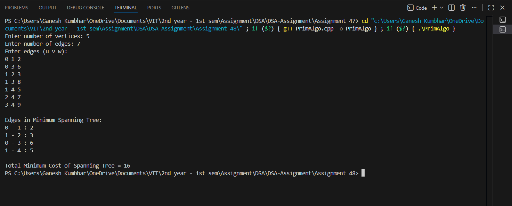

# Prim’s Algorithm using Adjacency List

## Theory

A **graph** is a collection of vertices (nodes) connected by edges.  
A **Minimum Spanning Tree (MST)** of a weighted graph is a subset of its edges that connects all the vertices together, without any cycles, and with the **minimum possible total edge weight**.

**Prim’s Algorithm** is a **greedy algorithm** that finds the MST for a connected, undirected, weighted graph.  
It starts with a single vertex and grows the MST one edge at a time by always adding the **smallest weight edge** that connects a vertex in the tree to a vertex outside it.

---

## Objectives

1. To represent a user-defined graph using an **Adjacency List**.
2. To implement **Prim’s Algorithm** for finding the **Minimum Spanning Tree (MST)**.
3. To display the **edges** and **total minimum cost** of the MST.

---

## Algorithm

### Prim’s Algorithm

1. Start from any vertex.
2. Maintain a set of vertices already included in the MST.
3. At each step, pick the edge with the **minimum weight** that connects a vertex in the MST to a vertex outside it.
4. Repeat until all vertices are included in the MST.

---

## Source Code

```cpp
#include <iostream>
#include <vector>
#include <queue>
#include <utility>
using namespace std;

class Graph_gsk {
    int V_gsk;
    vector<vector<pair<int, int>>> adj_gsk; // vertex -> (neighbor, weight)

public:
    Graph_gsk(int vertices_gsk) {
        V_gsk = vertices_gsk;
        adj_gsk.resize(V_gsk);
    }

    void addEdge_gsk(int u_gsk, int v_gsk, int w_gsk) {
        adj_gsk[u_gsk].push_back({v_gsk, w_gsk});
        adj_gsk[v_gsk].push_back({u_gsk, w_gsk}); // Undirected graph
    }

    void primMST_gsk() {
        vector<int> key_gsk(V_gsk, 1e9);  // Cost to reach each vertex
        vector<int> parent_gsk(V_gsk, -1);
        vector<bool> inMST_gsk(V_gsk, false);

        key_gsk[0] = 0; // Start from vertex 0
        priority_queue<pair<int, int>, vector<pair<int, int>>, greater<pair<int, int>>> pq_gsk;
        pq_gsk.push({0, 0}); // (weight, vertex)

        while (!pq_gsk.empty()) {
            int u_gsk = pq_gsk.top().second;
            pq_gsk.pop();

            if (inMST_gsk[u_gsk]) continue;
            inMST_gsk[u_gsk] = true;

            for (auto [v_gsk, w_gsk] : adj_gsk[u_gsk]) {
                if (!inMST_gsk[v_gsk] && w_gsk < key_gsk[v_gsk]) {
                    key_gsk[v_gsk] = w_gsk;
                    pq_gsk.push({key_gsk[v_gsk], v_gsk});
                    parent_gsk[v_gsk] = u_gsk;
                }
            }
        }

        cout << "\nEdges in Minimum Spanning Tree:\n";
        int totalWeight_gsk = 0;
        for (int i = 1; i < V_gsk; i++) {
            cout << parent_gsk[i] << " - " << i << " : " << key_gsk[i] << endl;
            totalWeight_gsk += key_gsk[i];
        }
        cout << "\nTotal Minimum Cost of Spanning Tree = " << totalWeight_gsk << endl;
    }
};

int main() {
    int vertices_gsk, edges_gsk;
    cout << "Enter number of vertices: ";
    cin >> vertices_gsk;

    Graph_gsk g_gsk(vertices_gsk);

    cout << "Enter number of edges: ";
    cin >> edges_gsk;

    cout << "Enter edges (u v w):\n";
    for (int i = 0; i < edges_gsk; i++) {
        int u_gsk, v_gsk, w_gsk;
        cin >> u_gsk >> v_gsk >> w_gsk;
        g_gsk.addEdge_gsk(u_gsk, v_gsk, w_gsk);
    }

    g_gsk.primMST_gsk();

    return 0;
}
```
---

## Sample Output

```
Enter number of vertices: 5
Enter number of edges: 7
Enter edges (u v w):
0 1 2
0 3 6
1 2 3
1 3 8
1 4 5
2 4 7
3 4 9

Edges in Minimum Spanning Tree:
0 - 1 : 2
1 - 2 : 3
1 - 4 : 5
0 - 3 : 6

Total Minimum Cost of Spanning Tree = 16
```
