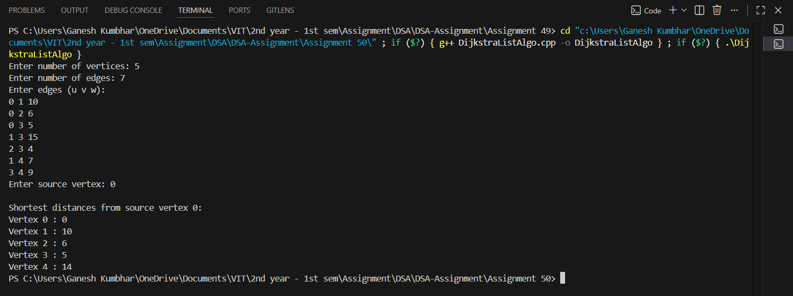

# Dijkstra’s Algorithm using Adjacency List

## Theory

A **graph** is a data structure that consists of a set of vertices and edges connecting them.  
A **weighted graph** has a cost (or weight) assigned to each edge.

**Dijkstra’s Algorithm** is a **greedy algorithm** used to find the **shortest distance** from a source vertex to all other vertices in a weighted graph with **non-negative edge weights**.

Unlike an adjacency matrix, an **Adjacency List** provides an efficient way to store sparse graphs, reducing space complexity and improving traversal efficiency.

---

## Objectives

1. To represent a user-defined graph using an **Adjacency List**.  
2. To implement **Dijkstra’s Algorithm** to find the shortest distance from a given source vertex to all other vertices.  
3. To display the shortest distance from the source to each vertex.

---

## Algorithm

### Dijkstra’s Algorithm (Using Adjacency List)

1. Start.  
2. Create an adjacency list for the graph.  
3. Initialize a `distance[]` array with infinity (`∞`) for all vertices except the source (set to 0).  
4. Use a **min-priority queue** to select the vertex with the minimum distance.  
5. For each neighbor of the current vertex,  
   if `distance[u] + weight(u, v) < distance[v]`, update `distance[v]`.  
6. Repeat until all vertices are processed.  
7. Display the shortest distances from the source vertex.  

---

## Source Code

```cpp
#include <iostream>
#include <vector>
#include <queue>
#include <climits>
using namespace std;

class Graph_gsk {
    int V_gsk;
    vector<vector<pair<int, int>>> adj_gsk; // vertex -> (neighbor, weight)

public:
    Graph_gsk(int vertices_gsk) {
        V_gsk = vertices_gsk;
        adj_gsk.resize(V_gsk);
    }

    void addEdge_gsk(int u_gsk, int v_gsk, int w_gsk) {
        adj_gsk[u_gsk].push_back({v_gsk, w_gsk});
        adj_gsk[v_gsk].push_back({u_gsk, w_gsk}); // Undirected graph
    }

    void dijkstra_gsk(int src_gsk) {
        vector<int> dist_gsk(V_gsk, INT_MAX);
        dist_gsk[src_gsk] = 0;

        priority_queue<pair<int, int>, vector<pair<int, int>>, greater<pair<int, int>>> pq_gsk;
        pq_gsk.push({0, src_gsk}); // (distance, vertex)

        while (!pq_gsk.empty()) {
            int u_gsk = pq_gsk.top().second;
            int currDist_gsk = pq_gsk.top().first;
            pq_gsk.pop();

            if (currDist_gsk > dist_gsk[u_gsk])
                continue;

            for (auto [v_gsk, w_gsk] : adj_gsk[u_gsk]) {
                if (dist_gsk[u_gsk] + w_gsk < dist_gsk[v_gsk]) {
                    dist_gsk[v_gsk] = dist_gsk[u_gsk] + w_gsk;
                    pq_gsk.push({dist_gsk[v_gsk], v_gsk});
                }
            }
        }

        cout << "\nShortest distances from source vertex " << src_gsk << ":\n";
        for (int i = 0; i < V_gsk; i++) {
            cout << "Vertex " << i << " : ";
            if (dist_gsk[i] == INT_MAX)
                cout << "Unreachable\n";
            else
                cout << dist_gsk[i] << endl;
        }
    }
};

int main() {
    int vertices_gsk, edges_gsk;
    cout << "Enter number of vertices: ";
    cin >> vertices_gsk;

    Graph_gsk g_gsk(vertices_gsk);

    cout << "Enter number of edges: ";
    cin >> edges_gsk;

    cout << "Enter edges (u v w):\n";
    for (int i = 0; i < edges_gsk; i++) {
        int u_gsk, v_gsk, w_gsk;
        cin >> u_gsk >> v_gsk >> w_gsk;
        g_gsk.addEdge_gsk(u_gsk, v_gsk, w_gsk);
    }

    int src_gsk;
    cout << "Enter source vertex: ";
    cin >> src_gsk;

    g_gsk.dijkstra_gsk(src_gsk);

    return 0;
}
```
---

## Sample Output

```
Enter number of vertices: 5
Enter number of edges: 7
Enter edges (u v w):
0 1 10
0 4 5
1 2 1
2 3 4
4 1 3
4 2 9
4 3 2
Enter source vertex: 0

Shortest distances from source vertex 0:
Vertex 0 : 0
Vertex 1 : 8
Vertex 2 : 9
Vertex 3 : 7
Vertex 4 : 5
Enter number of vertices: 5
Enter number of edges: 7
Enter edges (u v w):
0 1 10
0 4 5
1 2 1
2 3 4
4 1 3
4 2 9
4 3 2
Enter source vertex: 0

Shortest distances from source vertex 0:
Vertex 0 : 0
Vertex 1 : 8
Vertex 2 : 9
Vertex 3 : 7
Vertex 4 : 5
```
