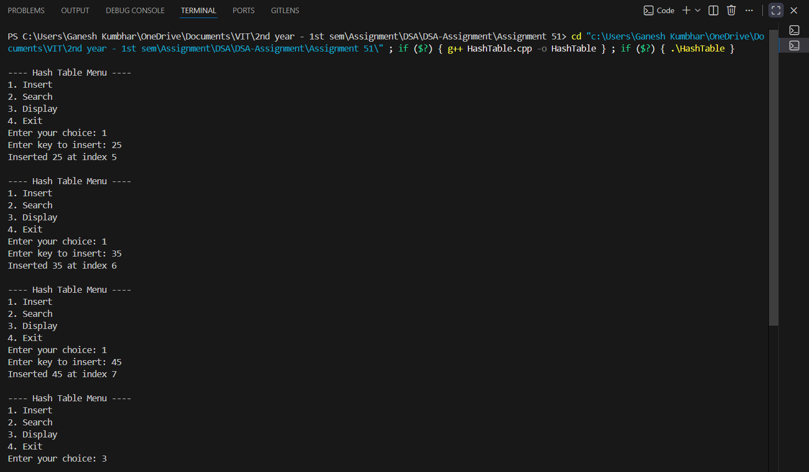
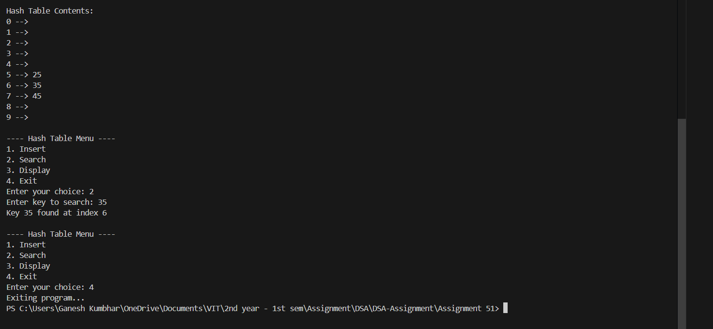

# Hash Table Implementation with Collision Resolution using Linear Probing

## Theory

A **Hash Table** is a data structure that stores key-value pairs and provides efficient insertion, deletion, and searching operations.  
The position of an element in the hash table is determined using a **hash function**.

However, multiple keys may hash to the same index — this situation is called a **collision**.  
To handle collisions, several strategies exist. One of the simplest and most effective ones is **Linear Probing**.

### **Linear Probing:**
When a collision occurs at a position `h(k)`, linear probing searches for the **next available slot** by checking sequentially `(h(k) + 1) % size`, `(h(k) + 2) % size`, and so on, until a free space is found.

---


## Algorithm

### **Algorithm for Insertion**
1. Compute the hash index using `index = key % SIZE`.
2. If the position is empty, insert the key.
3. If occupied, move to the next position `(index + 1) % SIZE`.
4. Repeat until an empty slot is found or the table is full.

### **Algorithm for Search**
1. Compute the hash index for the key.
2. If the key at that index matches, return found.
3. Otherwise, continue probing linearly until the key is found or an empty slot is reached.

### **Algorithm for Display**
1. Traverse the hash table.
2. Print all occupied indices and their corresponding keys.

---

## Source Code

```cpp
#include <iostream>
using namespace std;

#define SIZE 10

class HashTable_gsk {
    int table_gsk[SIZE];

public:
    HashTable_gsk() {
        for (int i = 0; i < SIZE; i++)
            table_gsk[i] = -1; // -1 means empty
    }

    int hashFunction_gsk(int key_gsk) {
        return key_gsk % SIZE;
    }

    void insert_gsk(int key_gsk) {
        int index_gsk = hashFunction_gsk(key_gsk);
        int originalIndex_gsk = index_gsk;
        int i = 0;

        while (table_gsk[index_gsk] != -1) {
            index_gsk = (originalIndex_gsk + ++i) % SIZE;
            if (index_gsk == originalIndex_gsk) {
                cout << "Hash table is full, cannot insert key " << key_gsk << endl;
                return;
            }
        }

        table_gsk[index_gsk] = key_gsk;
        cout << "Inserted " << key_gsk << " at index " << index_gsk << endl;
    }

    void search_gsk(int key_gsk) {
        int index_gsk = hashFunction_gsk(key_gsk);
        int originalIndex_gsk = index_gsk;
        int i = 0;

        while (table_gsk[index_gsk] != -1) {
            if (table_gsk[index_gsk] == key_gsk) {
                cout << "Key " << key_gsk << " found at index " << index_gsk << endl;
                return;
            }
            index_gsk = (originalIndex_gsk + ++i) % SIZE;
            if (index_gsk == originalIndex_gsk)
                break;
        }
        cout << "Key " << key_gsk << " not found!" << endl;
    }

    void display_gsk() {
        cout << "\nHash Table Contents:\n";
        for (int i = 0; i < SIZE; i++) {
            cout << i << " --> ";
            if (table_gsk[i] != -1)
                cout << table_gsk[i];
            cout << endl;
        }
    }
};

int main() {
    HashTable_gsk ht_gsk;
    int choice_gsk, key_gsk;

    do {
        cout << "\n---- Hash Table Menu ----";
        cout << "\n1. Insert";
        cout << "\n2. Search";
        cout << "\n3. Display";
        cout << "\n4. Exit";
        cout << "\nEnter your choice: ";
        cin >> choice_gsk;

        switch (choice_gsk) {
            case 1:
                cout << "Enter key to insert: ";
                cin >> key_gsk;
                ht_gsk.insert_gsk(key_gsk);
                break;

            case 2:
                cout << "Enter key to search: ";
                cin >> key_gsk;
                ht_gsk.search_gsk(key_gsk);
                break;

            case 3:
                ht_gsk.display_gsk();
                break;

            case 4:
                cout << "Exiting program..." << endl;
                break;

            default:
                cout << "Invalid choice!" << endl;
        }

    } while (choice_gsk != 4);

    return 0;
}
```

---

## **Sample Output**

```
---- Hash Table Menu ----
1. Insert
2. Search
3. Display
4. Exit
Enter your choice: 1
Enter key to insert: 25
Inserted 25 at index 5

Enter your choice: 1
Enter key to insert: 35
Inserted 35 at index 6

Enter your choice: 1
Enter key to insert: 45
Inserted 45 at index 7

Enter your choice: 3

Hash Table Contents:
0 -->
1 -->
2 -->
3 -->
4 -->
5 --> 25
6 --> 35
7 --> 45
8 -->
9 -->

Enter your choice: 2
Enter key to search: 35
Key 35 found at index 6

Enter your choice: 2
Enter key to search: 50
Key 50 not found!

Enter your choice: 4
Exiting program...
```

