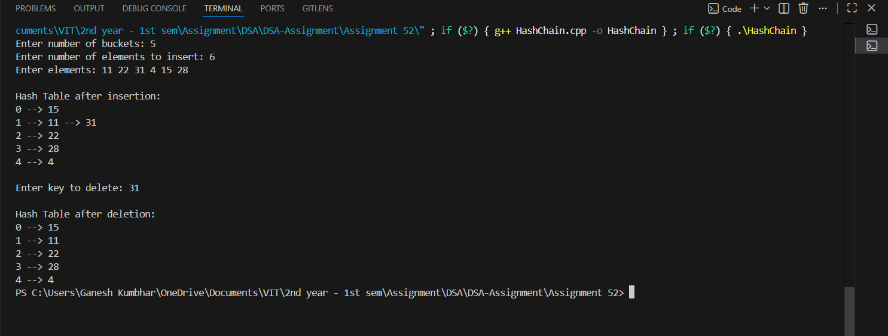

# Hash Table Implementation using Separate Chaining

## Theory

A **Hash Table** is a data structure used for storing key-value pairs. It provides efficient insertion, deletion, and searching operations.
However, multiple keys may map to the same index — this is known as a **collision**.  
To handle collisions, **Separate Chaining** is used where each index of the hash table stores a linked list of all elements hashed to that index.

### Advantages of Separate Chaining:
- Easy to implement.
- Handles collisions effectively.
- The hash table size does not need to be very large.

---

## Algorithm

1. **Start**
2. Create a hash table of size `n` where each slot is a linked list.
3. Use the hash function: `index = key % n`
4. To **insert** an element:
   - Compute its index using the hash function.
   - Insert it into the linked list at that index.
5. To **delete** an element:
   - Compute its index using the hash function.
   - Search and remove the element from the linked list at that index.
6. To **display** the table:
   - Traverse each index and print all elements of the corresponding list.
7. **End**

---

## Program

```cpp
#include <iostream>
#include <list>
#include <vector>
using namespace std;

class HashTable_gsk {
    int BUCKET_gsk;
    vector<list<int>> table_gsk;

public:
    HashTable_gsk(int b_gsk) {
        BUCKET_gsk = b_gsk;
        table_gsk.resize(BUCKET_gsk);
    }

    int hashFunction_gsk(int key_gsk) {
        return key_gsk % BUCKET_gsk;
    }

    void insertItem_gsk(int key_gsk) {
        int index_gsk = hashFunction_gsk(key_gsk);
        table_gsk[index_gsk].push_back(key_gsk);
    }

    void deleteItem_gsk(int key_gsk) {
        int index_gsk = hashFunction_gsk(key_gsk);
        list<int>::iterator i;
        for (i = table_gsk[index_gsk].begin(); i != table_gsk[index_gsk].end(); i++) {
            if (*i == key_gsk)
                break;
        }
        if (i != table_gsk[index_gsk].end())
            table_gsk[index_gsk].erase(i);
    }

    void displayHash_gsk() {
        for (int i = 0; i < BUCKET_gsk; i++) {
            cout << i;
            for (auto x : table_gsk[i])
                cout << " --> " << x;
            cout << endl;
        }
    }
};

int main() {
    int bucketCount_gsk, elements_gsk;
    cout << "Enter number of buckets: ";
    cin >> bucketCount_gsk;

    HashTable_gsk h_gsk(bucketCount_gsk);

    cout << "Enter number of elements to insert: ";
    cin >> elements_gsk;

    cout << "Enter elements: ";
    for (int i = 0; i < elements_gsk; i++) {
        int key_gsk;
        cin >> key_gsk;
        h_gsk.insertItem_gsk(key_gsk);
    }

    cout << "\nHash Table after insertion:\n";
    h_gsk.displayHash_gsk();

    int delKey_gsk;
    cout << "\nEnter key to delete: ";
    cin >> delKey_gsk;
    h_gsk.deleteItem_gsk(delKey_gsk);

    cout << "\nHash Table after deletion:\n";
    h_gsk.displayHash_gsk();

    return 0;
}
```

---

## Sample Output

```
Enter number of buckets: 5
Enter number of elements to insert: 6
Enter elements: 11 22 31 4 15 28

Hash Table after insertion:
0
1 --> 11 --> 31
2 --> 22
3 --> 28
4 --> 4 --> 15

Enter key to delete: 31

Hash Table after deletion:
0
1 --> 11
2 --> 22
3 --> 28
4 --> 4 --> 15
```
