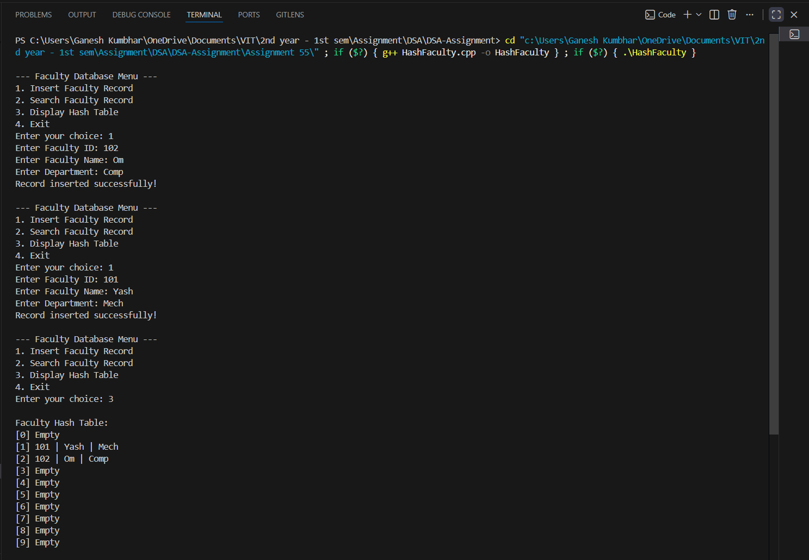

# Faculty Database using Hash Table with Linear Probing

## Theory

A **Hash Table** is a data structure that maps keys to values using a hash function.  
In this program, we simulate a **Faculty Database** using a hash table where **Faculty IDs** are stored using the **MOD hash function** for indexing.

When two keys produce the same hash (collision), we resolve it using the **Linear Probing** technique — which searches for the next available slot sequentially.

### Characteristics:
- **Hash Function:** `index = key % table_size`
- **Collision Resolution:** Linear Probing
- **Operations:**
  - Insert Faculty Record
  - Search Faculty Record
  - Display Hash Table

---

## Algorithm

1. **Start**
2. Initialize an empty hash table with a fixed size (e.g., 10).
3. For each faculty record:
   - Compute hash index = Faculty_ID % table_size.
   - If the slot is empty, store the record.
   - If occupied, perform **linear probing** until an empty slot is found.
4. To search for a faculty:
   - Compute hash index = Faculty_ID % table_size.
   - Search sequentially using **linear probing** until the key is found or an empty slot is encountered.
5. Display the entire hash table.
6. **End**

---

## C++ Program

```cpp
#include <iostream>
#include <string>
using namespace std;

struct Faculty_gsk {
    int id_gsk;
    string name_gsk;
    string department_gsk;
    bool occupied_gsk;
};

class HashTable_gsk {
    Faculty_gsk table_gsk[10];
    int size_gsk;

public:
    HashTable_gsk() {
        size_gsk = 10;
        for (int i = 0; i < size_gsk; i++) {
            table_gsk[i].occupied_gsk = false;
        }
    }

    int hashFunction_gsk(int key_gsk) {
        return key_gsk % size_gsk; // Divide method
    }

    void insertRecord_gsk(int id_gsk, string name_gsk, string dept_gsk) {
        int index_gsk = hashFunction_gsk(id_gsk);
        int start_gsk = index_gsk;

        while (table_gsk[index_gsk].occupied_gsk) {
            index_gsk = (index_gsk + 1) % size_gsk;
            if (index_gsk == start_gsk) {
                cout << "Hash Table is full!" << endl;
                return;
            }
        }

        table_gsk[index_gsk].id_gsk = id_gsk;
        table_gsk[index_gsk].name_gsk = name_gsk;
        table_gsk[index_gsk].department_gsk = dept_gsk;
        table_gsk[index_gsk].occupied_gsk = true;

        cout << "Record inserted successfully!" << endl;
    }

    void searchRecord_gsk(int id_gsk) {
        int index_gsk = hashFunction_gsk(id_gsk);
        int start_gsk = index_gsk;

        while (table_gsk[index_gsk].occupied_gsk) {
            if (table_gsk[index_gsk].id_gsk == id_gsk) {
                cout << "\nFaculty Found:\n";
                cout << "ID: " << table_gsk[index_gsk].id_gsk << endl;
                cout << "Name: " << table_gsk[index_gsk].name_gsk << endl;
                cout << "Department: " << table_gsk[index_gsk].department_gsk << endl;
                return;
            }
            index_gsk = (index_gsk + 1) % size_gsk;
            if (index_gsk == start_gsk)
                break;
        }

        cout << "Faculty not found!" << endl;
    }

    void displayTable_gsk() {
        cout << "\nFaculty Hash Table:\n";
        for (int i = 0; i < size_gsk; i++) {
            if (table_gsk[i].occupied_gsk)
                cout << "[" << i << "] "
                     << table_gsk[i].id_gsk << " | "
                     << table_gsk[i].name_gsk << " | "
                     << table_gsk[i].department_gsk << endl;
            else
                cout << "[" << i << "] Empty\n";
        }
    }
};

int main() {
    HashTable_gsk ht_gsk;
    int choice_gsk, id_gsk;
    string name_gsk, dept_gsk;

    while (true) {
        cout << "\n--- Faculty Database Menu ---\n";
        cout << "1. Insert Faculty Record\n";
        cout << "2. Search Faculty Record\n";
        cout << "3. Display Hash Table\n";
        cout << "4. Exit\n";
        cout << "Enter your choice: ";
        cin >> choice_gsk;

        switch (choice_gsk) {
        case 1:
            cout << "Enter Faculty ID: ";
            cin >> id_gsk;
            cout << "Enter Faculty Name: ";
            cin >> name_gsk;
            cout << "Enter Department: ";
            cin >> dept_gsk;
            ht_gsk.insertRecord_gsk(id_gsk, name_gsk, dept_gsk);
            break;
        case 2:
            cout << "Enter Faculty ID to search: ";
            cin >> id_gsk;
            ht_gsk.searchRecord_gsk(id_gsk);
            break;
        case 3:
            ht_gsk.displayTable_gsk();
            break;
        case 4:
            return 0;
        default:
            cout << "Invalid choice! Try again.\n";
        }
    }
}
```
---

## **Sample Output**

```
--- Faculty Database Menu ---
1. Insert Faculty Record
2. Search Faculty Record
3. Display Hash Table
4. Exit
Enter your choice: 1
Enter Faculty ID: 25
Enter Faculty Name: Rahul
Enter Department: Computer
Record inserted successfully!

--- Faculty Database Menu ---
Enter your choice: 1
Enter Faculty ID: 35
Enter Faculty Name: Sneha
Enter Department: ENTC
Record inserted successfully!

--- Faculty Database Menu ---
Enter your choice: 1
Enter Faculty ID: 45
Enter Faculty Name: Amit
Enter Department: Mechanical
Record inserted successfully!

--- Faculty Database Menu ---
Enter your choice: 3

Faculty Hash Table:
[0] Empty
[1] Empty
[2] Empty
[3] Empty
[4] Empty
[5] 25 | Rahul | Computer
[6] 35 | Sneha | ENTC
[7] 45 | Amit | Mechanical
[8] Empty
[9] Empty

--- Faculty Database Menu ---
Enter your choice: 2
Enter Faculty ID to search: 35

Faculty Found:
ID: 35
Name: Sneha
Department: ENTC

--- Faculty Database Menu ---
Enter your choice: 2
Enter Faculty ID to search: 50
Faculty not found!

--- Faculty Database Menu ---
Enter your choice: 4
```
