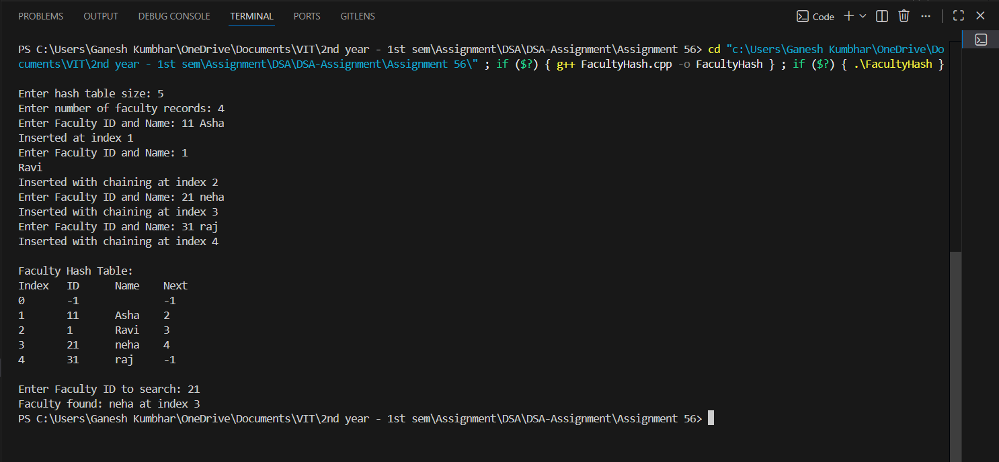

# Faculty Database using Hash Table (Divide Method with Linear Probing & Chaining Without Replacement)

## Theory

A **hash table** is a data structure used to store key-value pairs efficiently.  
It uses a **hash function** to map data to specific locations (called buckets) in memory.

In this program, we simulate a **Faculty Database** using a hash table.  
The hash function uses the **Divide Method** (key mod table size).  
When a collision occurs, it is resolved using **Linear Probing with Chaining Without Replacement**, meaning:
- Each collision is resolved by moving linearly to the next available slot.
- If a slot is already occupied, a chain link (next pointer) connects the colliding records.

---

## Algorithm

### Faculty Hash Table (Divide Method with Linear Probing and Chaining Without Replacement)
1. Start the program.
2. Initialize the hash table with a fixed size.
3. For each faculty record (with roll number or ID as key):
   - Compute hash index using: `index = key % table_size`.
   - If the index is empty, insert directly.
   - If occupied, use linear probing to find the next available slot.
   - If a record is displaced, update the chain (link) pointers accordingly.
4. For searching, compute the same hash index and follow the chain if necessary until the record is found or the end is reached.
5. Display the complete faculty database table.
6. Stop the program.

---

## Source Code

```cpp
#include <iostream>
#include <string>
#include <vector>
using namespace std;

struct Faculty_gsk {
    int id_gsk;
    string name_gsk;
    int next_gsk;

    Faculty_gsk() {
        id_gsk = -1;
        name_gsk = "";
        next_gsk = -1;
    }
};

class FacultyHashTable_gsk {
    vector<Faculty_gsk> table_gsk;
    int size_gsk;

public:
    FacultyHashTable_gsk(int size) {
        size_gsk = size;
        table_gsk.resize(size_gsk);
    }

    int hashFunction_gsk(int key_gsk) {
        return key_gsk % size_gsk;
    }

    void insertFaculty_gsk(int id_gsk, string name_gsk) {
        int index_gsk = hashFunction_gsk(id_gsk);

        if (table_gsk[index_gsk].id_gsk == -1) {
            table_gsk[index_gsk].id_gsk = id_gsk;
            table_gsk[index_gsk].name_gsk = name_gsk;
            cout << "Inserted at index " << index_gsk << endl;
            return;
        }

        int tempIndex_gsk = index_gsk;

        while (table_gsk[tempIndex_gsk].next_gsk != -1) {
            tempIndex_gsk = table_gsk[tempIndex_gsk].next_gsk;
        }

        int newIndex_gsk = (tempIndex_gsk + 1) % size_gsk;

        while (table_gsk[newIndex_gsk].id_gsk != -1 && newIndex_gsk != index_gsk) {
            newIndex_gsk = (newIndex_gsk + 1) % size_gsk;
        }

        if (newIndex_gsk == index_gsk) {
            cout << "Hash table is full. Cannot insert record.
";
            return;
        }

        table_gsk[newIndex_gsk].id_gsk = id_gsk;
        table_gsk[newIndex_gsk].name_gsk = name_gsk;
        table_gsk[tempIndex_gsk].next_gsk = newIndex_gsk;

        cout << "Inserted with chaining at index " << newIndex_gsk << endl;
    }

    void searchFaculty_gsk(int id_gsk) {
        int index_gsk = hashFunction_gsk(id_gsk);

        while (index_gsk != -1) {
            if (table_gsk[index_gsk].id_gsk == id_gsk) {
                cout << "Faculty found: " << table_gsk[index_gsk].name_gsk
                     << " at index " << index_gsk << endl;
                return;
            }
            index_gsk = table_gsk[index_gsk].next_gsk;
        }

        cout << "Faculty not found.
";
    }

    void displayTable_gsk() {
        cout << "\nFaculty Hash Table:\n";
        cout << "Index\tID\tName\tNext\n";
        for (int i = 0; i < size_gsk; i++) {
            cout << i << "\t" << table_gsk[i].id_gsk << "\t"
                 << table_gsk[i].name_gsk << "\t" << table_gsk[i].next_gsk << endl;
        }
    }
};

int main() {
    int size_gsk;
    cout << "Enter hash table size: ";
    cin >> size_gsk;

    FacultyHashTable_gsk h_gsk(size_gsk);

    int n_gsk;
    cout << "Enter number of faculty records: ";
    cin >> n_gsk;

    for (int i = 0; i < n_gsk; i++) {
        int id_gsk;
        string name_gsk;
        cout << "Enter Faculty ID and Name: ";
        cin >> id_gsk >> name_gsk;
        h_gsk.insertFaculty_gsk(id_gsk, name_gsk);
    }

    h_gsk.displayTable_gsk();

    int searchID_gsk;
    cout << "\nEnter Faculty ID to search: ";
    cin >> searchID_gsk;
    h_gsk.searchFaculty_gsk(searchID_gsk);

    return 0;
}
```

---

## Sample Output

```
Enter hash table size: 5
Enter number of faculty records: 4
Enter Faculty ID and Name: 11 Asha
Inserted at index 1
Enter Faculty ID and Name: 16 Ravi
Inserted with chaining at index 2
Enter Faculty ID and Name: 21 Neha
Inserted with chaining at index 3
Enter Faculty ID and Name: 31 Raj
Inserted with chaining at index 4

Faculty Hash Table:
Index   ID    Name    Next
0       -1           -1
1       11    Asha    2
2       16    Ravi    3
3       21    Neha    4
4       31    Raj    -1

Enter Faculty ID to search: 21
Faculty found: Neha at index 3
```
