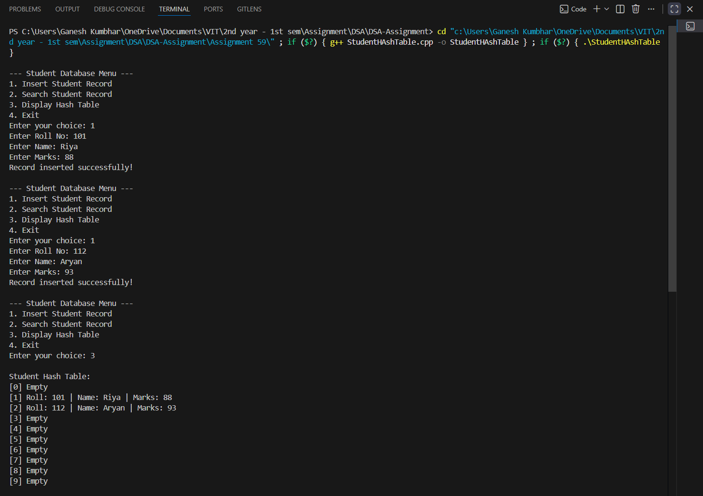

# Student Database Management using Hash Table (Linear Probing)

## **Title:**
Implementation of Student Database Management using Hash Table with Linear Probing

---

## **Theory:**

A **Hash Table** is a data structure that stores key-value pairs for quick data retrieval.  
It uses a **hash function** to calculate the index for each key, allowing efficient search, insertion, and deletion.

**Linear Probing** is a collision handling method in which, when two records hash to the same location,  
the next available slot in the table is used sequentially.

In this program, we store **student records** (roll number, name, and marks) using a hash table with linear probing.

---

## **Algorithm:**

1. Start the program.  
2. Define a hash function using the roll number: `index = roll_no % size`.  
3. If the calculated index is already occupied, move sequentially (linear probing).  
4. Insert the record into the next available empty location.  
5. To search, use the same hash function and check sequentially until the record is found.  
6. Display all stored records.  
7. Stop.

---

## **Program:**

```cpp
#include <iostream>
#include <string>
using namespace std;

struct Student_gsk {
    int roll_gsk;
    string name_gsk;
    float marks_gsk;
    bool occupied_gsk;
};

class HashTable_gsk {
    Student_gsk table_gsk[10];
    int size_gsk;

public:
    HashTable_gsk() {
        size_gsk = 10;
        for (int i = 0; i < size_gsk; i++) {
            table_gsk[i].occupied_gsk = false;
        }
    }

    int hashFunction_gsk(int key_gsk) {
        return key_gsk % size_gsk;
    }

    void insertStudent_gsk(int roll_gsk, string name_gsk, float marks_gsk) {
        int index_gsk = hashFunction_gsk(roll_gsk);
        int start_gsk = index_gsk;

        while (table_gsk[index_gsk].occupied_gsk) {
            index_gsk = (index_gsk + 1) % size_gsk;
            if (index_gsk == start_gsk) {
                cout << "Hash Table is full! Cannot insert record.\n";
                return;
            }
        }

        table_gsk[index_gsk].roll_gsk = roll_gsk;
        table_gsk[index_gsk].name_gsk = name_gsk;
        table_gsk[index_gsk].marks_gsk = marks_gsk;
        table_gsk[index_gsk].occupied_gsk = true;

        cout << "Record inserted successfully!\n";
    }

    void searchStudent_gsk(int roll_gsk) {
        int index_gsk = hashFunction_gsk(roll_gsk);
        int start_gsk = index_gsk;

        while (table_gsk[index_gsk].occupied_gsk) {
            if (table_gsk[index_gsk].roll_gsk == roll_gsk) {
                cout << "\nStudent Found:\n";
                cout << "Roll No: " << table_gsk[index_gsk].roll_gsk << endl;
                cout << "Name: " << table_gsk[index_gsk].name_gsk << endl;
                cout << "Marks: " << table_gsk[index_gsk].marks_gsk << endl;
                return;
            }
            index_gsk = (index_gsk + 1) % size_gsk;
            if (index_gsk == start_gsk)
                break;
        }

        cout << "Student not found!\n";
    }

    void displayTable_gsk() {
        cout << "\nStudent Hash Table:\n";
        for (int i = 0; i < size_gsk; i++) {
            if (table_gsk[i].occupied_gsk)
                cout << "[" << i << "] Roll: " << table_gsk[i].roll_gsk
                     << " | Name: " << table_gsk[i].name_gsk
                     << " | Marks: " << table_gsk[i].marks_gsk << endl;
            else
                cout << "[" << i << "] Empty\n";
        }
    }
};

int main() {
    HashTable_gsk ht_gsk;
    int choice_gsk, roll_gsk;
    string name_gsk;
    float marks_gsk;

    while (true) {
        cout << "\n--- Student Database Menu ---\n";
        cout << "1. Insert Student Record\n";
        cout << "2. Search Student Record\n";
        cout << "3. Display Hash Table\n";
        cout << "4. Exit\n";
        cout << "Enter your choice: ";
        cin >> choice_gsk;

        switch (choice_gsk) {
        case 1:
            cout << "Enter Roll No: ";
            cin >> roll_gsk;
            cout << "Enter Name: ";
            cin >> name_gsk;
            cout << "Enter Marks: ";
            cin >> marks_gsk;
            ht_gsk.insertStudent_gsk(roll_gsk, name_gsk, marks_gsk);
            break;
        case 2:
            cout << "Enter Roll No to Search: ";
            cin >> roll_gsk;
            ht_gsk.searchStudent_gsk(roll_gsk);
            break;
        case 3:
            ht_gsk.displayTable_gsk();
            break;
        case 4:
            return 0;
        default:
            cout << "Invalid choice! Try again.\n";
        }
    }
}
```

---

## **Sample Output:**

```
--- Student Database Menu ---
1. Insert Student Record
2. Search Student Record
3. Display Hash Table
4. Exit
Enter your choice: 1
Enter Roll No: 101
Enter Name: Riya
Enter Marks: 88
Record inserted successfully!

Enter your choice: 1
Enter Roll No: 112
Enter Name: Aryan
Enter Marks: 93
Record inserted successfully!

Enter your choice: 3
[0] Empty
[1] Roll: 101 | Name: Riya | Marks: 88
[2] Roll: 112 | Name: Aryan | Marks: 93
```
