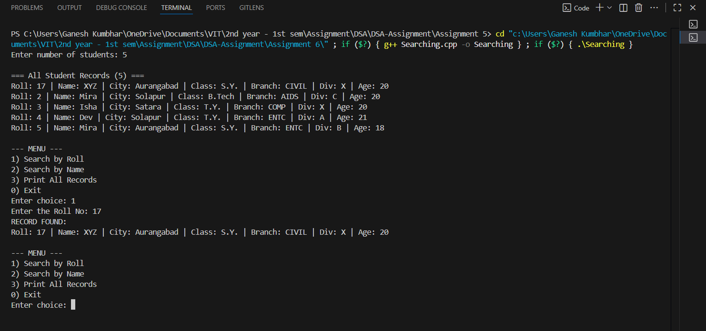

# Identifying a Student Using Linear Search

## Theory
Managing student records is a common application of **structures, arrays, and searching algorithms**. 
This program demonstrates:
- **Dynamic memory allocation** to store records of students.  
- **Random data generation** for student details (name, city, class, branch, division, age).  
- **Linear Search** by roll number and name to find specific students.  
- **Menu-driven approach** to interactively search and display records.  

It also ensures that a specific student record (`S.Y., Div X, Name = "XYZ", Roll = 17`) is always present, so that searching is successful.

## Algorithm

1. Input the number of student records `n`.  
2. Dynamically allocate memory for `n` students.  
3. Generate random details (name, city, class, branch, division, age) for each student.  
   - Ensure that roll 17, name "XYZ", div "X", and class "SE" exists.  
4. Print all student records.  
5. Display menu:  
   - **Option 1:** Search by Roll  
   - **Option 2:** Search by Name  
   - **Option 3:** Print All Records  
   - **Option 0:** Exit  
6. Implement **Linear Search** in options 1 and 2 to find matching records.  
7. Repeat until user exits.  
8. Free dynamically allocated memory.  

## Code

```cpp
#include <iostream>
#include <string>
#include <vector>
#include <cstdlib>  // For rand, srand
#include <ctime>
using namespace std;

class Student_gsk {
public:
    int roll_gsk;
    string name_gsk;
    string city_gsk;
    string className_gsk; // "S.Y.", "T.Y.", "B.Tech"
    string branch_gsk;
    char div_gsk;
    int age_gsk;

    void fillRandom_gsk(int r_gsk) {
        static const string names_gsk[] = { "Abir","Aarav","Isha","Rohan","Priya","Vikas","Neha","Sahil",
            "Anaya","Dev","Kriti","Mira","Kabir","Tanvi","Yash","Riya","Arjun","Asha","Nikhil","Pooja",
            "Kunal", "Vishal","Amir","Sharukh","Salman","Mrunal","Kirti", "XYZ" };
        static const string cities_gsk[] = { "Amravati","Akola","Nagar","Pune","Mumbai","Nashik","Nagpur",
            "Aurangabad","Thane","Satara","Solapur","Kolhapur","Nanded" };
        static const string classes_gsk[] = { "S.Y.","T.Y.","B.Tech" };
        static const string branches_gsk[] = { "COMP","IT","AIDS","ENTC","MECH","CIVIL", "AIML", "IOT"};
        static const char divs_gsk[] = { 'A','B','C','X' };

        roll_gsk = r_gsk;
        name_gsk = names_gsk[rand() % (sizeof(names_gsk) / sizeof(names_gsk[0]))];
        city_gsk = cities_gsk[rand() % (sizeof(cities_gsk) / sizeof(cities_gsk[0]))];
        className_gsk = classes_gsk[rand() % (sizeof(classes_gsk) / sizeof(classes_gsk[0]))];
        branch_gsk = branches_gsk[rand() % (sizeof(branches_gsk) / sizeof(branches_gsk[0]))];
        div_gsk = divs_gsk[rand() % (sizeof(divs_gsk) / sizeof(divs_gsk[0]))];
        age_gsk = 18 + (rand() % 5);
    }

    void display_gsk() const {
        cout << "Roll: " << roll_gsk << " | Name: " << name_gsk << " | City: " << city_gsk
             << " | Class: " << className_gsk << " | Branch: " << branch_gsk << " | Div: "
             << div_gsk << " | Age: " << age_gsk << endl;
    }
};

int main() {
    int n_gsk;
    srand(time(0));
    cout << "Enter number of students: ";
    cin >> n_gsk;

    // Dynamically allocate students
    Student_gsk* students_gsk = new Student_gsk[n_gsk];

    // Fill with random data
    for (int i_gsk = 0; i_gsk < n_gsk; ++i_gsk)
        students_gsk[i_gsk].fillRandom_gsk(i_gsk + 1);

    // Force-fill desired student in slot 0 for demonstration
    if (n_gsk > 0) {
        students_gsk[0].roll_gsk = 17;
        students_gsk[0].name_gsk = "XYZ";
        students_gsk[0].className_gsk = "S.Y.";
        students_gsk[0].div_gsk = 'X';
    }

    cout << "\n=== All Student Records (" << n_gsk << ") ===\n";
    for (int i_gsk = 0; i_gsk < n_gsk; ++i_gsk)
        students_gsk[i_gsk].display_gsk();

    int choice_gsk;
    do {
        cout << "\n--- MENU ---\n";
        cout << "1) Search by Roll\n";
        cout << "2) Search by Name\n";
        cout << "3) Print All Records\n";
        cout << "0) Exit\n";
        cout << "Enter choice: ";
        cin >> choice_gsk;

        switch (choice_gsk) {
        case 1: {
            int targetRoll_gsk;
            cout << "Enter the Roll No: ";
            cin >> targetRoll_gsk;
            bool found_gsk = false;
            for (int i_gsk = 0; i_gsk < n_gsk; ++i_gsk) {
                if (students_gsk[i_gsk].roll_gsk == targetRoll_gsk) {
                    cout << "RECORD FOUND:\n";
                    students_gsk[i_gsk].display_gsk();
                    found_gsk = true;
                    break;
                }
            }
            if (!found_gsk)
                cout << "RECORD NOT FOUND..\n";
            break;
        }
        case 2: {
            string targetName_gsk;
            cout << "Enter EXACT name to search (case-sensitive): ";
            cin >> targetName_gsk;
            int matches_gsk = 0;
            cout << "MATCHING RECORDS:\n";
            for (int i_gsk = 0; i_gsk < n_gsk; ++i_gsk) {
                if (students_gsk[i_gsk].name_gsk == targetName_gsk) {
                    students_gsk[i_gsk].display_gsk();
                    ++matches_gsk;
                }
            }
            if (!matches_gsk)
                cout << "RECORD NOT FOUND..\n";
            break;
        }
        case 3: {
            cout << "\n=== All Student Records (" << n_gsk << ") ===\n";
            for (int i_gsk = 0; i_gsk < n_gsk; ++i_gsk)
                students_gsk[i_gsk].display_gsk();
            break;
        }
        case 0:
            cout << "Exiting...\n";
            break;
        default:
            cout << "Invalid Choice...\n";
            break;
        }
    } while (choice_gsk != 0);

    delete[] students_gsk;
    return 0;
}
```

## Sample Output

**Input:**  
```
Enter the Number of Student Records you want to create: 5
```

**Output (varies due to randomness):**  
```
=== All Student Records (5) ===
Roll: 17 | Name: XYZ | City: Pune | Class: SE | Branch: COMP | Div: X | Age: 20
Roll: 2  | Name: Neha | City: Mumbai | Class: BE | Branch: IT | Div: A | Age: 19
Roll: 3  | Name: Sahil | City: Nashik | Class: TE | Branch: MECH | Div: B | Age: 21
Roll: 4  | Name: Priya | City: Amravati | Class: FE | Branch: CIVIL | Div: C | Age: 18
Roll: 5  | Name: Kabir | City: Nagpur | Class: TE | Branch: IT | Div: A | Age: 22

--- MENU ---
1) Search by Roll
2) Search by Name
3) Print All Records
0) Exit
Enter choice: 1
Enter the Roll No: 17
RECORD FOUND:
Roll: 17 | Name: XYZ | City: Pune | Class: SE | Branch: COMP | Div: X | Age: 20
```

