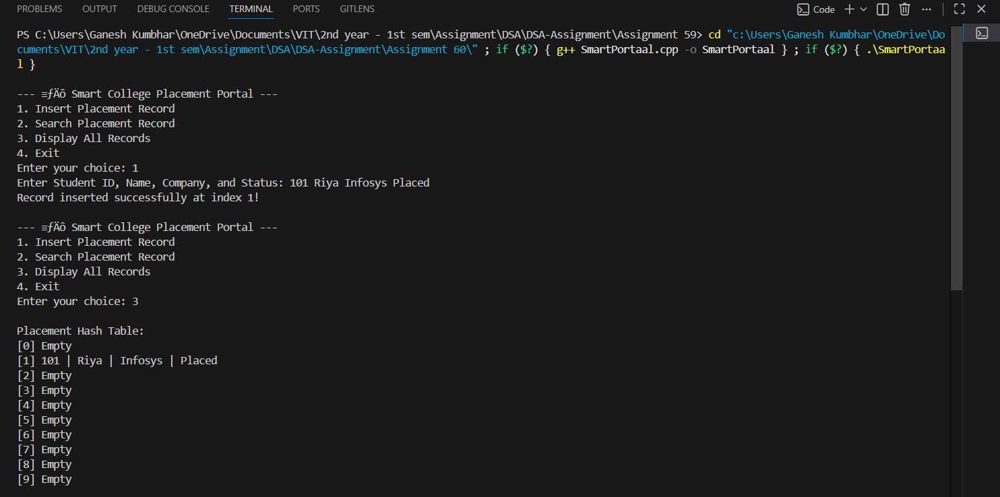

# Smart College Placement Portal using Advanced Hashing

## **Theory**
A **hash table** is a data structure that stores data in key-value pairs for efficient lookup, insertion, and deletion. In this program, we simulate a **Smart College Placement Portal** using an **advanced hashing technique** that combines **double hashing** and **dynamic rehashing** to handle collisions effectively and maintain performance even as data grows.

### **Double Hashing (Collision Resolution)**
Double hashing uses two different hash functions to compute the index for inserting or searching elements. If a collision occurs, the second hash function determines the next probing index.

**Formulas:**
```
Hash1(key) = key % table_size
Hash2(key) = 7 - (key % 7)
NextIndex = (Hash1(key) + i * Hash2(key)) % table_size
```
Here, `i` is the probing step counter. This method reduces clustering and ensures better distribution of records.

### **Dynamic Rehashing (Table Expansion)**
When the **load factor** (number of records / table size) exceeds a threshold (0.7), the table automatically resizes to double its size. All existing records are reinserted using the new hash functions to maintain efficiency.

---

## **Algorithm**
1. **Start** the program.
2. Initialize an empty hash table with a fixed size.
3. Define two hash functions:
   - `hashFunction1_gsk()` using modulo division.
   - `hashFunction2_gsk()` using prime subtraction.
4. For **insertion**:
   - Compute index using both hash functions.
   - Probe sequentially until an empty slot is found.
   - Insert record and mark slot as occupied.
   - If the load factor > 0.7, **rehash** (expand and reinsert records).
5. For **searching**:
   - Compute the hash indices using double hashing.
   - Probe until the record is found or all slots are checked.
6. For **display**, print all indices and their corresponding student placement details.
7. Repeat until the user exits.

---

## **Program Code**
```cpp
#include <iostream>
#include <string>
#include <vector>
using namespace std;

struct PlacementRecord_gsk {
    int studentID_gsk;
    string studentName_gsk;
    string companyName_gsk;
    string status_gsk;
    bool occupied_gsk;

    PlacementRecord_gsk() {
        occupied_gsk = false;
    }
};

class PlacementHashTable_gsk {
    vector<PlacementRecord_gsk> table_gsk;
    int size_gsk;
    int count_gsk;

public:
    PlacementHashTable_gsk(int initialSize_gsk = 10) {
        size_gsk = initialSize_gsk;
        count_gsk = 0;
        table_gsk.resize(size_gsk);
    }

    int hashFunction1_gsk(int key_gsk) { return key_gsk % size_gsk; }
    int hashFunction2_gsk(int key_gsk) { return 7 - (key_gsk % 7); }

    float loadFactor_gsk() { return (float)count_gsk / size_gsk; }

    void rehash_gsk() {
        cout << "\nRehashing triggered! Expanding table...\n";

        vector<PlacementRecord_gsk> oldTable_gsk = table_gsk;
        size_gsk *= 2;
        count_gsk = 0;
        table_gsk.clear();
        table_gsk.resize(size_gsk);

        for (auto &record : oldTable_gsk) {
            if (record.occupied_gsk)
                insertRecord_gsk(record.studentID_gsk, record.studentName_gsk, record.companyName_gsk, record.status_gsk);
        }

        cout << "Rehashing complete. New size: " << size_gsk << endl;
    }

    void insertRecord_gsk(int id_gsk, string name_gsk, string company_gsk, string status_gsk) {
        if (loadFactor_gsk() > 0.7)
            rehash_gsk();

        int index1_gsk = hashFunction1_gsk(id_gsk);
        int index2_gsk = hashFunction2_gsk(id_gsk);
        int i = 0;

        while (table_gsk[(index1_gsk + i * index2_gsk) % size_gsk].occupied_gsk) {
            i++;
            if (i >= size_gsk) {
                cout << " Hash table is full! Cannot insert record.\n";
                return;
            }
        }

        int finalIndex_gsk = (index1_gsk + i * index2_gsk) % size_gsk;
        table_gsk[finalIndex_gsk].studentID_gsk = id_gsk;
        table_gsk[finalIndex_gsk].studentName_gsk = name_gsk;
        table_gsk[finalIndex_gsk].companyName_gsk = company_gsk;
        table_gsk[finalIndex_gsk].status_gsk = status_gsk;
        table_gsk[finalIndex_gsk].occupied_gsk = true;
        count_gsk++;

        cout << "Record inserted successfully at index " << finalIndex_gsk << "!\n";
    }

    void searchRecord_gsk(int id_gsk) {
        int index1_gsk = hashFunction1_gsk(id_gsk);
        int index2_gsk = hashFunction2_gsk(id_gsk);
        int i = 0;

        while (table_gsk[(index1_gsk + i * index2_gsk) % size_gsk].occupied_gsk) {
            int index_gsk = (index1_gsk + i * index2_gsk) % size_gsk;
            if (table_gsk[index_gsk].studentID_gsk == id_gsk) {
                cout << "\nRecord Found:\n";
                cout << "Student ID: " << table_gsk[index_gsk].studentID_gsk << endl;
                cout << "Name: " << table_gsk[index_gsk].studentName_gsk << endl;
                cout << "Company: " << table_gsk[index_gsk].companyName_gsk << endl;
                cout << "Status: " << table_gsk[index_gsk].status_gsk << endl;
                return;
            }
            i++;
            if (i >= size_gsk)
                break;
        }

        cout << "Record not found!\n";
    }

    void displayTable_gsk() {
        cout << "\nPlacement Hash Table:\n";
        for (int i = 0; i < size_gsk; i++) {
            cout << "[" << i << "] ";
            if (table_gsk[i].occupied_gsk)
                cout << table_gsk[i].studentID_gsk << " | "
                     << table_gsk[i].studentName_gsk << " | "
                     << table_gsk[i].companyName_gsk << " | "
                     << table_gsk[i].status_gsk << endl;
            else
                cout << "Empty\n";
        }
    }
};

int main() {
    PlacementHashTable_gsk portal_gsk;
    int choice_gsk, id_gsk;
    string name_gsk, company_gsk, status_gsk;

    while (true) {
        cout << "\n--- 🎓 Smart College Placement Portal ---\n";
        cout << "1. Insert Placement Record\n";
        cout << "2. Search Placement Record\n";
        cout << "3. Display All Records\n";
        cout << "4. Exit\n";
        cout << "Enter your choice: ";
        cin >> choice_gsk;

        switch (choice_gsk) {
        case 1:
            cout << "Enter Student ID, Name, Company, and Status: ";
            cin >> id_gsk >> name_gsk >> company_gsk >> status_gsk;
            portal_gsk.insertRecord_gsk(id_gsk, name_gsk, company_gsk, status_gsk);
            break;

        case 2:
            cout << "Enter Student ID to search: ";
            cin >> id_gsk;
            portal_gsk.searchRecord_gsk(id_gsk);
            break;

        case 3:
            portal_gsk.displayTable_gsk();
            break;

        case 4:
            cout << "Exiting...\n";
            return 0;

        default:
            cout << "Invalid choice! Try again.\n";
        }
    }
}
```

---

## **Sample Run**
```
--- Smart College Placement Portal ---
1. Insert Placement Record
2. Search Placement Record
3. Display All Records
4. Exit
Enter your choice: 1
Enter Student ID, Name, Company, and Status: 101 Riya Infosys Placed
Record inserted successfully at index 4!

--- 🎓 Smart College Placement Portal ---
Enter your choice: 3
Placement Hash Table:
[4] 101 | Riya | Infosys | Placed
```

