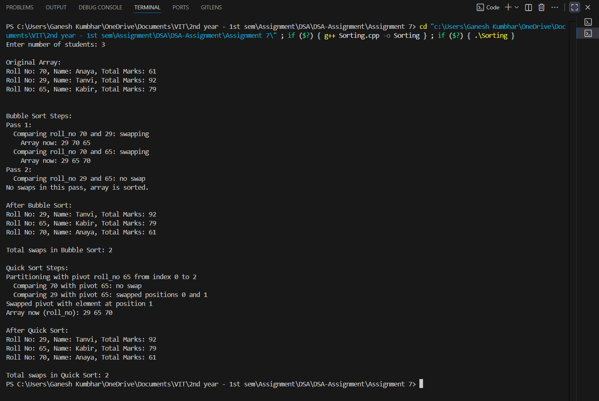

# Student Sorting using Bubble Sort and Quick Sort

## Theory
Sorting is one of the most fundamental operations in computer science.  
This program demonstrates two classic sorting algorithms applied to **student records** based on their **roll numbers**:

1. **Bubble Sort**  
   - A simple comparison-based sorting technique.  
   - Works by repeatedly swapping adjacent elements if they are in the wrong order.  
   - Time Complexity: O(n²)  
   - Space Complexity: O(1)  

2. **Quick Sort**  
   - A divide-and-conquer algorithm.  
   - Selects a pivot and partitions the array into two halves: elements smaller than pivot and elements larger than pivot.  
   - Time Complexity: O(n log n) on average, O(n²) in worst case.  
   - Space Complexity: O(log n) (due to recursion).  

Both algorithms are demonstrated step-by-step with the number of swaps counted.

## Algorithm

### Bubble Sort
1. Compare each adjacent pair of elements.  
2. Swap if they are out of order.  
3. Continue passes until no swaps occur.  

### Quick Sort
1. Choose the last element as pivot.  
2. Partition the array such that smaller elements are on the left and larger on the right.  
3. Recursively apply quicksort on left and right subarrays.  

## Code
```cpp
#include <iostream>
#include <string>
#include <cstdlib>
#include <ctime>
using namespace std;

struct Student_gsk {
    string name_gsk;
    int roll_no_gsk;
    float total_marks_gsk;
};

const string sample_names_gsk[] = {
    "Rohan", "Isha", "Priya", "Kabir", "Tanvi", "XYZ", "Arjun", "Anaya", "Neha", "Salman"
};
const int NAMES_SIZE_gsk = sizeof(sample_names_gsk) / sizeof(sample_names_gsk[0]);

void printStudents_gsk(const Student_gsk arr_gsk[], int n_gsk) {
    for (int i_gsk = 0; i_gsk < n_gsk; ++i_gsk) {
        cout << "Roll No: " << arr_gsk[i_gsk].roll_no_gsk << ", Name: " << arr_gsk[i_gsk].name_gsk << ", Total Marks: " << arr_gsk[i_gsk].total_marks_gsk << endl;
    }
    cout << endl;
}

void bubbleSort_gsk(Student_gsk arr_gsk[], int n_gsk, int& swapCount_gsk) {
    swapCount_gsk = 0;
    cout << "\nBubble Sort Steps:\n";
    for (int i_gsk = 0; i_gsk < n_gsk - 1; ++i_gsk) {
        bool swapped_gsk = false;
        cout << "Pass " << i_gsk + 1 << ":\n";
        for (int j_gsk = 0; j_gsk < n_gsk - i_gsk - 1; ++j_gsk) {
            cout << "  Comparing roll_no " << arr_gsk[j_gsk].roll_no_gsk << " and " << arr_gsk[j_gsk + 1].roll_no_gsk << ": ";
            if (arr_gsk[j_gsk].roll_no_gsk > arr_gsk[j_gsk + 1].roll_no_gsk) {
                cout << "swapping\n";
                swap(arr_gsk[j_gsk], arr_gsk[j_gsk + 1]);
                swapCount_gsk++;
                swapped_gsk = true;

                // Print array after swap
                cout << "    Array now: ";
                for (int k_gsk = 0; k_gsk < n_gsk; ++k_gsk) cout << arr_gsk[k_gsk].roll_no_gsk << " ";
                cout << endl;
            }
            else {
                cout << "no swap\n";
            }
        }
        if (!swapped_gsk) {
            cout << "No swaps in this pass, array is sorted.\n";
            break;
        }
    }
}

int partition_gsk(Student_gsk arr_gsk[], int low_gsk, int high_gsk, int& swapCount_gsk) {
    int pivot_gsk = arr_gsk[high_gsk].roll_no_gsk;
    int i_gsk = low_gsk - 1;
    cout << "Partitioning with pivot roll_no " << pivot_gsk << " from index " << low_gsk << " to " << high_gsk << endl;
    for (int j_gsk = low_gsk; j_gsk < high_gsk; ++j_gsk) {
        cout << "  Comparing " << arr_gsk[j_gsk].roll_no_gsk << " with pivot " << pivot_gsk << ": ";
        if (arr_gsk[j_gsk].roll_no_gsk < pivot_gsk) {
            ++i_gsk;
            swap(arr_gsk[i_gsk], arr_gsk[j_gsk]);
            swapCount_gsk++;
            cout << "swapped positions " << i_gsk << " and " << j_gsk << endl;
        } else {
            cout << "no swap\n";
        }
    }
    swap(arr_gsk[i_gsk + 1], arr_gsk[high_gsk]);
    swapCount_gsk++;
    cout << "Swapped pivot with element at position " << (i_gsk + 1) << endl;

    // Print array after partition
    cout << "Array now (roll_no): ";
    for (int k_gsk = low_gsk; k_gsk <= high_gsk; ++k_gsk) cout << arr_gsk[k_gsk].roll_no_gsk << " ";
    cout << endl;

    return i_gsk + 1;
}

void quickSort_gsk(Student_gsk arr_gsk[], int low_gsk, int high_gsk, int& swapCount_gsk) {
    if (low_gsk < high_gsk) {
        int pi_gsk = partition_gsk(arr_gsk, low_gsk, high_gsk, swapCount_gsk);
        quickSort_gsk(arr_gsk, low_gsk, pi_gsk - 1, swapCount_gsk);
        quickSort_gsk(arr_gsk, pi_gsk + 1, high_gsk, swapCount_gsk);
    }
}

int main() {
    srand(static_cast<unsigned>(time(0)));
    int n_gsk;
    cout << "Enter number of students: ";
    cin >> n_gsk;
    Student_gsk* arr_gsk = new Student_gsk[n_gsk];

    // Generate random student data
    for (int i_gsk = 0; i_gsk < n_gsk; ++i_gsk) {
        arr_gsk[i_gsk].name_gsk = sample_names_gsk[rand() % NAMES_SIZE_gsk];
        arr_gsk[i_gsk].roll_no_gsk = 1 + rand() % 100;
        arr_gsk[i_gsk].total_marks_gsk = 40.0f + static_cast<float>(rand() % 61);
    }

    cout << "\nOriginal Array:\n";
    printStudents_gsk(arr_gsk, n_gsk);

    // Bubble Sort
    Student_gsk* arr_bubble_gsk = new Student_gsk[n_gsk];
    for (int i_gsk = 0; i_gsk < n_gsk; ++i_gsk) arr_bubble_gsk[i_gsk] = arr_gsk[i_gsk];
    int bubbleSwaps_gsk = 0;
    bubbleSort_gsk(arr_bubble_gsk, n_gsk, bubbleSwaps_gsk);
    cout << "\nAfter Bubble Sort:\n";
    printStudents_gsk(arr_bubble_gsk, n_gsk);
    cout << "Total swaps in Bubble Sort: " << bubbleSwaps_gsk << "\n\n";

    // Quick Sort
    Student_gsk* arr_quick_gsk = new Student_gsk[n_gsk];
    for (int i_gsk = 0; i_gsk < n_gsk; ++i_gsk) arr_quick_gsk[i_gsk] = arr_gsk[i_gsk];
    int quickSwaps_gsk = 0;
    cout << "Quick Sort Steps:\n";
    quickSort_gsk(arr_quick_gsk, 0, n_gsk - 1, quickSwaps_gsk);
    cout << "\nAfter Quick Sort:\n";
    printStudents_gsk(arr_quick_gsk, n_gsk);
    cout << "Total swaps in Quick Sort: " << quickSwaps_gsk << "\n";

    delete[] arr_gsk;
    delete[] arr_bubble_gsk;
    delete[] arr_quick_gsk;
    return 0;
}

```


## Sample Output

**Input:**  
```
Enter number of students: 5

```

**Output (varies due to randomness):**  
```
Original Array:
Roll No: 42, Name: Kabir, Total Marks: 77
Roll No: 15, Name: XYZ, Total Marks: 88
Roll No: 73, Name: Neha, Total Marks: 54
Roll No: 6,  Name: Isha, Total Marks: 91
Roll No: 29, Name: Salman, Total Marks: 65

Bubble Sort Steps:
Pass 1:
  Comparing roll_no 42 and 15: swapping
    Array now: 15 42 73 6 29
  Comparing roll_no 42 and 73: no swap
  Comparing roll_no 73 and 6: swapping
    Array now: 15 42 6 73 29
  Comparing roll_no 73 and 29: swapping
    Array now: 15 42 6 29 73
Pass 2:
  Comparing roll_no 15 and 42: no swap
  Comparing roll_no 42 and 6: swapping
    Array now: 15 6 42 29 73
  Comparing roll_no 42 and 29: swapping
    Array now: 15 6 29 42 73
Pass 3:
  Comparing roll_no 15 and 6: swapping
    Array now: 6 15 29 42 73
  Comparing roll_no 15 and 29: no swap
No swaps in this pass, array is sorted.

After Bubble Sort:
Roll No: 6,  Name: Isha,   Total Marks: 91
Roll No: 15, Name: XYZ,    Total Marks: 88
Roll No: 29, Name: Salman, Total Marks: 65
Roll No: 42, Name: Kabir,  Total Marks: 77
Roll No: 73, Name: Neha,   Total Marks: 54
Total swaps in Bubble Sort: 6


Quick Sort Steps:
Partitioning with pivot roll_no 29 from index 0 to 4
  Comparing 42 with pivot 29: no swap
  Comparing 15 with pivot 29: swapped positions 0 and 1
  Comparing 73 with pivot 29: no swap
  Comparing 6 with pivot 29: swapped positions 1 and 3
Swapped pivot with element at position 2
Array now (roll_no): 15 6 29 73 42
...
(continues with recursive steps)

After Quick Sort:
Roll No: 6,  Name: Isha,   Total Marks: 91
Roll No: 15, Name: XYZ,    Total Marks: 88
Roll No: 29, Name: Salman, Total Marks: 65
Roll No: 42, Name: Kabir,  Total Marks: 77
Roll No: 73, Name: Neha,   Total Marks: 54
Total swaps in Quick Sort: 5
```

