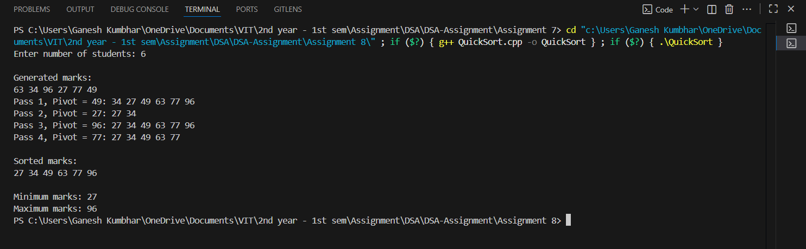

# Quick Sort with Pass Tracing and Min/Max using Divide & Conquer

## Theory
This program demonstrates:
1. **Quick Sort** with **detailed pass tracing** to show how the array evolves during each partitioning step.  
2. **Finding Minimum and Maximum** values in the array using **Divide & Conquer** strategy.  

### Quick Sort
- A **divide-and-conquer** sorting algorithm.  
- Selects a pivot element, partitions the array into two halves, and recursively sorts each half.  
- Average Time Complexity: **O(n log n)**  
- Worst Case Time Complexity: **O(n²)** (if pivot choice is poor).  
- Space Complexity: **O(log n)** (due to recursion).  

### Min/Max using Divide & Conquer
- Instead of scanning the array linearly, the array is recursively divided into halves.  
- Each half finds its min and max, then combines results.  
- Reduces the total number of comparisons compared to naive scanning.  

---

## Algorithm

### Quick Sort
1. Choose the **last element** as pivot.  
2. Partition the array so elements smaller than pivot go left, larger go right.  
3. Print the array after each partitioning step (pass).  
4. Recursively apply quick sort on left and right halves.  

### Min/Max (Divide & Conquer)
1. If array has one element → that element is both min and max.  
2. If array has two elements → directly compare them.  
3. Otherwise, split array in two halves, recursively find min/max for each half, then merge results.  

---

## Code

```cpp
#include <iostream>
#include <cstdlib>
#include <ctime>
using namespace std;

void printArray_gsk(int arr_gsk[], int n_gsk) {
    for (int i_gsk = 0; i_gsk < n_gsk; ++i_gsk)
        cout << arr_gsk[i_gsk] << " ";
    cout << endl;
}

int partition_gsk(int arr_gsk[], int low_gsk, int high_gsk, int pass_gsk) {
    int pivot_gsk = arr_gsk[high_gsk];
    int i_gsk = low_gsk - 1;
    cout << "Pass " << pass_gsk << ", Pivot = " << pivot_gsk << ": ";
    for (int j_gsk = low_gsk; j_gsk < high_gsk; ++j_gsk) {
        if (arr_gsk[j_gsk] <= pivot_gsk) {
            i_gsk++;
            swap(arr_gsk[i_gsk], arr_gsk[j_gsk]);
        }
    }
    swap(arr_gsk[i_gsk + 1], arr_gsk[high_gsk]);
    i_gsk++;
    printArray_gsk(arr_gsk, high_gsk + 1);
    return i_gsk;
}

void quickSort_gsk(int arr_gsk[], int low_gsk, int high_gsk, int& pass_gsk) {
    if (low_gsk < high_gsk) {
        int pi_gsk = partition_gsk(arr_gsk, low_gsk, high_gsk, pass_gsk);
        pass_gsk++;
        quickSort_gsk(arr_gsk, low_gsk, pi_gsk - 1, pass_gsk);
        quickSort_gsk(arr_gsk, pi_gsk + 1, high_gsk, pass_gsk);
    }
}

pair<int, int> findMinMax_gsk(int arr_gsk[], int low_gsk, int high_gsk) {
    if (low_gsk == high_gsk)
        return {arr_gsk[low_gsk], arr_gsk[low_gsk]};
    if (high_gsk == low_gsk + 1)
        return {min(arr_gsk[low_gsk], arr_gsk[high_gsk]), max(arr_gsk[low_gsk], arr_gsk[high_gsk])};
    int mid_gsk = (low_gsk + high_gsk) / 2;
    auto left_gsk = findMinMax_gsk(arr_gsk, low_gsk, mid_gsk);
    auto right_gsk = findMinMax_gsk(arr_gsk, mid_gsk + 1, high_gsk);
    return {min(left_gsk.first, right_gsk.first), max(left_gsk.second, right_gsk.second)};
}

int main() {
    srand((unsigned)time(0));
    int n_gsk;
    cout << "Enter number of students: ";
    cin >> n_gsk;

    int* marks_gsk = new int[n_gsk];

    // Generate random marks between 0 and 100
    for (int i_gsk = 0; i_gsk < n_gsk; ++i_gsk) {
        marks_gsk[i_gsk] = rand() % 101;
    }

    cout << "\nGenerated marks:\n";
    printArray_gsk(marks_gsk, n_gsk);

    int pass_gsk = 1;
    quickSort_gsk(marks_gsk, 0, n_gsk - 1, pass_gsk);

    cout << "\nSorted marks:\n";
    printArray_gsk(marks_gsk, n_gsk);

    auto minmax_gsk = findMinMax_gsk(marks_gsk, 0, n_gsk - 1);
    cout << "\nMinimum marks: " << minmax_gsk.first << "\nMaximum marks: " << minmax_gsk.second << endl;

    delete[] marks_gsk;
    return 0;
}

```
## Sample Output

**Input:**  
```
Enter number of students: 6
```

**Output:**  
```
Generated marks:
45 12 78 34 90 23

Pass 1, Pivot = 23: 12 23 78 34 90
Pass 2, Pivot = 90: 12 23 78 34 90
Pass 3, Pivot = 34: 12 23 34 78
Pass 4, Pivot = 78: 12 23 34 78

Sorted marks:
12 23 34 45 78 90

Minimum marks: 12
Maximum marks: 90
```

