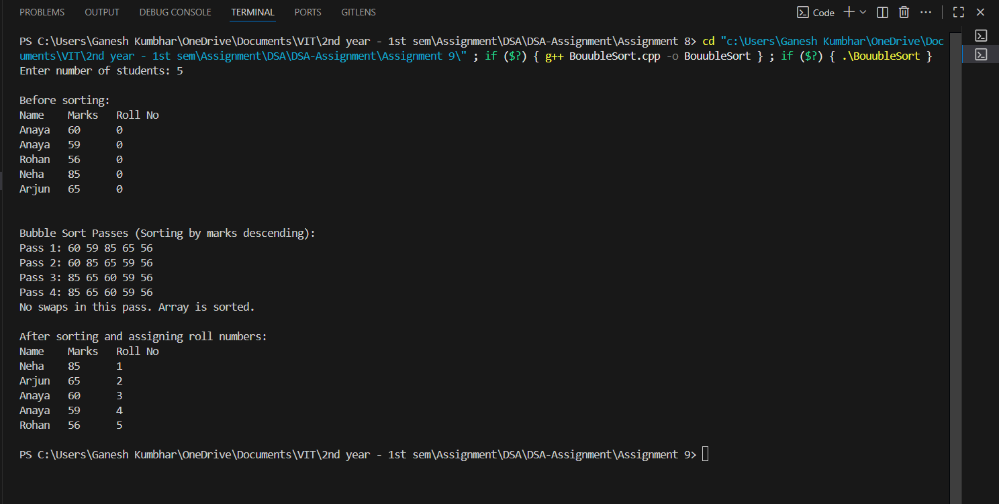

# Bubble Sort (Descending by Marks) and Roll Number Assignment

## Theory
This program demonstrates how to:
1. **Sort students** by their marks in **descending order** using **Bubble Sort**.  
2. **Assign roll numbers** based on ranking, where the topper gets roll no. **1**, the second highest gets roll no. **2**, and so on.  

### Bubble Sort (Descending Order)
- Bubble sort is a simple comparison-based algorithm.  
- It repeatedly compares adjacent elements and swaps them if they are in the wrong order.  
- Here, the comparison ensures **higher marks come before lower marks**.  

**Time Complexity:**  
- Best Case: O(n) (already sorted)  
- Average/Worst Case: O(n²)  
- Space Complexity: O(1)  

---

## Algorithm
1. Generate random student records with **names** and **marks**.  
2. Print students before sorting.  
3. Apply **Bubble Sort** in descending order of marks.  
   - Print array after each pass.  
4. Assign roll numbers based on rank:  
   - Highest marks → Roll No 1  
   - Second highest → Roll No 2  
   - … and so on.  
5. Print students after sorting and roll number assignment.  

---

## Code

```cpp
#include <iostream>
#include <string>
#include <cstdlib>
#include <ctime>
using namespace std;

struct Student_gsk {
    string name_gsk;
    float marks_gsk;
    int roll_no_gsk; // To be assigned
};

const string sample_names_gsk[] = {
    "Rohan", "Isha", "Priya", "Kabir", "Tanvi", "XYZ", "Arjun", "Anaya", "Neha", "Salman"
};
const int NAMES_SIZE_gsk = sizeof(sample_names_gsk) / sizeof(sample_names_gsk[0]);

void printStudents_gsk(const Student_gsk arr_gsk[], int n_gsk) {
    cout << "Name\tMarks\tRoll No\n";
    for (int i_gsk = 0; i_gsk < n_gsk; ++i_gsk) {
        cout << arr_gsk[i_gsk].name_gsk << "\t" << arr_gsk[i_gsk].marks_gsk << "\t" << arr_gsk[i_gsk].roll_no_gsk << endl;
    }
    cout << endl;
}

void bubbleSortDescending_gsk(Student_gsk arr_gsk[], int n_gsk) {
    bool swapped_gsk;
    cout << "\nBubble Sort Passes (Sorting by marks descending):\n";
    for (int i_gsk = 0; i_gsk < n_gsk - 1; ++i_gsk) {
        swapped_gsk = false;
        cout << "Pass " << i_gsk + 1 << ": ";
        for (int j_gsk = 0; j_gsk < n_gsk - i_gsk - 1; ++j_gsk) {
            if (arr_gsk[j_gsk].marks_gsk < arr_gsk[j_gsk + 1].marks_gsk) {
                swap(arr_gsk[j_gsk], arr_gsk[j_gsk + 1]);
                swapped_gsk = true;
            }
        }
        for (int k_gsk = 0; k_gsk < n_gsk; ++k_gsk)
            cout << arr_gsk[k_gsk].marks_gsk << " ";
        cout << endl;
        if (!swapped_gsk) {
            cout << "No swaps in this pass. Array is sorted.\n";
            break;
        }
    }
}

int main() {
    srand(static_cast<unsigned int>(time(0)));
    int n_gsk;
    cout << "Enter number of students: ";
    cin >> n_gsk;

    Student_gsk* students_gsk = new Student_gsk[n_gsk];

    // Generate random names and marks
    for (int i_gsk = 0; i_gsk < n_gsk; ++i_gsk) {
        students_gsk[i_gsk].name_gsk = sample_names_gsk[rand() % NAMES_SIZE_gsk];
        students_gsk[i_gsk].marks_gsk = 40 + static_cast<float>(rand() % 61); // Marks between 40 and 100
        students_gsk[i_gsk].roll_no_gsk = 0;
    }

    cout << "\nBefore sorting:\n";
    printStudents_gsk(students_gsk, n_gsk);

    bubbleSortDescending_gsk(students_gsk, n_gsk);

    // Assign roll numbers (topper gets roll no 1)
    for (int i_gsk = 0; i_gsk < n_gsk; ++i_gsk)
        students_gsk[i_gsk].roll_no_gsk = i_gsk + 1;

    cout << "\nAfter sorting and assigning roll numbers:\n";
    printStudents_gsk(students_gsk, n_gsk);

    delete[] students_gsk;
    return 0;
}
```

## Sample Output

**Input:**  
```
Enter number of students: 5
```

**Output:**  
```
Before sorting:
Name    Marks   Roll No
Priya   72      0
Rohan   95      0
Tanvi   63      0
Isha    88      0
Kabir   40      0

Bubble Sort Passes (Sorting by marks descending):
Pass 1: 95 72 88 63 40
Pass 2: 95 88 72 63 40
Pass 3: 95 88 72 63 40
No swaps in this pass. Array is sorted.

After sorting and assigning roll numbers:
Name    Marks   Roll No
Rohan   95      1
Isha    88      2
Priya   72      3
Tanvi   63      4
Kabir   40      5

```

